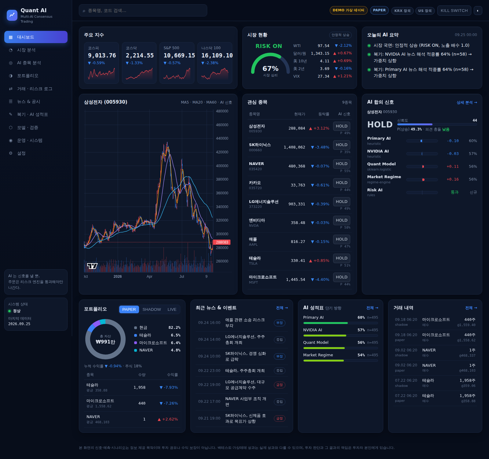

# Quant AI — 멀티 AI 합의 기반 퀀트 시스템

여러 AI 가 **서로 모른 채 독립적으로** 시장을 분석하고, 앙상블 엔진이 **과거 성적으로 가중**해 합의 신호를 만든다.
AI 에게 주문 권한은 없다. 신호는 반드시 **리스크 게이트**를 통과해야 주문이 되며, 매일 장이 끝나면
**어떤 AI 가 왜 틀렸는지 자동 복기**하고 그 성적이 다음 날 가중치에 반영된다.



> 실제 KRX 데이터(2026-09-23 기준)로 가상매매 장부를 돌린 화면입니다. LLM 키 없이 휴리스틱 AI 로 실행했고,
> 뉴스·해외지표 칸은 키(RSS·FRED)를 넣으면 채워집니다.

**이 플랫폼이 답하는 질문**
- 데이터가 과거 시점에서 정확했나
- AI 확률이 실제 확률과 맞나
- AI 가 코어 대비 추가 수익을 만들었나
- 비용을 빼도 남나
- 실제 주문에서도 같은가
- 반복되나

국내·미국 모두 이 **증명 체인 6단계**로 판정해 홈 최상단에 보여준다.
자동 킬스위치 10개 조건(→ HALTED), champion 자동 롤백, 사이트 채팅 AI 도 들어 있다.

> **v17 사용 원칙 — AI 는 '실수 방지 도구'다.** 먼저 `#budget` 에서 원금·최대 손실을 정하면 모든 한도가 자동으로 정해지고,
> 누적 손실이 그 한도에 닿으면 전체 정지한다. 대부분은 코어(지수형)로, AI 신호는 소액 위성에서 6개월 이상 전진 기록이 기준을 넘을 때만.
> AI 성적이 3일 연속 기준 미달이면 시스템이 스스로 주문에서 뺀다. 미국 주식은 아직 **수동 주문표**(`#usorder`)다.
> 뉴스는 '읽는 목록' 대신 **뉴스 보드**(`#news`)·**증시 지도**(`#map`)·**그날 재현**(`#replay`)으로 본다.

> **v18 — 홈은 5칸부터.** 오늘 시장 · 내 자산 · AI 상태(🟢검증됨/🟡검증 중/🔴사용 금지) · 중요한 뉴스 · 오늘 할 일.
> 뉴스·공시를 누르면 원문 → 번역 → 쉬운 설명 → 주가 영향 → 영향 받을 종목(🔴🟠🟡) 순서로 보여 준다. 종목마다 회사 로고가 붙는다.
> `.env` 에 키를 넣었는데 "키 없음" 이면 **옛 폴더의 서버가 떠 있던 것**이다. 이제 `./run.sh` 가 알아서 끄고 새로 띄운다 (`./run.sh stop` 으로 직접 끌 수도 있다).

- **현황·결과·한계: [docs/PLATFORM_STATUS.md](docs/PLATFORM_STATUS.md)** (V17: 8-8장 · V18: 8-9장)
- **지금 할 일과 다음 개선: [docs/ROADMAP.md](docs/ROADMAP.md)**

```text
Market Data ─┬─▶ Primary AI (Gemini 무료 / Claude · 종합)  ─┐
             ├─▶ Second AI (NVIDIA Nemotron · 독립 검증) ─┤
             ├─▶ Panel AI (Cloudflare Gemma · 교차검증)  ─┤
             ├─▶ Quant Model (champion · 숫자/통계)      ─┼─▶ Ensemble ─▶ Risk Gate ─▶ Execution ─▶ Broker
             ├─▶ Market Regime (국면)                    ─┤   충돌 탐지      킬스위치      Paper/Shadow/Live
             └─▶ Risk AI (Groq gpt-oss · veto)           ─┘   성적 가중      손실·비중 한도
장 마감 후 ─▶ 실제 결과로 채점 ─▶ AI 성적표(방향·뉴스·거시·추세·위험) ─▶ 복기 교훈 ─▶ RAG 메모리
```

- 설계: [docs/ARCHITECTURE.md](docs/ARCHITECTURE.md)
- 실제 KRX 데이터 연구: [docs/RESEARCH_KRX.md](docs/RESEARCH_KRX.md)
- **실전 투자자 가이드 (기대 수익·최소 투자금·계좌·세금·월간 루틴·멈춤 규칙): [docs/INVESTOR_GUIDE.md](docs/INVESTOR_GUIDE.md)**
- **KIS 모의투자 연결·운영 절차: [docs/KIS_DEMO_RUNBOOK.md](docs/KIS_DEMO_RUNBOOK.md)**
- **`.env` 키 발급처 (KIS · 무료 AI · 알림 · 데이터): [docs/ENV_KEYS.md](docs/ENV_KEYS.md)**
- **서비스 출시 준비도 점검 · 부족한 점 · 법규제 · 로드맵: [docs/PRODUCTION_READINESS.md](docs/PRODUCTION_READINESS.md)**

## 구성 (요청한 16단계 대응)

| # | 단계 | 위치 |
|---|---|---|
| 1 | 국내 + 해외 시세 수집 | `data/collectors/prices.py` (Yahoo, CSV, 실시간 `RealtimeFeed` 인터페이스) |
| 2 | 뉴스/공시/경제 데이터 | `collectors/news.py` (RSS), `disclosures.py` (DART), `macro.py` (FRED) |
| 3 | PostgreSQL 저장 | `data/models.py` (JSONB), `docker-compose.yml` |
| 4 | Market Regime Engine | `engines/regime.py` |
| 5 | News Intelligence | `engines/news_intel.py` + LLM 애널리스트 |
| 6 | Technical/Fundamental Feature | `engines/features.py` (공시일 기준 as-of merge) |
| 7 | Prediction Engine | `engines/prediction.py`, `engines/scenario.py` |
| 8 | Backtester | `backtest/backtester.py` (walk-forward, purge/embargo, 비용·세금) |
| 9 | Paper Trading | `trading/broker.py: PaperBroker` |
| 10 | Shadow Trading | `ShadowBroker` (호가 기준 체결, 잔량 부족 시 부분체결) |
| 11 | Risk Engine | `trading/risk.py` + Risk AI (`analysts/analysts.py`) |
| 12 | Broker Execution | `trading/execution.py` (모든 모드 공통) |
| 13 | Trade Journal | `trading/journal.py` (신호·주문·거부 사유 전부) |
| 14 | 자동 복기 | `review/review.py`, `ensemble/tracker.py` |
| 15 | 검증된 모델만 교체 | `registry/model_registry.py` (candidate→shadow→champion) |
| 16 | 소액 Live | `trading/kis.py` 한국투자증권(모의/실전) — 보호 지정가·체결확인·잔량취소·잔고동기화, 소액 상한 |

### 운영 기능
- **무료 멀티 AI**: Gemini · NVIDIA · Groq · Cloudflare Gemma 를 역할별 자동 배정, 한도 초과 시 다음 모델로 전환 (`analysts/llm_clients.py`)
- **신뢰 계층**: 주문 멱등성·재시작 복구 · AI 별 확률 보정 · 포트폴리오 VaR/ES·상관 군집·유동성 · Evidence Chain · AI Journal · NO TRADE 사유별 가치 · 슬리피지 실측
- **LLM 가드**: 응답 캐시 · 일 비용 예산 · 공급자별 무료 일 한도 · 모든 호출 감사 로그 (`analysts/guard.py`)
- **검증 통계**: PSR · DSR(다중검정 보정) · Sharpe 부트스트랩 CI · 비용 2배 스트레스 · 확률 보정표
- **안전장치**: DB 공유 킬스위치 · 자동 정지(급락) · 치명 위험 시 강제 청산 · 매매 사이클 잠금 · 영속 주문 한도 · 낡은 데이터로 매매 금지
- **관측**: 작업 실행 기록, `/api/health`, 운영 화면, Discord/Slack/Telegram 알림, JSON 로그
- **배포**: Dockerfile, docker-compose(PostgreSQL+마이그레이션+스케줄러+웹), Alembic, GitHub Actions CI

## 빠른 시작 — `./run.sh` 하나로

```bash
./run.sh
```

설치(Python 3.11+ 가상환경) → DB 확인 (PostgreSQL 이 없으면 설치가 필요 없는 SQLite 로 자동 전환) →
KRX 데이터 받기·갱신 → 점검 → 대시보드(http://127.0.0.1:8050, 브라우저 자동 열림) + 24시간 운영까지 자동.
두 번째 실행부터는 설치·데이터를 건너뛰고 바로 시작한다. 종료는 Ctrl+C.

- `.env` 에 **KIS 모의투자 키 3개**를 넣으면 다음 실행부터 모의계좌로 자동매매 (없으면 가상매매) — 발급처: [docs/ENV_KEYS.md](docs/ENV_KEYS.md)
- 무료 AI 키(Gemini·Groq·NVIDIA·Cloudflare)는 선택. 기본은 코어 전용(`QUANT_CORE_ONLY=true`)
- 대시보드가 먼저 뜨고, 뉴스·AI 판단·미국 장부는 뒤에서 채워진다 (`logs/warmup.log`, 홈의 '시작 체크리스트')
- **새 버전으로 바꿀 때**: 새 폴더에서 `./run.sh` 를 실행하면 직전 버전 폴더의 `.env`(키)·`quant_ai.db`(기록)를 자동으로 가져온다.
  - 가상환경·주가 데이터는 `~/.quant-ai` 에 한 번만 설치하고 모든 버전이 함께 쓴다.
  - 디스크가 부족하면 `./run.sh clean-old` 로 옛 버전 폴더의 설치 파일을 정리한다(.env·DB 는 보존).
- 개별 명령
  - `./run.sh doctor --ai --kis --notify` · `./run.sh chat` (채팅 AI)
  - `./run.sh proof [--market US]` (증명 체인) · `./run.sh guardian` (킬스위치 조건)
  - `./run.sh us` (미국 장부) · `./run.sh db-clean` · `./run.sh kis-check` · `./run.sh orders …`
  - `./run.sh up` (Docker) · `./run.sh help`

가상 데이터 데모: `./run.sh demo && ./run.sh serve` · 테스트: `./run.sh test`

### 실제 데이터로

```bash
cp .env.example .env                # 키 입력 (docs/ENV_KEYS.md)
docker compose up -d --build        # PostgreSQL + 마이그레이션 + 스케줄러 + 대시보드 (또는 아래처럼 수동)
alembic upgrade head                # 스키마 마이그레이션
quant-ai collect prices --symbols 005930.KS,000660.KS,NVDA,AAPL,^KS11 --years 5
quant-ai collect macro && quant-ai collect disclosures
quant-ai train                      # walk-forward 검증 → 게이트 통과 시 shadow
quant-ai decide                     # 멀티 AI 합의 신호 확인 (주문 없음)
quant-ai run --mode shadow          # 24시간: 장중 판단/Shadow 매매, 장외 수집·채점·복기·재학습
quant-ai kis-check --test-order     # 한국투자증권 모의투자 점검 (docs/KIS_DEMO_RUNBOOK.md)
quant-ai kill on                    # 킬스위치 (모든 프로세스 공유)
quant-ai health                     # 헬스체크
```

### 코어-위성 전략 (기본 전략)

```text
코어 80%  검증된 팩터 (모멘텀 + 저변동성 + 52주 고점, 20거래일 리밸런싱, 상위 20 동일가중)
          └ 추세 필터: 리밸런싱 날 KOSPI < 200일선이면 코어 비중 절반 (사전등록 시험 통과, 최대 낙폭 -55% → -43%)
          └ 소액 계좌: 1주 가격이 목표 금액보다 훨씬 비싼 종목은 다음 순위로 대체
          └ AI 역할: 종목 고유 위험 거부권 (신규 편입 대신 다음 순위) · 상장폐지 시 즉시 청산
위성 20%  멀티 AI 합의 BUY 상위 5 (AI 종목선택을 작은 비중으로 실전 검증)
          └ 시장 전체 위험(위기 국면·FOMC 임박)에는 위성 신규 매수 중단
AI 기여도  가상 장부 3개(코어만 / +거부권 / +위성)를 같은 가격으로 나란히 굴려 비교
```

```bash
quant-ai collect krx --marcap-dir marcap/data --years 3 --top 100   # 실제 KRX 데이터 적재
quant-ai cycle --mode paper                                         # 한 사이클
quant-ai replay --days 60                                           # 최근 60거래일 재생
quant-ai run --mode shadow                                          # 24시간 (QUANT_STRATEGY=core_satellite)
quant-ai orders --cash 30000000 --holdings my.csv --no-ai --out orders.csv   # 다른 증권사·ISA 수동 매매용 주문표
quant-ai checkup --mode paper                                       # 전략 건강검진 (손실이 과거 범위 안인가)
```

16년 실데이터 기준 기대치는 **KOSPI 와 비슷한 수익, 더 작은 변동성**이다 (연 7.6% vs 8.3%, 변동성 15.7% vs 21.4%).
지수를 이긴다는 증거는 없다 — 자세한 숫자와 실전 운용 규칙은 [투자자 가이드](docs/INVESTOR_GUIDE.md).

### 실제 KRX 데이터로 연구 (생존편향 제거)

```bash
git clone --depth 1 --filter=blob:none --sparse https://github.com/FinanceData/marcap.git
cd marcap && git sparse-checkout set --no-cone $(for y in $(seq 2010 2026); do printf "/data/marcap-$y.parquet "; done) && cd ..
quant-ai research krx --marcap-dir marcap/data --start 2010 --top 100 --register
```

- 월말 시가총액 상위 N 을 **그 시점 기준**으로 선정 (나중에 상장폐지된 종목 포함), 보통주만
- KRX 전일대비(기준가 대비)로 **수정주가 복원** (액면분할·병합 자동 반영)
- 시도한 모든 설정을 공개하고 DSR 로 다중검정 보정, KOSPI·유니버스 동일가중 두 벤치마크와 비교
- 결과는 대시보드 **실데이터 연구** 화면에서 확인

API 키가 없으면 해당 AI 는 오프라인 휴리스틱으로 대체되어 시스템은 계속 동작한다 (대시보드 설정 화면에 표시).

### 매매 준비 · 실제 예측력 (v13)

```bash
quant-ai readiness                                   # 7관문 (DATA·BROKER·MODEL·RISK·EVENT·DRIFT·CALIBRATION)
quant-ai kis-check --suite                           # KIS 모의투자 검증 8단계 (장중이면 주문·취소 경로까지)
quant-ai kis-check --suite --fill                    # + 모의투자 1주 실제 체결 → 슬리피지 실측
quant-ai power-study --marcap-dir marcap/data        # 실제 KRX 과거 데이터로 코어 점수 예측력 사후 검증
```

- NOT READY 면 live·shadow 장부의 **신규 매수가 막힌다** (매도·위험 축소는 항상 허용). `QUANT_READINESS_GATE=live|all|off`
- 실적 발표 D-1 이내 매수는 ×0.5 (`QUANT_EVENT_GATE=reduce|block|off`)
- "실제 시장 예측력" 은 사전 등록한 기준으로, 등록 이후 봉인된 예측만 순차 검정(SPRT)해서 판정한다 — 대시보드 **실제 예측력** 화면

### Truth Center · 완성 기준 · 사용자 화면 (v14)

```bash
quant-ai watchdog --mode paper       # 스케줄러를 감시견 아래에서 실행 (죽음·멈춤 → 재시작). ./run.sh 기본값
python -m quant_ai.checklist         # 완성 기준 체크리스트 (docs/FINAL_CHECKLIST.md)
```

- **Truth Center** (`#truth`): 시장 시계 · 데이터 · 이벤트 · 증권사 · 포트폴리오 위험 · 체결이 사실인가를 먼저 확인. 🔴 항목은 매매 준비 관문을 빨강으로 만든다 (fail-closed).
- 매매 준비 점검이 없거나 오래됐거나 실패하면, 게이트가 적용되는 장부의 신규 매수를 막는다. 휴장일 캘린더·이벤트 캘린더가 없어도 막는다.
- 국내 일봉 1차 소스(KRX)가 늦으면 Yahoo 로 **빈 날만** 채우고(겹치는 날 종가 비율로 맞춤), 1차가 갱신되면 1차 값으로 덮어쓴다.
- 종목 페이지: **왜 BUY / SELL / HOLD / NO TRADE** · 차트 위 AI 진입 구간·손절·목표 선 · 내 보유(장부 + 계좌) · 이 종목 과거 AI 적중률 · 관심종목 ★
- 홈: **오늘 할 일** · 시장 한눈에 · 상단 시장 시계(장중·장외·휴장, 개장/폐장까지 남은 시간)
- **종목 비교** (`#compare/005930,000660`) · 키보드 단축키(`?` 로 목록, `/` 검색, `g t` Truth Center) · 최근 검색

### 올인원 종목 · AI Health · 내 설정 (v15)

- 종목 페이지: 섹션 이동 · **데이터 신뢰도** · D-day 띠 · **왜 샀나/왜 안 샀나** · **사전 리스크 게이트**("지금 사면?" 통과/축소/차단, 주문 없음) · **뉴스·공시 자동 요약**
- **AI · 모델 Health** (`#aihealth`): AI 별 적중(전체·초기·최근 20거래일) · 성능 저하 자동 감지(일별 검정 → 알림) · LLM 응답 상태
- 홈 **⚙ 홈 편집**(숨기기·순서) · 설정의 **외부 알림 설정**(종류별 텔레그램/디스코드·웹 푸시 · 조용한 시간) — 서버 저장, 모든 기기 공통

### Stock OS · 검증 가능한 AI · 데이터 OS (v16)

- 종목 페이지: **현재 상황 한 줄**(🟢/🟡/🔴) · **OS 헤더**(AI 확률·실적 D-n·뉴스 톤·공시·수급·밸류·위험·내 보유) · 가격/뉴스/공시/AI **신선도(초 단위)** · 차트 위 지지/저항·뉴스·공시·실적 표시 · 뉴스 v2(톤·예상 영향·AI 요약·영향 분석) · 실적 · 종목 리스크 · **과거 동일 조건 N회 검증** · **투자 논리** · **모의 주문**(수동 장부) · 섹션 숨기기/순서
- `#action` 오늘 할 일 · `#watch` 관심종목 그룹 · `#notrade` 거래 안 한 이유 · `#scorecard` **공개 AI 성적표**(1000건 전부, 실패 포함) · `#ailab` AI Lab·실패 연구
- `#datahealth` **DATA HEALTH**(가격 지연 15분 → 매수 차단) · Sentinel · Fail-Closed · `#pos` Portfolio OS·위기 시뮬레이션 · `#profile` 투자 성향·실수 패턴 · `#validation` 실전 검증 진행표·비용 실측 · `#governance` 규제 단계·보안·라이선스·감사 로그
- 문서: [COMPLIANCE](docs/COMPLIANCE.md) · [SECURITY](docs/SECURITY.md) · [DATA_LICENSES](docs/DATA_LICENSES.md) · [SAAS_ARCHITECTURE](docs/SAAS_ARCHITECTURE.md)

## 테스트

- `pytest` — 테스트 409개 · 건너뜀 0개 (PostgreSQL 이 설치돼 있으면 임시 DB 를 직접 띄워 통합 테스트까지)
- 문서의 테스트 수가 실제와 다르면 테스트가 실패한다 (`tests/test_docs_counts.py`) · CI 는 건너뜀이 하나라도 있으면 실패 (`QUANT_NO_SKIP=1`)

## 안전 원칙
- AI → 신호 → 앙상블 → **리스크 게이트** → 실행 엔진 → 증권사. AI 는 `broker.buy()` 를 호출할 수 없다.
- Risk AI 의 규칙 veto (이벤트 임박, 변동성 급증, 데이터 이상, 위기 국면, 상장폐지 공시)는 다른 AI 가 뒤집을 수 없다.
- Live 는 `QUANT_LIVE_ENABLED=true` + `QUANT_LIVE_CONFIRM=I_UNDERSTAND_REAL_MONEY` + 소액 상한 + Shadow 검증 champion 이 모두 있어야 켜진다.
- NVIDIA 무료 엔드포인트는 연구·테스트 용도로 안내되어 있으니 Live 전에 최신 약관을 확인할 것.
- 이 프로젝트는 투자 조언이 아니며, 백테스트/가상 성과는 실제 수익을 보장하지 않는다.
