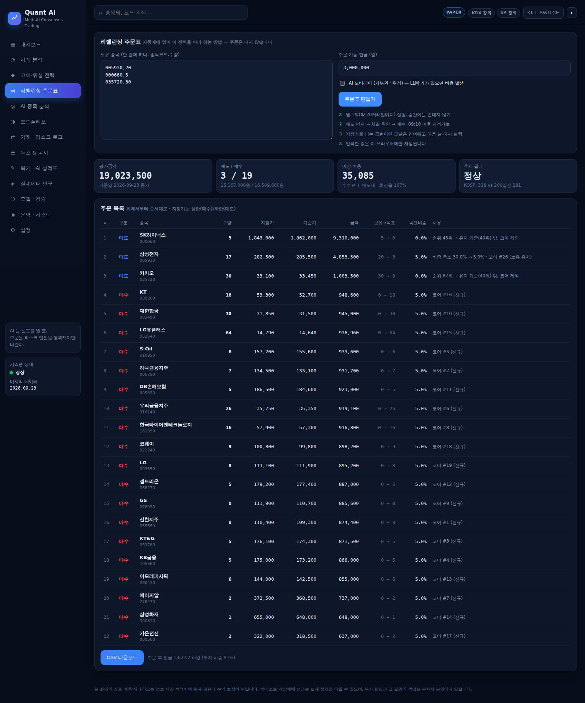

# 실전 투자자 가이드 — 이 시스템으로 내 돈을 운용하기 전에

> 이 문서는 투자 권유가 아니며, 수익을 보장하지 않는다. 아래 숫자는 모두 **실제 KRX 데이터 백테스트**
> (2011-01 ~ 2026-09, 매월 시총 상위 100, 상장폐지 종목 포함, 거래비용·연도별 실제 매도세율 반영)이고,
> 과거 성과는 미래를 보장하지 않는다. 재현 방법은 [RESEARCH_KRX.md](RESEARCH_KRX.md) 참고.

## 0. 먼저 결론 (솔직하게)

| | 이 전략 (코어 + 200일선 필터) | KOSPI (시총가중) |
|---|---|---|
| 연평균 수익률 (16년) | **7.6%** | 8.3% |
| 연 변동성 | **15.7%** | 21.4% |
| Sharpe | **0.54** | 0.48 |
| 최대 낙폭 | -43.4% (2017-08 → 2020-03) | -44.1% |
| 2011~2020 (개발 구간) | 연 2.2% | 연 3.4% |
| 2021~2026-09 (검증 구간) | 연 17.3%, 최대 낙폭 **-23%** | 연 17.1%, 최대 낙폭 -39% |

- **이 전략은 KOSPI 보다 더 번다는 증거가 없다.** 수익률은 비슷하고, 흔들림(변동성·하락장 낙폭)이 작다.
  "같은 수익을 덜 무섭게" 가 현실적인 기대치다.
- 강점: 하락장 방어 (2018 -15% vs KOSPI -18%, 2022 -6% vs -25%, 2024 +13% vs -10%).
- 약점: 급반등·주도주 장세에서 크게 뒤처진다 (2020 +7% vs +31%, 2023 +2% vs +19%, 2025 +27% vs +76%).
- **가장 길었던 손실 구간은 2017-08 ~ 2025-05, 약 7년 10개월** 동안 전 고점을 회복하지 못했다.
  이 기간을 버틸 수 없다면 이 전략은 맞지 않는다.
- 2026-09 현재 전략 건강검진은 **주의(warn)** 상태다: 최근 1년 KOSPI 대비 -45%p (강한 반등장), 최근 12개월 팩터 IC t=-0.6
  (통계적으로 유의하지 않은 부진). 과거 하위 5% 안쪽이지만, 전략이 "고장 났다" 고 할 수준은 아니다.
- 멀티 AI(거부권·위성)가 수익을 더한다는 증거는 **아직 없다** (LLM 은 과거로 백테스트할 수 없어 전진 성과로만 측정 가능).
  → 처음에는 **코어만**(`--no-ai`) 운용하고, AI 기여도 장부가 6개월 이상 좋을 때만 켠다.

### 보유 기간별 결과 분포 (백테스트, 매 거래일 시작 기준)

| 보유 기간 | 손실로 끝난 비율 | 중앙값 | 하위 5% | KOSPI 를 이긴 비율 |
|---|---|---|---|---|
| 1년 | 45% | +2.3% | -14.5% | 48% |
| 3년 | 27% | +10.7% (누적) | -19.9% | 47% |
| 5년 | 20% | +17.1% (누적) | -13.4% | 46% |

**최소 3~5년 이상 쓰지 않을 돈**으로만 운용한다.

### 연도별 (가격 수익률, 배당 제외)

| 연도 | 전략 | KOSPI | | 연도 | 전략 | KOSPI |
|---|---|---|---|---|---|---|
| 2011 | +1.6% | -12.0% | | 2019 | -4.2% | +7.7% |
| 2012 | +10.0% | +9.4% | | 2020 | +7.1% | +30.8% |
| 2013 | -11.5% | +0.9% | | 2021 | +8.4% | +3.6% |
| 2014 | +8.0% | -4.7% | | 2022 | -5.6% | -24.9% |
| 2015 | +16.5% | +2.5% | | 2023 | +1.6% | +18.8% |
| 2016 | -6.0% | +3.4% | | 2024 | +12.9% | -9.5% |
| 2017 | +21.5% | +21.6% | | 2025 | +27.3% | +75.6% |
| 2018 | -15.2% | -17.6% | | 2026 (~9월) | +65.9% | +68.0% |

배당은 전략과 KOSPI 모두 빠져 있다. 실제로는 양쪽 다 연 1.5~2.5% 정도 배당이 더해진다
(저변동성 종목은 배당이 많은 편이라 전략 쪽이 약간 유리할 수 있다).

**대안도 정직하게:** KOSPI200 ETF 를 사서 들고 있는 것(보수 연 0.01~0.05%)이 이 전략과 장기 수익이 비슷했다.
이 전략을 고르는 이유는 "더 벌어서" 가 아니라 "하락장에서 덜 잃어서" 여야 한다.

## 1. 전략이 하는 일

1. 매월 말 기준 시총 상위 100 종목 중에서
2. **모멘텀(12-1개월) + 저변동성(60일) + 52주 고점 근접도** 순위 합산 상위 20종목을 동일 비중으로 보유
3. 약 20거래일마다 리밸런싱. 이미 가진 종목은 40위 안이면 유지 (거래 비용·세금 절약)
4. **추세 필터:** 리밸런싱 날 KOSPI 가 200일 이동평균 아래면 주식 비중을 절반으로 (나머지 현금)
5. (선택) 멀티 AI: 종목 고유 위험(공시·이벤트·급변) 종목의 신규 편입 거부, 상장폐지 위험 긴급 제외, 위성 20%

연 회전율은 약 2배(편도)로 낮다 → 연 거래비용은 약 0.3~0.5%.

## 2. 최소 투자금

20종목을 정수 주로 사야 해서, 금액이 작으면 비싼 종목을 못 사거나 비중이 틀어진다
(2026-09-23 실데이터 주문표로 계산, 코어만):

| 투자금 | 보유 종목 | 비싸서 다음 순위로 대체 | 목표 비중 대비 오차 (평균 / 최대) | 실제 투자 비중 |
|---|---|---|---|---|
| 300만 원 | 16 | 5 | 17% / 42% | 66% |
| 500만 원 | 20 | 4 | 19% / 50% | 81% |
| 1,000만 원 | 19 | 1 | 15% / 36% | 81% |
| 2,000만 원 | 20 | 0 | 8% / 35% | 93% |
| **3,000만 원** | 20 | 0 | **4% / 15%** | 96% |
| 1억 원 | 20 | 0 | 2% / 9% | 98% |

- **권장 3,000만 원 이상, 최소 2,000만 원.** 그보다 작으면 백테스트와 다른 포트폴리오가 된다.
- 1,000만 원 미만이면 이 전략보다 KOSPI200 ETF 적립이 합리적이다.

## 3. 어떤 계좌에서?

| 계좌 | 개별 주식 | 이 시스템 자동매매 | 권장 사용법 |
|---|---|---|---|
| 일반 종합계좌 (한국투자증권) | 가능 | **가능** (KIS Open API) | 모의투자 3개월 → 소액 실전 ([KIS_DEMO_RUNBOOK.md](KIS_DEMO_RUNBOOK.md)) |
| 다른 증권사 종합계좌 | 가능 | 불가 (KIS 만 구현) | **주문표**로 월 1회 수동 매매 |
| 중개형 ISA | 국내 상장주식 가능 | API 주문 지원 여부는 증권사·시기마다 다름 → 확인 필요 | **주문표**로 수동 매매 (절세 효과 큼) |
| 연금저축 · IRP | **불가** (ETF·펀드만) | - | 이 전략 불가. KOSPI200·배당 ETF 등으로 |

- 이 시스템은 KIS **종합계좌(상품코드 01)** 로만 테스트했다.
- ISA(중개형): 순이익 200만 원(서민형 400만 원)까지 비과세, 초과분 9.9% 분리과세, 연 납입 2,000만 원·의무 보유 3년
  (2025년 기준. 한도 확대 논의가 있으니 가입 시점 조건을 확인).
  월간 리밸런싱으로 생기는 매매차익·배당을 계좌 안에서 합산하므로, **수동 운용 가능하다면 ISA 가 가장 유리**하다.

## 4. 세금과 비용

| 항목 | 내용 |
|---|---|
| 증권거래세 (매도 시) | 2026년 **0.20%** (2025년 0.15%). 매년 바뀔 수 있음 → `QUANT_SELL_TAX_BPS` 로 설정 |
| 매매 수수료 | 증권사·계좌마다 다름 (기본 가정 0.015%) → `QUANT_COMMISSION_BPS` |
| 매매차익 | 국내 상장주식은 **대주주가 아니면 비과세** (대주주 기준은 자주 바뀜) |
| 배당 | 15.4% 원천징수. 이자+배당이 연 2,000만 원을 넘으면 금융소득 종합과세 |
| 슬리피지 | 백테스트 가정 0.05%. 모의투자로 실측 후 재검증 권장 |

세법은 매년 바뀐다. 이 문서의 세율은 작성 시점 기준이므로 **실제 거래 전에 증권사 공지와 국세청 안내로 확인**한다.

## 5. 월간 루틴 (수동 — 다른 증권사·ISA)

리밸런싱은 **약 20거래일(한 달)에 한 번**. 중간에는 아무것도 하지 않는 것이 규칙이다.

1. **데이터 갱신 (장 마감 후, 전날 저녁):**
   `quant-ai collect krx --marcap-dir /data/marcap/data --years 5`
   (`quant-ai run` 스케줄러가 켜져 있으면 자동)
2. **보유 종목 파일 만들기** — 증권사 앱의 잔고를 보고 `holdings.csv`:
   ```
   종목코드,수량
   005930,12
   105560,8
   ```
3. **주문표 만들기:**
   `quant-ai orders --cash 1234567 --holdings holdings.csv --no-ai --out orders.csv`
   또는 대시보드 **리밸런싱 주문표** 화면 → 붙여넣기 → CSV 다운로드
4. **주문 (다음 날 09:10 이후):**
   - **매도 먼저** → 체결 확인 → 매수
   - 주문표의 지정가(매수는 기준가 +1% 상한, 매도는 −1% 하한)로 주문
   - 지정가 밖으로 급변한 종목은 그날 건너뛰고 다음 날 주문표를 다시 만든다
5. **입출금 기록:** `quant-ai cashflow 5000000 --mode live` (출금은 음수) — 건강검진이 입금을 수익으로,
   출금을 손실로 착각하지 않도록 시간가중수익률로 보정한다
6. **건강검진:** `quant-ai checkup --mode paper` (또는 대시보드 코어-위성 화면 상단)



한 번에 걸리는 시간은 약 20~30분이다. 비용은 1회 약 0.03~0.1% 수준이다.

## 6. 멈춤 규칙 — 미리 정해 두고 지킨다

실전 손실의 가장 큰 원인은 **정상 범위의 손실을 보고 규칙을 버리는 것**이다.
대시보드와 `quant-ai checkup` 이 현재 상태를 과거 16년 분포와 비교해 알려 준다 (상태가 바뀌면 알림).

| 상태 | 기준 (하나라도 해당) | 할 일 |
|---|---|---|
| 🟢 정상 | 아래 어디에도 해당 없음 | **규칙대로 유지.** 손실 구간도 전략의 일부 |
| 🟡 주의 | 고점 대비 -28% 이하 · 1년 수익률 -14.5% 이하 · 1년 KOSPI 대비 -40%p 이하 · 6개월 KOSPI 대비 -21%p 이하 · 60일 변동성 27% 이상 · 팩터 IC t < -1 | 유지. 추가 입금·비중 확대 보류. 시장 전체 하락인지, 전략만의 부진인지 확인 |
| 🔴 위험 | 고점 대비 -43% 이하 · 1년 수익률 -26% 이하 · 1년 KOSPI 대비 -123%p 이하 · 60일 변동성 53% 이상 · 팩터 IC t < -2 | **신규 매수 중단** (킬스위치). 보유분은 서둘러 팔지 말고 재검증 (`quant-ai lab`) 후 결정 |

개인 규칙 (권장):
- 레버리지·신용·미수 금지. 생활비·3년 안에 쓸 돈은 넣지 않는다.
- 전략이 고른 종목을 **내 판단으로 빼거나 더하지 않는다** (그 순간 검증된 전략이 아니다).
- 일시에 넣기보다 **6~12개월 나눠 넣기**가 심리적으로 쉽다 (리밸런싱 날마다 일정액).
- 1년 성과로 판단하지 않는다. 1년 단위로는 절반 가까이 지거나 잃는다 (위 표).

## 7. 단계별 투입

1. **모의투자 3개월** (KIS 모의 또는 PAPER 장부) — 주문표·체결·장애 대응에 익숙해질 때까지
2. **실전 소액** — 투자할 총액의 10~20%, 최소 금액 기준(2,000만 원)을 넘기 어렵다면 코어 종목 수를 줄이지 말고 ETF 병행
3. **6개월 무사고 후 증액** — 실측 슬리피지로 `quant-ai lab` 재검증, 여전히 양의 Sharpe 인지 확인
4. **AI 오버레이** — AI 기여도 장부(대시보드 코어-위성 화면)에서 `attr-full` 이 `attr-core` 보다 6개월 이상 좋을 때만

## 8. 한계

- 백테스트는 실제 체결이 아니다. 종가 기준 신호 → 다음 날 시가 체결을 가정했다.
- 유니버스는 시총 상위 100 이므로 소형주 효과는 없다. 상장폐지는 -30% 할인 청산으로 반영했다.
- KOSPI 비교 지수는 marcap 데이터로 만든 시총가중 대용 지수다 (공식 지수와 약간 다르다).
- 같은 데이터로 여러 설정을 시험했다 (누적 시험 수는 RESEARCH_KRX.md 참고). 다중검정 보정 DSR(시험 14회) 은 0.17 로,
  **통계적으로 '우연이 아니다' 라고 말할 수 있는 수준이 아니다.**
- 본인 계좌 외 **다른 사람의 돈을 운용하거나 유료로 신호를 제공하면** 투자일임·자문업 등록 대상이다
  ([PRODUCTION_READINESS.md](PRODUCTION_READINESS.md) 4장).
