# 플랫폼 현황 — 증명 체인 · AI 알파 · 자동 킬스위치 · 해외장 · 채팅 AI

상태 표시: ✅ 구현·테스트 완료 · 🟡 일부 구현 (한계를 적어 둠) · ⛔ 아직 없음 (이유를 적어 둠)
검증: 전체 테스트 통과 · 건너뜀 0개 (개수는 CI 결과 기준 — 문서에 손으로 적지 않음) (PostgreSQL 통합 테스트 포함 — `pytest` 가 임시 DB 를 직접 띄움 · CI 는 `QUANT_NO_SKIP=1`).
실제 KRX 데이터, 가짜 KIS 서버, `./run.sh` 전체 자동 실행(예전 DB 업그레이드 포함)으로 확인했다.


## 1. 가장 중요한 질문 — 증명 체인 6단계

이 플랫폼은 "AI 가 똑똑한가" 를 묻지 않는다. 아래 여섯 가지를 **순서대로** 묻는다.
각 단계는 통과 / 미달 / 표본 부족 중 하나로 판정한다. 기준은 `review/net_alpha.py` 에 상수로 고정되어 있고, 결과를 본 뒤에 바꾸지 않는다.

| 단계 | 질문 | 판정 기준 | 실데이터 결과 (휴리스틱 AI, 60거래일) |
|---|---|---|---|
| ① | 데이터가 과거 시점에서 정확했나 | 판단 기록에 저장된 뉴스·공시·마지막 봉이 모두 판단 시각 이전일 것. 수정주가일 것. 유니버스가 시점 기준이거나 전진 기록만 쓸 것 | ✅ 판단 717건 중 누수 0건 |
| ② | AI 확률이 실제 확률과 맞나 | 채점 200건 이상에서 Brier Skill > 0, ECE ≤ 5%p | ❌ Brier Skill −0.056, ECE 10.3% |
| ③ | AI 가 실제로 추가 수익을 만들었나 | AI 장부 − 코어 장부. 60거래일 이상이고 t > 1.64 (단측 5%) | ❌ −1.23%p (t=−0.46) |
| ④ | 비용을 빼도 남나 | AI 알파가 비용 후에도 + 이고, 운용 장부가 비용 후에도 벤치마크를 넘을 것 | ❌ AI 알파 −1.23%p |
| ⑤ | 실제 주문에서도 같은 결과가 나오나 | 실제 장부와 같은 규칙의 시뮬레이션 장부 차이 ±1%p 이내, 실측 슬리피지 ≤ 가정, 체결률 ≥ 90% (KIS 실주문 20건·20거래일 이상) | ⚪ 가상매매만 있어 판정 불가 |
| ⑥ | 그 성과가 반복되나 | 20거래일 구간의 2/3 이상에서 + 이고, 전반과 후반 모두 + | ⚪ 구간 2개 중 1개 (표본 부족) |

이 결과는 LLM 키 없이 휴리스틱 AI 로 돌린 것이다. 판정이 정확히 그렇게 나왔다. 확률은 찍기보다 못했고, AI 는 코어에 수익을 더하지 못했다.
그래서 기본값은 **코어 전용**이다. `.env` 에 넣은 AI 키는 이제 **AI 섀도** 로 매일 판단하고 채점된다. 그 기록이 쌓이면 같은 여섯 단계로 다시 판정한다.

- **AI Alpha 분리 증명 ✅**
  - 같은 날, 같은 가격, 같은 코어 규칙으로 장부 세 개를 굴린다: 코어 / 코어+거부권 / 코어+거부권+위성. 세 장부는 AI 가 관여한 부분만 다르다.
  - 따라서 장부 사이의 차이가 곧 AI 의 순수 기여다. 비용이 포함되어 있고, t 값과 90% 구간을 함께 보여준다.
  - 이 기여는 다시 **거부권·긴급청산**과 **위성 베팅**으로 나눠 보여준다.
- **Point-in-Time 보정·가중치 ✅**
  - 보정기는 적합할 때마다 버전을 기록한다(`calibration_history`).
  - 과거 재생에서는 그 시점 이전에 적합된 보정기와 그 시점에 결과가 나와 있던 성적만 쓴다.
  - 합의 확률 자체도 과거 합의로 한 번 더 보정한다(OOS Ensemble Calibration). 정보가 없는 합의는 0.5 로 눌려 NO TRADE 가 된다.

## 2. 해외장 (미국) 🟡

- **장부**: 미국 대형주 40종목으로 국내와 **같은 코어 팩터 규칙**을 쓴다.
  - 실제 설정 장부 `us-paper` 와 AI 기여 측정 장부 3개(`us-attr-*`)를 둔다.
  - 모두 가상매매이고 단위는 USD다. 벤치마크는 SPY, 수수료는 0.25%(해외주식)이고 매도세는 없다.
- **증명**: 국내와 같은 6단계 체인과 AI 알파 분리 증명을 쓴다. 대시보드에서 🇰🇷/🇺🇸 로 전환한다.
- **데이터**: 무료 일봉을 받는다(Yahoo → 실패하면 Stooq, 수정주가, 키 필요 없음).
  - 과거 백테스트는 **하지 않는다**. 현재 구성 종목으로 과거를 돌리면 생존편향이 생기기 때문이다. 목록을 고정한 날부터의 전진 기록만 성과로 쓴다.
  - ① 단계에는 "전진 기록만 사용" 으로 표시된다.
- **한계**
  - 해외 실주문(KIS 해외주식)은 실계좌로 검증하기 전까지 넣지 않았다. 그래서 ⑤ 단계는 계속 "가상매매만" 이다.
  - 환율 효과는 장부에 반영하지 않는다(USD 기준).

## 3. 자동 킬스위치 — 버튼이 아니라 조건 ✅


5분마다 자동으로 점검하고, 매매 사이클 직전에도 한 번 더 점검한다(`trading/guardian.py`). 조건 하나라도 **심각** 이면 `LIVE TRADING → HALTED` 로 바뀐다.

| 조건 | 심각 기준 |
|---|---|
| Broker disconnect | 증권사 API 연속 3회 실패 |
| Quote stale | 주가가 한도(5영업일)보다 오래됨 · 0/음수 시세 |
| Position mismatch | DB 장부 ≠ 증권사 잔고 2회 연속 |
| Duplicate order | 같은 목표의 미완료 주문 2개 이상 |
| Daily loss limit | 당일 손실이 한도의 1.5배 |
| Abnormal volatility | KOSPI 일간 ±5% (서킷브레이커급) |
| Data source conflict | 증권사 시세 vs DB 종가가 ±30%(가격제한폭) 밖 |
| Model anomaly | champion 확률 붕괴 · 전진 적중률 45% 미만 → **자동 롤백** |
| Risk engine unavailable | 리스크 계산 연속 2회 실패 |
| Database unavailable | DB 응답 없음 |

- **HALTED 상태**: 매도를 포함해 새 주문을 하나도 내지 않는다. 자동 해제는 없다. 원인을 확인한 사람이 안전 센터에서 해제한다. 해제해도 조건이 여전히 심각이면 다음 점검에서 다시 멈춘다.
- **수동 긴급정지**: 기존과 같다. 신규 매수만 막고 매도·위험 축소는 허용한다.

## 4. 연구하고, 검증을 통과한 것만 승격 ✅

```
연구(walk-forward · 비용 2배 · DSR) → Candidate(백테스트 게이트) → Shadow(채점만) → Champion(실매매 모델)
      → 전진 감시(적중률 · Brier · 확률 붕괴) → 이상 시 Rollback(직전 champion 복귀) + 알림 + 기록
```
- AI 는 스스로 바뀌지 않는다. 매일 후보가 생겨도 게이트를 통과해야 shadow 가 되고, 실시간 성적까지 통과해야 champion 이 된다.
- **실험 레지스트리**: 모든 모델 후보와 연구 리포트의 시험 수를 모은다. 시험을 많이 할수록 DSR 기준이 올라간다.
- **AI 켜기 판정**
  - 섀도 60거래일과 채점 200건을 채우고, Brier Skill > 0 이고, 가상 장부 초과수익 +1%p 이상일 때만 "AI 켜기" 를 추천한다.
  - 추천은 알림으로만 간다. 설정은 사람이 바꾼다.

## 5. 요청 14개

| # | 항목 | 상태 | 어디에 |
|---|---|---|---|
| ① | PIT Calibration | ✅ | 보정기 버전 기록 · 판단 시점 이전 적합만 사용 (`ensemble/calibration.py calibrators_as_of`) |
| ② | OOS Ensemble Calibration | ✅ | 합의 확률 보정 (`CONSENSUS_KEY`) · 원래 확률은 `prob_raw` 로 보존 |
| ③ | Point-in-Time Model Weights | ✅ | 성적표 `scoreboard(until=)` — 그 시점에 결과가 나와 있던 의견만 |
| ④ | Alpha Attribution | ✅ | 시장(베타) · 코어 팩터 · AI 거부권 · AI 위성 · 비용 · 기타 |
| ⑤ | Counterfactual Engine | ✅ | "AI 없이 / 거부권만 / 전부 / KOSPI 보유" 경로 · 거부권이 피한 손실 · NO TRADE 사유별 가치 |
| ⑥ | Event Reaction DB | ✅ | 공시 유형별 다음 1·5일 KOSPI 대비 초과수익 → AI 입력("과거 유상증자 다음날 평균 −3.1%") |
| ⑦ | Execution Quality Analytics | ✅ | 체결률 · 부분체결 · 취소 · 슬리피지 평균/p90 vs 가정 · Implementation Shortfall · 최악 주문 |
| ⑧ | Real Broker Reconciliation | ✅ | 매 사이클 증권사 잔고 = 진실의 원천, 불일치 연속 시 HALTED |
| ⑨ | Portfolio Stress Engine | ✅ | 2008·2011·2018·2020·2022·2024·2025 실제 급락 재현(데이터가 있으면 실제, 없으면 베타 추정) + 요인 충격 |
| ⑩ | Champion/Challenger Forward Validation | ✅ | champion 승격 이후 전진 성적 감시 |
| ⑪ | Automatic Rollback | ✅ | 이상 시 직전 champion 복귀 + 알림 + 기록 |
| ⑫ | Data Confidence / Freshness | ✅ | 소스별 신선도 · 커버리지 · 품질 경고 → 0~100 신뢰도 |
| ⑬ | Research Experiment Registry | ✅ | 모델 후보 + 연구 리포트 시험 수 · DSR |
| ⑭ | Net Alpha Dashboard | ✅ | **홈 최상단** · 🇰🇷/🇺🇸 전환 · 6단계 · AI 알파 곡선 |

## 6. 완성 기준

| 영역 | 기준 | 상태 |
|---|---|---|
| 데이터 | PIT + survivorship + corporate action + release timestamp | ✅ 국내 (상장폐지 포함 월별 유니버스 · 수정주가 · 판단 입력 시각 감사). 🟡 미국은 전진 기록만 |
| AI | OOS 예측 + calibrated probability + 모델별 forward 성적 | ✅ 판정은 키를 넣은 뒤 쌓이는 기록으로 |
| 전략 | benchmark 대비 순수익 기준 incremental alpha 검증 | ✅ AI 장부 − 코어 장부, 비용 후, t · 구간 |
| 리스크 | portfolio / factor / correlation / liquidity / stress | ✅ |
| 실행 | 실제 주문·부분체결·취소·복구·재시작·reconciliation | ✅ 국내 KIS (가짜 서버로 전 과정 테스트). 실계좌 검증은 사용자 키가 있어야 함 |
| 학습 | Champion/Challenger + Shadow + Promotion + Rollback | ✅ |

## 7. 사이트 채팅 AI ✅


- **위치**: 모든 화면 오른쪽 아래의 **AI 에게 묻기**, 또는 메뉴의 **AI 어시스턴트**. 터미널에서는 `./run.sh chat`.
- **모델**: 설정된 키 중 문맥이 가장 길고 품질이 높은 것을 쓴다. 기본은 Gemini 2.5 Pro이고, 한도에 걸리면 Flash 로 자동 전환한다. `QUANT_CHAT_PROVIDER` 로 바꿀 수 있다.
- **플랫폼 데이터 조회 (읽기 전용 도구 10종)**
  - 종목(국내·해외), 시장, 포트폴리오, 증명 체인
  - 안전 상태, AI 성적, 서버 상태, DB 상태
  - 예: "하이닉스 지금 어때?" → 시세·추세·AI 합의·코어 순위·보유·뉴스·공시. "엔비디아 어때?" → 무료 일봉을 받아 분석(해외는 AI 합의 대상이 아님을 밝힘).
- **안전**: DB 정리 같은 작업은 채팅이 **버튼으로 제안만** 하고, 사람이 눌러야 실행된다. DB 정리는 주문·체결·판단·복기·모델 기록을 절대 지우지 않는다.
- **키가 없거나 한도를 다 썼을 때**: 같은 데이터를 규칙으로 요약해 답한다.
- **검색 개선**: 한글 별명(하이닉스·하닉·삼전·현차·엔솔…), 미국 티커·한글 이름(엔비디아·애플·테슬라…), 종목코드로 찾는다. 해외 종목을 누르면 무료 일봉을 받아 차트를 보여준다.

## 8. 이번 점검에서 찾아 고친 문제

1. **코어 전용이면 AI 를 한 번도 부르지 않았다**
   - 문제: `.env` 에 넣은 AI 키가 쓰이지 않았고, 성적표·보정·저널·근거 추적이 계속 비어 있었다.
   - 수정: 이제 AI 섀도가 새 일봉마다 한 번 판단한다. 실제 주문을 낸 뒤에 판단하므로 LLM 지연이 주문을 늦추지 않는다.
2. **"데이터 없음"**
   - 문제: 뉴스 피드 기본값이 없었고, AI 판단 기록도 없었다.
   - 수정: 기본 국내 경제·증권 RSS 를 넣었다. 대시보드에 **시작 체크리스트와 "지금 채우기"** 버튼을 달았다. `./run.sh` 는 대시보드를 먼저 띄우고 뒤에서 데이터를 채운다.
3. **스케줄러 버그 (예전부터 있던 것)**
   - 문제: `QUANT_MARCAP_DIR` 이 비어 있으면 코어 전략과 함께 **AI 합의 직접매매가 15분마다 같은 장부에서** 돌았다(코어 전용 설정도 무시). 주가 자동 갱신도 꺼져 있었다.
   - 수정: 전략 분기를 고치고, 기본 데이터 위치를 쓰게 했다. 회귀 테스트를 추가했다.
4. **모델 파일이 없어지면 AI 판단 전체가 멈췄다**
   - 수정: 그 모델만 빼고 계속 판단하고, 알림을 보낸다.
5. **미국 고가 종목** 은 1주도 못 사는 경우가 있었다.
   - 수정: 국내와 같은 "다음 순위 대체" 규칙을 적용했다.
6. **대시보드 속도**
   - 문제: 전 종목 일봉을 매번 다시 읽었다.
   - 수정: 60초 캐시를 넣었다(적재 시 무효화). 두 번째 호출부터 0.03~0.4초.

### 실사용 피드백으로 고친 것 (v4)

- **`doctor --ai` 가 멈춘 것처럼 보였다**
  - 원인: 긴 타임아웃(120초)과 재시도 3회에, 분당 한도 대기까지 겹쳤다.
  - 수정: 공급사당 최대 40초로 줄이고 진행 표시를 넣었다. 같은 공급사는 한 번만 확인한다.
  - 오류 원인을 공급사 응답 본문으로 구분해서 안내한다(키 / 한도 / 모델 / 네트워크).
- **AI 키를 넣었는데 "AI 판단 0건"**
  - 원인: AI 4곳을 한 줄로 차례차례 불렀고, 전 종목이 끝나야 한 번에 저장했다.
  - 수정: 공급사를 동시에 부르고, 종목마다 즉시 저장하고, 진행률(예: 12/42)을 표시한다.
  - 응답 없는 공급사는 3번 연속 실패하면 10분간 건너뛴다(서킷 브레이커).
  - 백그라운드 채우기와 스케줄러가 같은 판단을 두 번 하지 않게 잠갔다. SQLite 는 WAL 모드와 30초 대기로 동시 사용 충돌을 막았다.
- **SK하이닉스처럼 코어 후보가 아닌 종목은 AI 판단이 영영 없었다**
  - 종목 화면을 열면 AI 가 **그 자리에서 판단**한다(키가 있으면 자동, 없으면 버튼).
  - 본 종목과 채팅에서 물어본 종목은 **관심 종목**이 되어 매일 판단한다(최근 20개).
- **엔비디아 시세: Yahoo 429 · Stooq 결과 없음**
  - 수정: yfinance(브라우저 흉내) 일괄 받기 → Yahoo query1·query2 → Nasdaq → Stooq 순서로 시도한다.
  - 실패한 종목은 30분 동안 다시 요청하지 않아 차단이 길어지지 않는다.
- **설치 때 `Ignoring invalid distribution ~ip` 경고**
  - 원인: 중단된 pip 업그레이드가 깨진 폴더를 남겼다.
  - 수정: `./run.sh` 가 명령마다 자동으로 정리한다.
- **`No module named pip` 로 설치가 멈춤**
  - 원인: 예전 폴더에서 복사해 온 가상환경(.venv)이 깨져 있었다.
  - 수정: `./run.sh` 가 pip 를 자동 복구하고, 다른 폴더에서 복사된 .venv 는 알아서 새로 만든다.
- **`No space left on device`**
  - 원인: 버전마다 새 폴더에 가상환경(약 700MB)과 주가 데이터를 새로 설치해, 폴더 10개면 수 GB 가 쌓였다.
  - 수정: 이제 `~/.quant-ai` 에 한 번만 설치해 공용으로 쓴다. 새 폴더는 직전 버전의 `.env`·DB 를 자동으로 가져온다. `./run.sh clean-old` 로 옛 설치 파일과 pip 캐시를 확인 후 정리한다.
- **`.git/index.lock: File exists`**: 중간에 끊긴 데이터 받기의 잠금 파일과 망가진 저장소를 자동으로 복구한다.
- **상단 "작업 실패 N건"**: 누르면 서버·DB 화면으로 가고, 마우스를 올리면 실패한 작업 이름과 오류가 보인다.

### 종목 화면 — 투자 전에 보는 것들 (v10)

엔비디아·삼성전자 같은 종목을 열면 맨 위에 **다가오는 일정**이 D-day 로 뜬다.

- **다가오는 일정**
  - 실적 발표일: 장 시작 전/장 마감 후 구분, EPS·매출 예상치. 날짜가 확정이 아니면 "예상" 표시.
  - 배당락일, 배당 지급일.
  - 국내 종목: DART 공시(기업설명회·주총·배당·잠정실적).
  - 국내에서 발표일을 모르면 **분기보고서 법정 제출 기한**(분기 45일·사업보고서 90일)을 "예상"으로 보여준다.
  - 실적 발표가 7일 안이면 변동성 경고가 뜬다.
- **투자 전 체크**: 시가총액, PER, 선행 PER, PBR, EPS, 배당수익률, 베타, 평균 거래량, 외국인 소진율(국내), 52주 범위 안에서 현재 위치.
- **애널리스트 전망**
  - 평균·최고·최저 목표가와 현재가 대비 여력, 투자의견 분포.
  - 국내는 최근 증권사 리포트 제목도 보여준다.
  - 플랫폼 AI 판단과는 별개라고 표시한다.
- **실적**: 분기 매출·영업이익 막대, EPS 예상 대비 실제(상회/하회)와 서프라이즈 %.
- **재무 건전성**: 성장률, 이익률, ROE, 부채비율, 잉여현금흐름, 기관 보유, 공매도 비율.
- **기업 정보**: 섹터, 산업, 직원 수, 웹사이트, 사업 설명. "AI 한국어 요약" 버튼이 있다.
- **관련 뉴스**: 국내 RSS 에서 종목명·별칭(엔비디아·엔비·NVDA 등)이 제목에 들어간 기사와 Yahoo 뉴스를 합쳐, 원문 링크와 함께 보여준다.
- **출처**: 모두 키가 필요 없는 무료 공개 자료다.
  - 해외: Yahoo Finance, 막히면 Nasdaq 공개 API.
  - 국내: 네이버 증권, Yahoo(.KS/.KQ), DART.
- **캐시와 재시도**
  - 결과는 6시간 캐시하고, 실패한 소스는 30분 쉬었다가 다시 시도한다.
  - 모두 실패하면 이전 결과를 "이전 자료"로 표시한다.
  - D-day 는 볼 때마다 다시 계산한다.
- **채팅 AI**: "엔비디아 어때?" 라고 물으면 다가오는 일정(D-day)을 맨 앞 근거로 말한다. 목표가와 지표도 함께 쓴다.

**홈에서 고친 것**
- **오늘의 주요 뉴스가 비어 있던 문제**
  - 원인: 화면을 연 뒤에 뉴스가 수집됐는데, 화면이 그 사실을 몰랐다.
  - 수정: 체크리스트에서 뉴스·판단이 채워지면 바로 다시 그린다.
  - "피드 미설정"이라는 잘못된 문구도 "수집 대기"로 바꿨다.
- **AI 종합 분석 칸에 해외 종목이 남던 문제**: 해외 종목을 보고 왔으면 AI 합의가 있는 국내 종목으로 대신 보여준다.
- **관심 종목이 가나다순이던 문제**
  - 이제 보유 → 코어 → 내가 본 종목 → AI 신호 → 거래대금 큰 순으로 정렬한다.
  - 각 종목에 보유·코어·관심 표시가 붙는다.
- **국내 지수 탭이 아무 종목으로 채워지던 문제**
  - KOSDAQ 시총가중 대용 지수를 추가했다. 벤치마크는 그대로 KOSPI 다.
  - 빈칸은 거래대금 상위 "대표 종목"으로 채운다.
- **주요 경제 이벤트**: 열어 본 종목의 30일 안 실적 발표·배당락이 D-day 와 함께 여기에 모인다.

## 8-2. 컴퓨터만 켜 두면 — 24시간 관찰 · 기록 · 복기 · 검증된 것만 실제 돈 (v11)

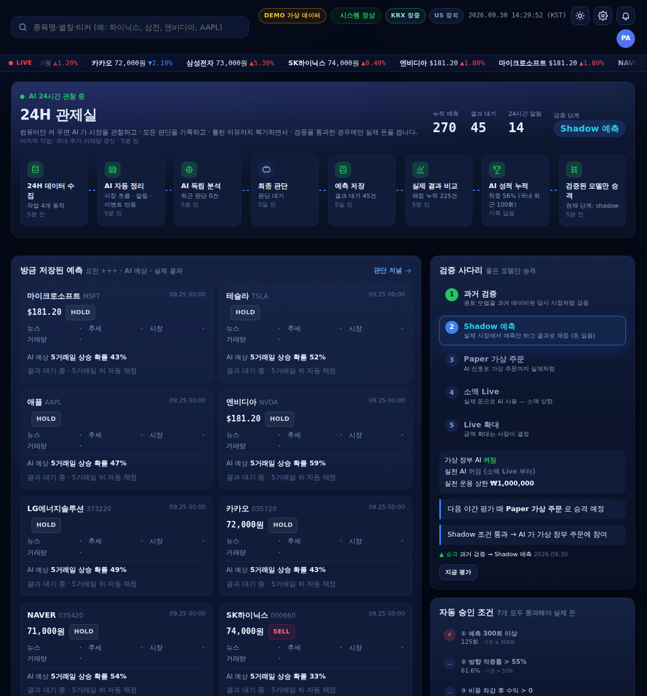

**24H 관제실** (메뉴 두 번째)은 흐름을 한 화면에 보여준다.

- **흐름**: 수집 → 정리 → 독립 분석 → 최종 판단 → 예측 저장 → 실제 결과 비교 → 성적 누적 → 승격.
  - 단계마다 마지막 실행 시각과 상태가 표시된다.
- **방금 저장된 예측**: 종목, 현재가, 요인(뉴스·추세·시장·거래량·해외 연동 `+++`/`−−`), AI 예상, 실제 결과를 카드로 보여준다.
  - AI 예상 형식: "5거래일 상승 확률 68% · 예상 +1.8%".
  - 채점되면 적중 ✔ / 빗나감 ✘ 가 붙는다.
- **24시간 작업표**: 작업마다 주기, 마지막 실행, 다음 실행, 상태.

### 예측 성적표 — "10개 중 3개"가 아니라 돈으로
최근 100회(종목·날짜별 마지막 판단 하나씩)를 다음 기준으로 본다.
- 방향 적중률
- 평균 기대수익과 평균 실제수익
- 비용 차감 후 신호 수익
- MDD: 신호를 매일 1/기간씩 나눠 따른 겹침 포트폴리오 기준
- 확률 보정: Brier Skill, ECE, 보정 곡선
- 국면별 적중률

틀린 예측에는 이유(충돌 중 소수 의견이 맞음 / 과신 / 이벤트 쇼크 등)가 자동으로 붙는다.

기대수익은 AI 가 따로 말한 숫자가 아니다. 합의 확률과 최근 변동성에서 계산한다: `σ·√h·Φ⁻¹(p)`. 화면에도 그렇게 적었다.

미국 예측도 이제 채점된다. 전에는 저장만 되고 채점되지 않던 문제를 고쳤다.

### 검증 사다리 — 자동 승인 · 자동 강등
단계는 `과거 검증 → Shadow → Paper → 소액 Live(20만원) → Live 확대` 이고, 한 번에 한 칸씩만 올라간다.

- **소액 Live 조건**: 아래 7개를 모두 통과해야 한다. 기준은 미리 고정했다.
  - ① 예측 300회 이상
  - ② 방향 적중률 55% 초과
  - ③ 비용 차감 후 수익 > 0
  - ④ 확률 보정: BSS > 0, ECE ≤ 5%
  - ⑤ 최대 손실 제한
  - ⑥ 최근 30일에도 성능 유지
  - ⑦ 국면 2개 이상에서 각 50% 이상
- **실제 돈의 추가 조건**: `.env` 에 사람이 미리 동의해 둔 경우에만 쓴다 (`QUANT_LIVE_ENABLED` + 확인 문구). 동의가 없으면 "준비됨" 알림만 보낸다.
- **강등**: 아래 중 하나면 즉시 Shadow 로 내려가고, 14일 동안 재승격하지 않는다.
  - 최근 50회 적중률 50% 미만
  - 최근 30일 수익 < 0
  - 보정 붕괴
  - 실전 낙폭 −10% 초과
  - HALTED
- **Live 확대**: 자동으로 하지 않는다. 금액은 사람이 정한다.
- **실제 돈 계좌의 AI**: 설정과 무관하게 사다리 '소액 Live' 이상일 때만 쓴다 (안전장치).
- **LLM 과거 검증을 하지 않는 이유**: LLM 은 학습 데이터에 미래가 섞여 있어 과거로 공정하게 시험할 수 없다. 그래서 과거 검증은 퀀트 모델만 하고, LLM 은 Shadow 부터 시작한다.

### 실시간 알림 (토스트 · 알림센터 · 데스크톱 · 소리)
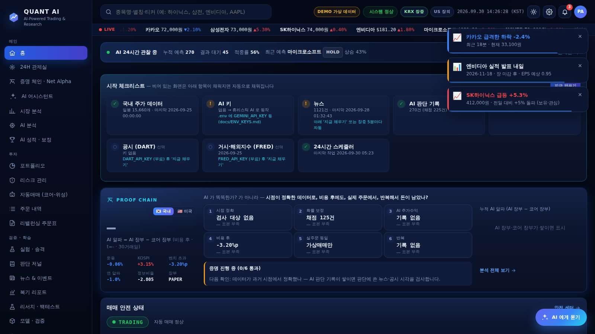

- **급등·급락**: 장중 2.5분마다 확인한다. 대상은 보유·관심·코어 종목이다.
  - 전일 대비 ±3/5/10% 돌파.
  - 20분 안 ±2% 급변.
  - 시세 출처: 국내는 네이버, 미국은 Yahoo 실시간(지연 가능). 표시·알림 전용이고 매매는 증권사 시세만 쓴다.
- **그 밖의 알림**: 새 AI 신호(방향이 바뀐 BUY/SELL), 새 공시, 중요 뉴스, 이벤트 재분석, 예측 채점 결과, 실적 발표 D-1·당일, 자동 정지/해제, 승격·강등, 시장 RISK ON/OFF 전환, 작업 연속 실패.
- **화면**
  - 오른쪽 위에 토스트가 뜬다. 누르면 해당 화면으로 가고, 마우스를 올리면 멈춘다.
  - 종 아이콘에 안 읽은 개수가 표시되고, 누르면 알림센터가 열린다.
  - 설정에서 종류별로 켜고 끌 수 있다. 창이 가려져 있을 때의 데스크톱 알림과 알림음도 여기서 켠다.
- **외부 알림(텔레그램 등)**: 보유 종목 ±5%, 자동 정지, 강등만 보낸다.
- **실시간 가격**: 화면 위 LIVE 티커와 관심 종목·종목 화면의 가격이 오르면 빨강, 내리면 파랑으로 깜빡인다.

### 24시간 AI 학습 순서
- 실시간: 데이터 수집, 급등락 감시.
- 매시간: 시장 재분석 (RISK ON/OFF 흐름 기록).
- 새 뉴스·공시가 뜨면: 해당 종목을 즉시 재분석한다.
  - 무료 한도 보호를 위해 종목당 3시간에 1회, 하루 20회까지만 한다.
  - 같은 날 여러 번 판단해도 성적표에는 마지막 하나만 센다.
- 장 종료: 채점과 복기.
- 야간: 후보 모델 학습·백테스트, Shadow 평가, 검증 사다리.
- 다음 날: 검증된 것만 적용한다. 장중에 모델 자체를 바꾸지 않는다.

### AI 역할 전문화
같은 재료를 서로 다른 눈으로 본다. 성적표 호환을 위해 역할 이름은 그대로 두고 프롬프트만 바꿨다.
- **뉴스 AI**: 선반영과 중복 보도를 구분한다.
- **경제·시장 AI**: 금리·환율·VIX·해외 지수 연동을 본다.
- **공시·실적 AI**: 공시와 실적 이벤트를 본다.
- **차트·Quant AI**: 숫자 모델이다.
- **Risk AI**: 거부권을 가진다.

### 커뮤니티·SNS
- 출처: StockTwits(미국, 글쓴이의 Bullish/Bearish 표시), 네이버 종목토론방(국내, 제목 감성).
- 대상과 주기: 보유·관심 종목만, 30분마다.
- 뉴스 테이블과 섞지 않는다. 그래서 퀀트 모델 피처가 오염되지 않는다.
- AI 에게는 "참고 · 신뢰도 낮음 · 과열은 역지표일 수 있음"으로만 전달하고, 종목 화면에도 그렇게 표시한다.

## 8-3. 요청 28개 + 추천 8개 (v12)

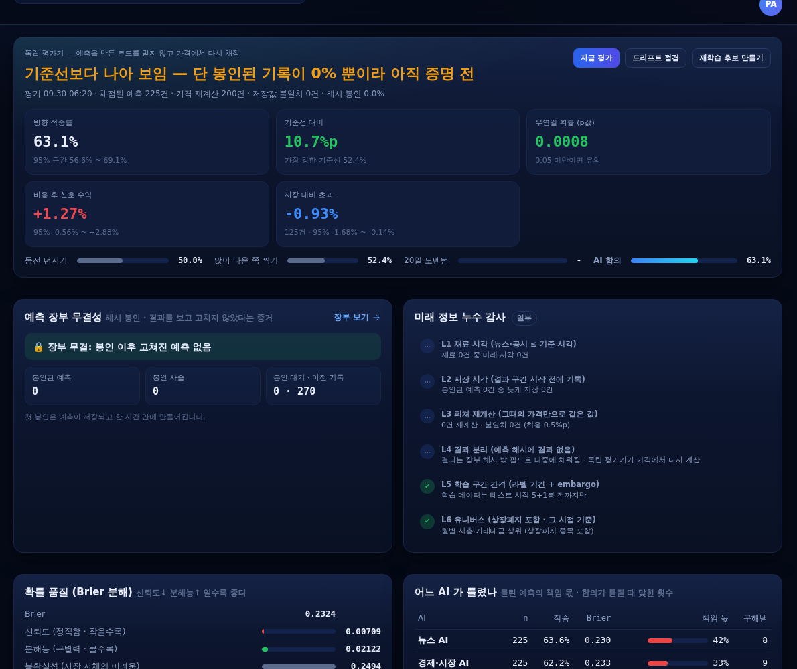

**"검증됨"의 조건** (독립 평가기): 기준선보다 유의하게 나음(p<0.05) + 장부·누수 무결성 통과 + 저장값 불일치 1% 미만 + **평가 대상의 절반 이상이 해시 봉인된 기록**. 봉인 이전 기록뿐이면 성적이 좋아 보여도 "아직 증명 전"으로 표시한다 (위 화면이 그 경우).

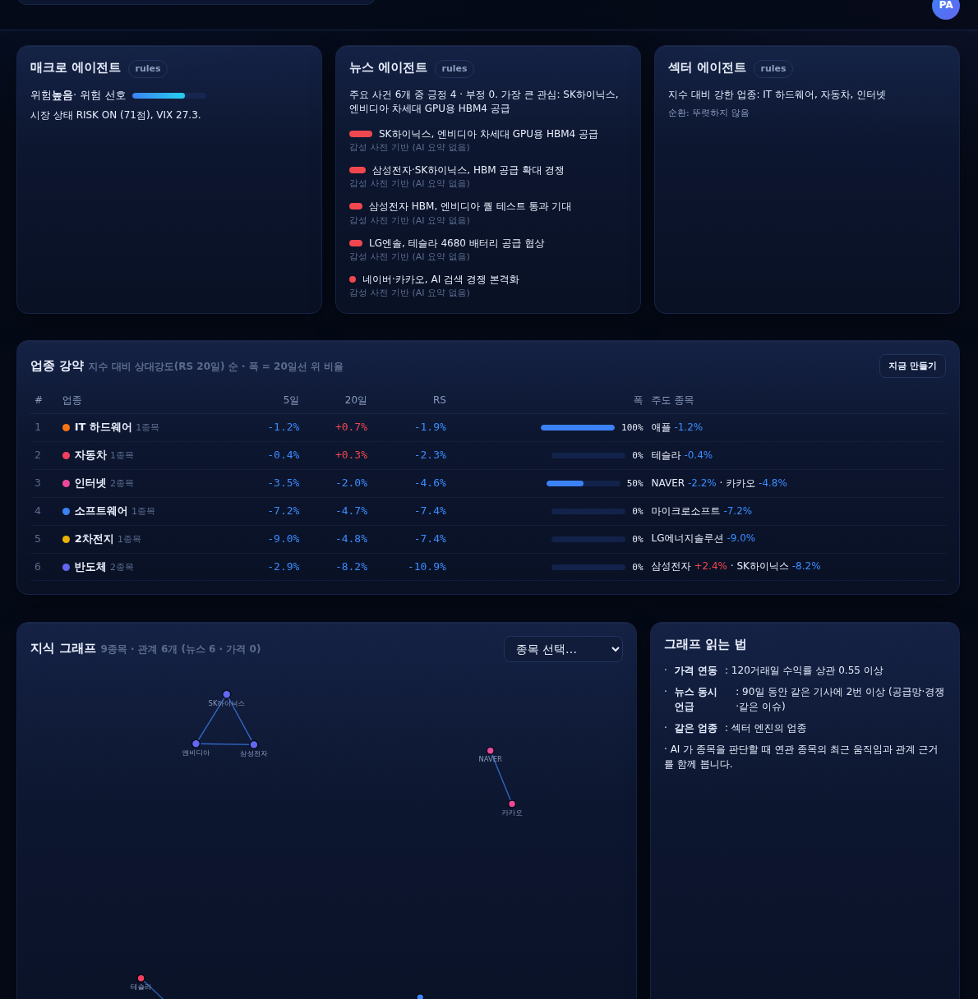

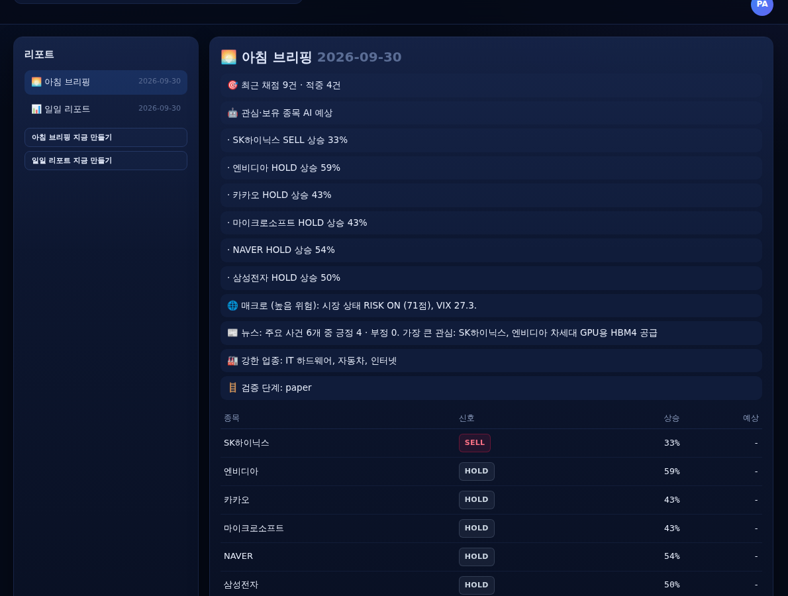

### 🔴 P0 — 반드시 먼저

| # | 항목 | 상태 | 어디에 |
|---|---|---|---|
| 1 | Prediction Ledger | ✅ 새로 만듦 | `review/ledger.py`: 예측을 저장하는 순간 **저장 시각 + 내용 해시**, 매시간 **해시 사슬 봉인**. 고치거나 지우거나 끼워 넣으면 검증실에 바로 드러난다. 마지막 봉인 해시는 일일 리포트와 함께 텔레그램으로 나간다 → 외부 증거 |
| 2 | 실제 결과 자동 매칭 | ✅ 강화 | `review/outcomes.py`: 예측마다 1·5·20 거래일 결과 + 시장(KOSPI/SPY) 대비 초과수익. 미국 예측도 채점 |
| 3 | 독립 Evaluator | ✅ 새로 만듦 | `review/evaluator.py`: 저장된 채점을 믿지 않고 가격에서 다시 계산 · 기준선 3개(동전·많이 나온 쪽·모멘텀) · Wilson 95% · 이항 검정 p값 · 부트스트랩 구간 · Brier 분해 |
| 4 | Walk-forward Backtest | ✅ 기존 | 라벨 기간 + embargo 간격, 매 20일 재학습, 비용 2배 스트레스, DSR. 누수 감사 L5 가 embargo 를 확인 |
| 5 | Look-ahead/Leakage 검사 | ✅ 새로 만듦 | `review/leakage.py` L1~L6: 재료 시각 · 저장 시각 · **피처 재계산**(그때의 가격만으로 다시 계산해 비교) · 결과 분리 · embargo · 생존편향 |
| 6 | 비용 + 슬리피지 | ✅ 강화 | 수수료·세금·고정 슬리피지에 **시장 충격(제곱근 법칙)** 추가: 계수 × 변동성 × √(주문금액/평균 거래대금), 상한 150bp. 실측 슬리피지 통계는 기존 |
| 7 | Risk Engine | ✅ 강화 | 기존 한도(비중·총노출·일손실·주문 수·유동성·VaR)에 **업종 한도 40%** 추가 |
| 8 | Position Sizing | ✅ 강화 | 위성은 보정된 확률의 **반켈리**로 크기를 정한다 (p=0.60 이상이면 상한, 0.55 면 절반, 0.50 이하는 안 산다). 코어는 검증된 동일 비중 유지 |
| 9 | Shadow Trading | ✅ 기존 | SHADOW 모드 · AI 섀도 · 가상 장부 3개 |
| 10 | 자동 성능 강등 | ✅ 기존 + 강화 | 사다리 강등 + champion 롤백. 이제 **장부·누수 무결성 실패**도 승격을 막고 실전은 강등 |

### 🟠 P1

| # | 항목 | 상태 | 어디에 |
|---|---|---|---|
| 11 | Market Regime Engine | ✅ 기존 | 국면 · 노출 배수 · 시장 흐름(매시간) |
| 12 | Confidence / Calibration | ✅ 기존 + 강화 | Platt 보정 · PIT 보정기. 이제 Brier 분해(신뢰도·분해능·불확실성)와 보정 곡선을 함께 본다 |
| 13 | Champion / Challenger | ✅ 기존 | 게이트 → Shadow 전진 검증 → champion · 자동 롤백 |
| 14 | Data Drift | ✅ 새로 만듦 | `engines/drift.py`: 피처 6개 · AI 확률 분포 · 기준율의 PSI (0.1 주의 · 0.25 큰 변화) → 알림 + 재학습 트리거 |
| 15 | Model Registry | ✅ 기존 + 강화 | 계보: 이유 · 부모 모델 · 학습 기간 · embargo · 학습 행 수 |
| 16 | Event-driven analysis | ✅ 기존 + 강화 | 새 공시·뉴스 → 즉시 재분석. 이제 **공시 원문 요약**까지 AI 가 본다 |
| 17 | Portfolio correlation | ✅ 기존 | 상관 묶음 · VaR 예산. 지식 그래프에 가격 연동 관계로도 쓰인다 |
| 18 | NO TRADE engine | ✅ 기존 | 거부권 · 의견 부족 · 충돌 · 약한 신호. 피한 손실 측정 |
| 19 | 예측 설명 / 오차 분해 | ✅ 새로 만듦 | 어느 AI 가 틀렸나(책임 몫 · 합의가 틀릴 때 맞힌 횟수) · 요인별 · 확신도별 · 국면별 · 충돌별 · 이벤트별 · 프롬프트 버전별 · 틀린 이유 분포 |
| 20 | Model versioning | ✅ 새로 만듦 | 모든 예측에 **모델·프롬프트·코드 버전**을 봉인. 프롬프트 문구가 바뀌면 버전 해시가 바뀐다 |

### 🟡 P2

| # | 항목 | 상태 | 어디에 |
|---|---|---|---|
| 21 | LLM News Agent | ✅ 새로 만듦 | 24시간 뉴스 사건 12개 → 영향 · 기간 · 영향 받는 종목/업종 · 선반영 여부 · 이유 (장중 매시간 1회 호출) |
| 22 | Macro Agent | ✅ 새로 만듦 | 금리·환율·유가·VIX·시장 상태 → 국면 해석 · 위험 수준 · 오늘 볼 것 |
| 23 | Sector Agent | ✅ 새로 만듦 | 업종 지도(Yahoo 업종 → 한국어) · 업종 강약(RS·폭·순위) · 순환매 해석. 종목마다 업종 재료 |
| 24 | Knowledge Graph | ✅ 새로 만듦 | 뉴스 동시 언급 · 가격 상관 · 같은 업종. AI 가 연관 종목 움직임을 보고, 화면에서 그래프로 본다 |
| 25 | 텔레그램/디스코드 | ✅ 강화 | 분당 20건 제한 · 10분 중복 방지 · 긴 글 나눠 보내기 · 텔레그램 서식 · 채널별 테스트 · 알림 종류별 전송 |
| 26 | 모바일 대시보드 | ✅ 새로 만듦 | 앱 설치(PWA) · 하단 탭 · 오프라인 화면 틀 · 웹 푸시 (docs/MOBILE.md) |
| 27 | 자동 일일 리포트 | ✅ 새로 만듦 | 16:10 KST 일일 리포트 + 평일 08:30 아침 브리핑 → HTML 저장 · 알림센터 · 텔레그램 · 푸시 |
| 28 | 재학습 후보 자동 생성 | ✅ 강화 | 트리거(드리프트 · champion 성과 하락 · 7일) → 변형 2개(로지스틱 750일 · 500일, GBM 선택) → 게이트 → Shadow |

### 추천 1~8

1. **종목별 알림 규칙**: 목표가 · 손절가 · 등락률 · 거래량 N배.
   - 한 번 울리면 꺼지거나, 매일 반복하도록 고를 수 있다.
   - 종목 화면에서 바로 추가할 수 있다 (+10% · −7% · ±5% · 거래량 3배 빠른 버튼).
2. **아침 브리핑**: 오늘 일정, 밤사이 미국, 어제 채점, 관심 종목 AI 예상, 매크로·뉴스·업종 요약.
3. **앱 설치 + 웹 푸시**
   - VAPID 서명과 RFC 8291 암호화를 직접 구현했다. 외부 서비스 가입은 필요 없다.
   - 휴대폰에서 받으려면 HTTPS 로 열어야 한다 (docs/MOBILE.md).
4. **KIS 실시간 체결 (웹소켓)**
   - 장중에만 연결하고, 최대 40종목을 본다. 3초마다 알림을 판단한다. 끊기면 다시 붙는다.
   - 표시·알림 전용이고 주문에는 쓰지 않는다.
5. **LLM 묶음 호출**
   - 기본 3종목을 한 요청에 묻는다. 분당 토큰이 작은 Groq 는 1(끔)이다.
   - 빠진 종목은 하나씩 다시 묻고, 묶음이 실패하면 전부 하나씩 다시 묻는다.
6. **공시 원문 AI 요약**: DART 원문에서 금액·비율·기간·상대를 뽑는다. LLM 이 없으면 숫자가 들어간 줄로 요약한다.
7. **외국인·기관 수급**: 5·20일 순매수, 연속 일수, 보유율. 체크리스트의 수급 항목이 실제 수급으로 바뀌었다.
8. **DB 자동 백업**: 하루 1개, 7개 보관, gzip 압축, 무결성 확인.

### 새 화면
- **검증실 · 예측 장부**: 독립 평가, 장부 무결성, 누수 감사, Brier 분해, 오차 분해, 드리프트, 모델 계보, 프롬프트 버전.
- **지식 그래프 · 업종**: 에이전트 3개 요약, 업종 강약 표, 전체·종목 중심 그래프.
- **리포트 · 브리핑**
- **종목 화면에 추가된 것**: 알림 설정, 수급, 연관 종목, 공시 요약.
- **설정에 추가된 것**: 앱 설치, 푸시, 텔레그램 테스트, 백업, 전체 규칙.

### 이번에 찾아 고친 문제
- **CSP 때문에 인라인 `onclick` 버튼이 동작하지 않던 문제**
  - 해당 버튼: 종목 화면 "AI 에게 묻기", "AI 한국어 요약", 홈 이벤트 클릭 등.
  - 원인: 브라우저 보안 정책(CSP)이 인라인 스크립트를 막았다.
  - 수정: `data-*` 속성과 위임 이벤트 방식으로 바꿨다.

## 8-4. V13 — "실제 시장에서 통하나" 를 가려내는 장치 (v13)

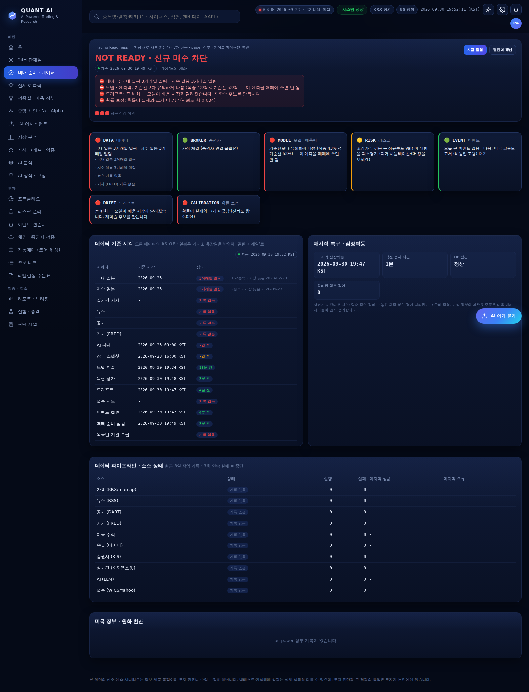

### 🔴 P0

| # | 항목 | 한 일 |
|---|---|---|
| 1 | Portfolio Risk Engine | 상관 행렬 · 업종 노출(WICS 우선) · 집중도(HHI·유효 종목 수) · VaR 7가지(과거 95/99 · ES · 정규 · Cornish-Fisher · EWMA · 10일) · 성분 VaR · 실제 위기 재생 스트레스(2008·2011·2018·2020·2022·2024-08) + 가정 시나리오 · 유동성 조정 VaR · **주문 전 사전 게이트**(넣은 뒤 업종·묶음·VaR 한도를 넘으면 수량 축소) · Risk-of-Ruin(블록 부트스트랩 1년) |
| 2 | Event Calendar 2.0 | 거래소 휴장일(XKRX·XNYS, 대체공휴일 포함) · 조기 폐장 · 새해 10시 개장 · KOSPI200 옵션 만기/동시만기 · 미국 옵션 만기/쿼드러플 위칭 · KOSPI200 정기 변경 · MSCI 리뷰 · FOMC · 고용 · CPI(FRED 공식 일정) · 수출입 · 실적 · 배당 · 공시 · 사용자 일정. 출처와 '추정' 여부 표시 |
| 3 | 모든 데이터 AS-OF | `2026-09-30 14:32 KST` 형식. 상단 '데이터 기준' 칩 · 화면별 기준 시각 칩. 일봉은 휴장일을 반영해 "N거래일 밀림" 으로 |
| 4 | Trading Readiness Engine | DATA · BROKER · MODEL · RISK · EVENT · DRIFT · CALIBRATION. 빨강이 하나라도 있으면 NOT READY → **live·shadow 장부 신규 매수 차단**(매도는 항상 허용) |
| 5 | KIS 모의투자 검증 | 8단계 스위트: 설정 → 토큰 → 잔고·장부 대조 → 시세·호가 정합성 → 지연 → 주문·조회·취소 → (선택) 1주 실제 체결 → 웹소켓 접속키. 결과가 BROKER 관문으로 |

### 🟠 P1

| # | 항목 | 한 일 |
|---|---|---|
| 6 | WebSocket 호가 | KIS H0STASP0 10단계 호가 (보유 상위 10종목) |
| 7 | 실측 Slippage | 고정분 + 계수×σ×√(주문/거래대금) 로 분해 · 표본 가중 수축 · 50건부터 비용 모델에 자동 반영 |
| 8 | Execution Simulator | 호가 잔량을 한 단계씩 먹는 체결가 · 지정가 부분체결 · 지연 비용 · 비용 분해. 섀도 장부가 사용 |
| 9 | Position Sizing | 반켈리 · 변동성 목표 · 종목 한도 중 최소 × 이벤트 배수 × 준비 상태 배수 |
| 10 | Entry Zone | 진입 구간 + '추격 금지 가격'(비용 후 기대수익 0 이 되는 가격) |
| 11 | Invalidation | 가격(2 ATR · 10일 저점) · 시간 · 판단 · 이벤트. **예측과 함께 해시 봉인** — 결과를 보고 손절선을 못 고친다 |
| 12 | Stress Test | P0-1 에 포함 |
| 13 | Risk-of-Ruin | P0-1 에 포함 |
| 14 | Model decay | CUSUM + 추세 + 두 비율 검정 · 모델 나이별 적중 · 우위 반감기 (모의실험: 안정 시 오경보 2% · 17%p 하락 검출 83%) |
| 15 | Data drift | PSI + KS 검정 · 결측률 · 이력 30회 |
| 16 | Event impact attribution | 이벤트 날 지수 변동폭 ÷ 평소 · 종목 이벤트 비정상 수익률(t 값) · 예측 오차 중 이벤트가 낀 비율 |

### 🟡 P2

| # | 항목 | 한 일 |
|---|---|---|
| 17 | 옵션 데이터 | 미국: ATM IV · 예상 변동폭 · 실적 내재 변동 · 스큐 · 풋/콜 · 맥스 페인. 국내는 무료 데이터 없음 (화면에 표시) |
| 18 | 수급 강화 | 60일 · z점수 · 누적 매집 곡선 · 가격-수급 괴리(매집/분산) · 수급→5일 수익 상관 |
| 19 | Sector rotation | RRG (RS-Ratio × RS-Momentum, 8주 궤적) |
| 20 | Earnings surprise model | 베타-이항 P(상회) · 상회/하회 반응 비대칭 · 발표 후 표류 · 옵션 내재 변동 |
| 21 | Alternative data | 위키백과 조회수(키 불필요) · 네이버 데이터랩(선택) → 관심 z점수 |
| 22 | NLP 이벤트 추출 | 20개 유형 · 금액(억·조·달러) · 상대방 · 시총 대비 중요도 (규칙 기반 → 재현 가능) |
| 23 | 종목별 Knowledge Graph | 관계 종류(공급망·경쟁·협력·인수합병·소송) + 근거 기사 · 2단계 연결 · 급등락 전파 |
| 24 | 개인 저널 vs AI | 내 판단도 봉인·채점 · 같은 종목 AI 와 짝지어 비교 · 확신도 보정 · 습관 경고 |

### 로드맵 1~6 (v12 제안)

| # | 항목 | 한 일 |
|---|---|---|
| 1 | 실측 슬리피지 → 계수 보정 | P1-7 |
| 2 | 묶음 호출 A/B | 약 20% 를 하나씩 물어 비교 → 유의하게 나쁘면 묶음 크기 자동 절반 |
| 3 | 공식 업종 | WICS 10개 대분류 (와이즈인덱스, 키 불필요) 우선 |
| 4 | 원화 환산 성과 | 달러 수익 · 환율 · 원화 수익 분해 |
| 5 | 장부 외부 공증 | OpenTimestamps(무료) → 표준 `.ots` 파일 · 선택: GitHub Gist |
| 6 | 호가 스트림 | P1-6 |

그 밖에: **재시작 복구**(심장박동 · 멈춘 작업 정리 · 놓친 채점·봉인·평가 따라잡기 · DB 점검) · 데이터 소스 상태.

### 실제 시장 예측력 — 증거 세 층

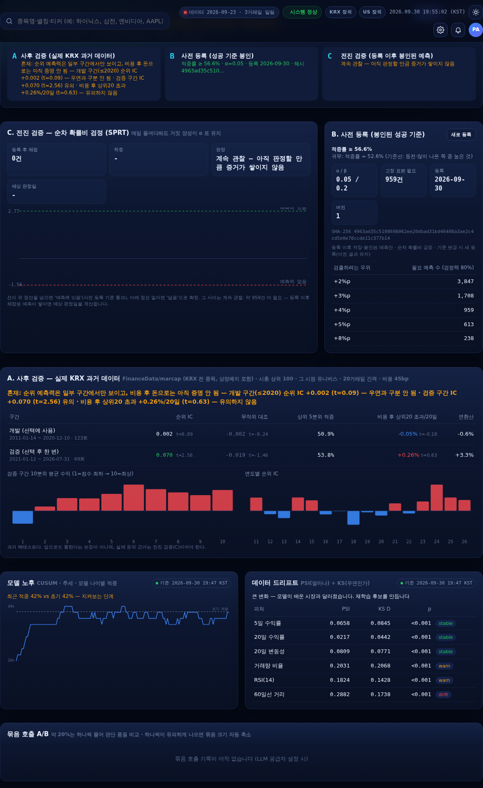

- **A. 사후 검증** (실제 KRX 2010~2026, 상장폐지 포함, 시점 기준 시총 상위 100): 코어 점수의 20일 순위 예측력
  - 개발 구간(2011~2020) IC **+0.002 (t=0.09)** — 우연과 구분되지 않음
  - 검증 구간(2021~2026-07) IC **+0.070 (t=2.56)** — 유의. 무작위 대조군 −0.019
  - 비용 후 상위 20 초과수익 +0.26%/20일 (**t=0.63**) — 유의하지 않음
  - 판정: **"혼재"** — 순위 예측력은 일부 구간에서만 보이고, 비용 후 돈으로는 아직 증명되지 않았다
- **B. 사전 등록**: 성공 기준(적중률 ≥ 기준선 + 4%p, α=0.05, β=0.2)을 결과를 보기 전에 해시로 봉인
- **C. 전진 검증**: 등록 이후 봉인된 예측만으로 SPRT. 매일 봐도 거짓 양성이 α 로 유지된다. **이것만이 실제 돈의 근거**

### 직접 써 본 결과 (실제 KRX 데이터 · 네트워크 없는 환경)

실제 KRX 데이터(162종목 · 2023-09~2026-09-23)로 서버를 띄우고 모든 화면을 직접 써 봤다.
- **모델 학습**: 5일 ML 모델이 게이트 탈락 (IC −0.004 · Sharpe −0.87) → 챔피언 없음. 시스템이 올바르게 거부.
- **AI 판단 재생 3,000건** (오프라인 휴리스틱, 120거래일): 적중 **43% < 기준선 53%**
  - 이 경우를 위해 독립 평가기에 **"기준선보다 유의하게 나쁨"** 판정을 새로 넣었다.
  - 전에는 "우연과 구분 안 됨" 으로만 보였다. 이제 MODEL 관문이 빨강이 된다.
- **매매 준비 = NOT READY**. 네 관문이 빨강이다.
  - DATA: 일봉 3거래일 밀림 (추석 연휴 뒤 데이터 미갱신이 정확히 잡힘)
  - MODEL: 예측이 기준선보다 나쁨
  - DRIFT: 60일선 거리 PSI 0.29
  - CALIBRATION: 신뢰도 항 0.034
- **가상 장부 20종목** (코어 전용)
  - 1일 VaR95 2.2% · ES 3.8% · 초과 첨도 5.9 → '두꺼운 꼬리' 경고
  - 2024-08 블랙먼데이 재생 −10.5%
  - 1년 −20% 낙폭 확률 12%
- **이벤트 영향 (실측 KOSPI)**
  - 미국 고용 발표 다음 날 변동폭: 평소의 2배
  - FOMC 다음 날 변동폭: 평소의 0.58배
- **리플레이 예측은 전진 검증(C)에 세지 않는다.** 등록 이후 0건 → "계속 관찰". 사후에 만든 예측을 증거로 쓰지 않는다.

### 이번 사용 중 찾아 고친 문제

- **재시작 복구가 채점을 빠뜨림**: 따라잡기가 결과 매칭만 하고 복기·채점(review)을 건너뛰었다 → 추가.
- **실측 체결 0건일 때 슬리피지 보정 화면이 멈춤** (verdict 키 없음) → 수정.
- **매매 계획이 신호를 무시**: 합의가 HOLD 인데 "매수 가능 · 10%" 로 보였다 → BUY 가 아니면 "산다면 참고용" 으로 표시하고, 주문 가능 여부에 신호를 반영.
- **종목 화면의 새 패널이 외부 종목 정보가 늦으면 안 뜸** → 따로 불러오게 분리.
- **내 저널 해시가 DB 왕복 뒤 달라짐** (SQLite 가 시간대를 버림) → 모든 기록이 '수정됨' 으로 보이던 문제. UTC 로 맞춰 해시.
- **모델 노후 오경보**: 안정적인 데이터에서도 '노후' 판정 → 두 비율 검정을 함께 요구하고 모의실험으로 문턱 보정 (오경보 2%).
- **휴장일 반영**: 2026-09-24(추석 전날)를 거래일로 가정한 기존 테스트가 있었다 → 실제 거래일로 수정.

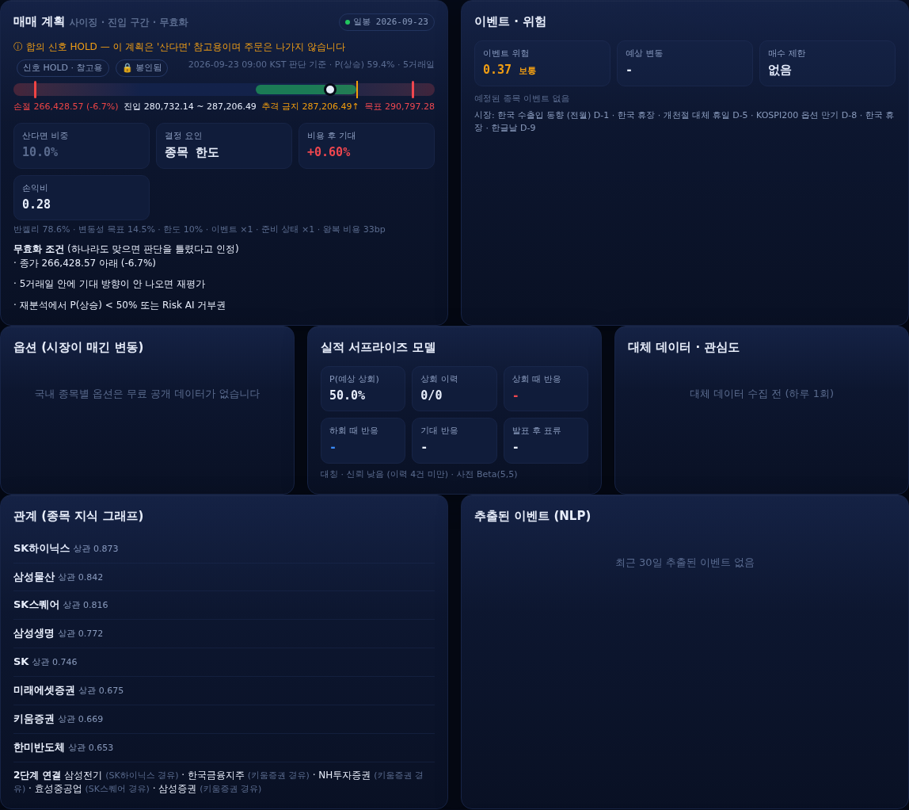

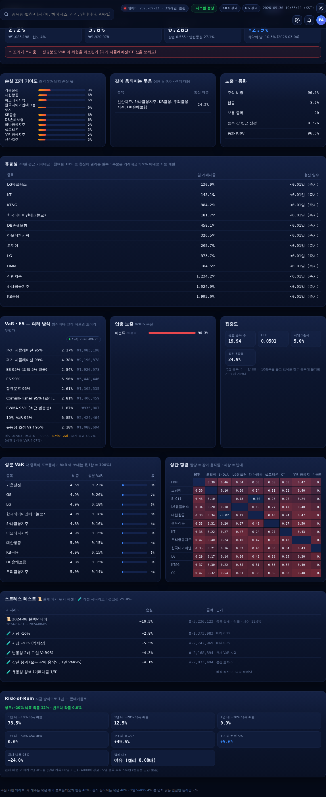

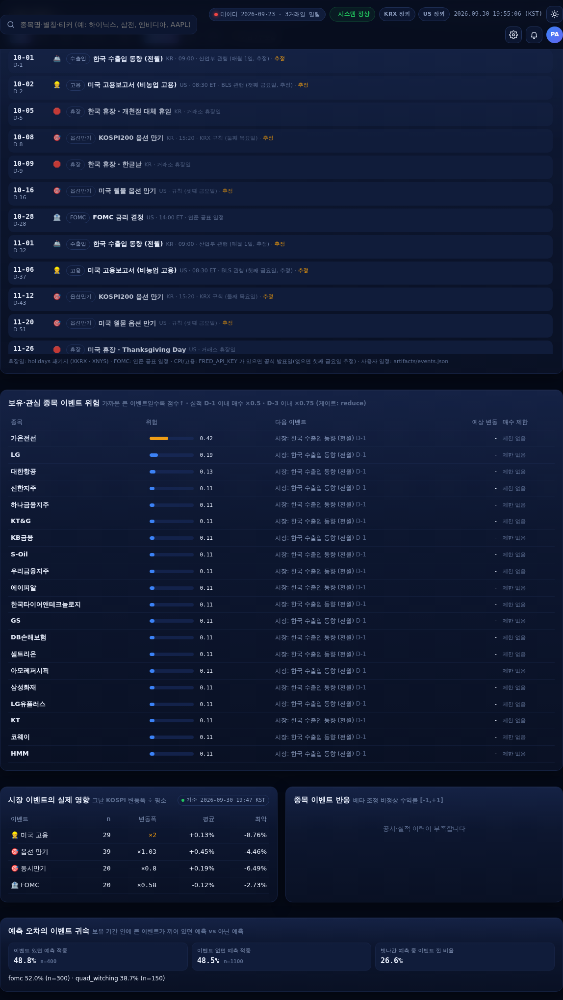

## 8-5. V14 — AI 를 더하기 전에 "사실" 부터 (Truth Center · 완성 기준 · 사용자 화면)

요청: "AI 를 더 넣기 전에 Market Clock + Data Truth + Event Truth + Broker Truth + Portfolio Risk + Execution Truth".

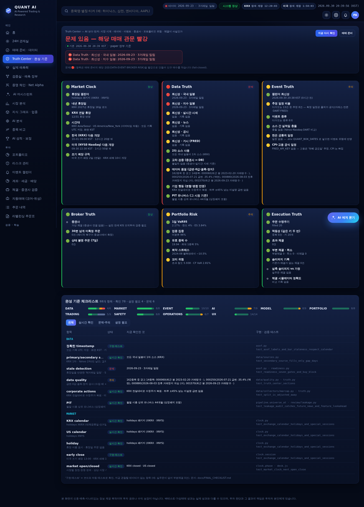

### 6개 Truth — 확인 결과가 매매 관문으로 이어진다

| Truth | 확인하는 것 | 🔴 이면 |
|---|---|---|
| Market Clock | 휴장일 캘린더 로드 · 내년 휴장일 · 연말 휴장 · 시간대 · 다음 개장/폐장 · 조기 폐장 | EVENT 관문 빨강 (캘린더가 없으면 주말만 쉬는 것으로 계산돼 휴장일에 주문할 수 있다) |
| Data Truth | 데이터별 최신성(거래일 기준) · 2차 소스 사용량 · 증권사↔DB 교차 검증 · 품질 재검사 · 미수정 분할(±45%) · PIT 유니버스 | DATA 관문 빨강 |
| Event Truth | 캘린더 유무·나이(26시간) · 추정 비율 · 종류 누락 · 소스 간 실적일 충돌 · 금통위 · FRED 공식 일정 | EVENT 관문 빨강 |
| Broker Truth | 연속 실패 · KIS 검증 스위트 · 잔고 대조 · 웹소켓 · 30분 넘은 미확정 주문 · 상태 불명 주문 | BROKER 관문 빨강 |
| Portfolio Risk | VaR95 · 업종 집중 · 유효 종목 수 · 스트레스 · 꼬리 | RISK 관문 빨강 |
| Execution Truth | 주문 수명주기 · 멱등성(같은 키 두 번) · 초과 체결 · 부분 체결·취소 · 슬리피지 기록 · 실측 vs 가정 · 시뮬레이터 정확도 | BROKER 관문 빨강 |

- **Fail-closed**: 매매 준비 기록이 없거나 2시간 넘었거나 다른 장부 기준이면 주문 직전에 다시 점검한다. 점검 자체가 실패해도 신규 매수를 막는다. Truth Center 가 실패하면 DATA 관문이 빨강이다.
- **1차/2차 소스**: KRX(marcap)가 늦으면 Yahoo `.KS/.KQ` 로 **1차 마지막 날 이후의 빈 날만** 채운다. 겹치는 날 종가 비율로 수정주가 기준을 맞추고, 겹치는 날들의 비율이 2% 넘게 흔들리면(분할·오류 의심) 채우지 않는다. 1차가 갱신되면 같은 날을 1차 값·출처로 덮어쓴다.
- **감시견**: `./run.sh` 가 스케줄러를 감시견 아래에서 띄운다. 프로세스가 죽거나 심장박동이 5분 넘게 멈추면 다시 띄운다 (10초 → 최대 10분 백오프, 알림). 다시 뜬 스케줄러는 놓친 일을 따라잡는다.
- **Purged walk-forward 를 테스트로 증명**: 학습 표본의 마지막 행과 예측일 사이가 항상 horizon + embargo 이상인지 실제 백테스트를 가로채 확인한다.
- **도전자(challenger) 모델 테스트 추가**: 조용히 채점만 되고 Shadow 게이트(기간·정확도·MDD)를 통과해야만 챔피언이 된다.

### 완성 기준 체크리스트 — 88개 항목, 항목마다 구현 위치 · 검증 테스트 · 지금 상태

`docs/FINAL_CHECKLIST.md` (코드에서 생성, 테스트가 문서와 코드가 같은지 확인). 대시보드 **Truth Center → 완성 기준** 에서 실시간 상태를 본다.

실데이터(KRX 162종목, 2026-09-23 까지)로 확인한 결과:

| 영역 | 실시간 확인 | 구현·테스트 | 설정 필요 | 주의·문제 |
|---|---|---|---|---|
| DATA | 3 | 1 | – | 품질 경고 14종목 · **일봉 3거래일 밀림 (문제)** |
| MARKET | 7 | 1 | – | – |
| EVENT | 5 | 5 | – | – |
| AI | – | 7 | – | 드리프트 큼 · 전진 평가 "기준선보다 나쁨" |
| MODEL | – | 8 | – | 챔피언 없음 (후보가 게이트 탈락) |
| PORTFOLIO | – | 8 | – | – |
| TRADING | 2 | 3 | KIS · 웹소켓 · 호가 · 잔고 대조 | – |
| SAFETY | 3 | 5 | – | – |
| OPERATIONS | 1 | 5 | – | 스케줄러가 꺼져 있어 심장박동 51분 전 |
| UX | 2 | 12 | – | – |

문제 항목이 그대로 보이는 것이 정상이다 — 데이터가 밀려 있고 AI 가 기준선보다 못하니 **지금 이 DB 로는 NOT READY 가 맞다.**

### 사용자 화면

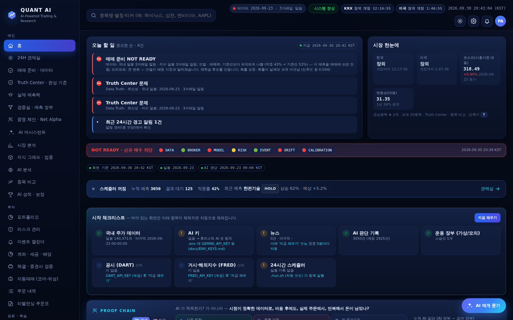

| # | 요청 | 한 일 |
|---|---|---|
| 1 | 종목 검색 → 올인원 종목 페이지 | 기존 종목 페이지에 **왜 BUY/SELL/HOLD/NO TRADE** · 내 보유 · 과거 적중률 · 관심 ★ · 비교 버튼 추가 |
| 2 | 시장 장중/장외/휴장 실시간 | 상단 시장 시계. 1초마다 줄어드는 "개장/폐장까지" · 휴장이면 이름 · 누르면 Truth Center. 모바일에서도 보임 |
| 3 | 실적·공시·경제지표 D-Day | 이벤트 캘린더(v13) + 오늘 할 일에 보유·관심 종목의 D-3 이내 일정, 시장 큰 이벤트 D-1 |
| 4 | 모든 데이터 기준 시각 | AS-OF 칩(v13) + Truth Center 가 데이터별 기준 시각을 사실 점검 |
| 5 | AI BUY/HOLD/SELL/NO TRADE + 이유 | 봉인된 판단 그대로 설명: 한 줄 결론 · 찬성/반대 근거(영향 = 가중치 × 확률의 치우침) · 막은 것 · 무엇이 바뀌면 · 무효화 가격 |
| 6 | 차트 + AI 매수/매도 구간 | 캔들 위에 진입 하단/상단 · 손절 · 목표 · 추격 금지 선 + 과거 AI BUY/SELL 표시. HOLD 면 "산다면 참고용" 이라고 표시 |
| 7 | 뉴스/공시 자동 요약 | 기존 DART 원문 요약 · 뉴스 이벤트 추출 (v12·v13) |
| 8 | 보유종목 ↔ 종목 페이지 | 시스템 장부(paper·shadow·live) + 사용자가 입력한 계좌 보유를 한 표로 (평단·평가·손익) |
| 9 | 관심종목 | ★ 별표 (단축키 s). 별표 종목은 최근 본 종목과 별도로 유지되며 매일 AI 판단·알림 대상 |
| 10 | 가격/AI/뉴스 알림 | 종목별 알림 규칙 (v12) |
| 11 | 오늘 할 일 | 긴급 정지 · NOT READY · Truth 문제 · 미확정 주문 · 보유/관심 종목 일정 · AI 신호 · 경고 알림 (중요한 순) |
| 12 | 시장 한눈에 | 한국·미국 장 상태 · 지수 · 변동성(VKOSPI 또는 대용) |
| 13 | 포트폴리오 위험도 | 리스크 2.0 (v13) + Truth Center 요약 |
| 14 | 종목 비교 | 2~4개 · 같은 기간 100 기준 차트 · 수익률 · 변동성 · 베타 · MDD · AI 신호 · 과거 적중 · PER/PBR · 상관 행렬 |
| 15 | 종목별 과거 AI 적중률 | 채점된 판단만 · 95% 구간 · "항상 상승" 기준과 비교 · 신호별 · 최근 10건 |
| 16~19 | 모바일 · 다크모드 · 단축키 · 최근 검색 | 모바일 하단 탭 버그 수정 · 다크/라이트(`d`) · `?` 단축키 목록 · 검색창을 누르면 최근 본 종목 10개 |

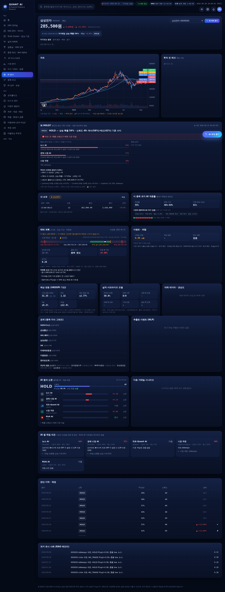

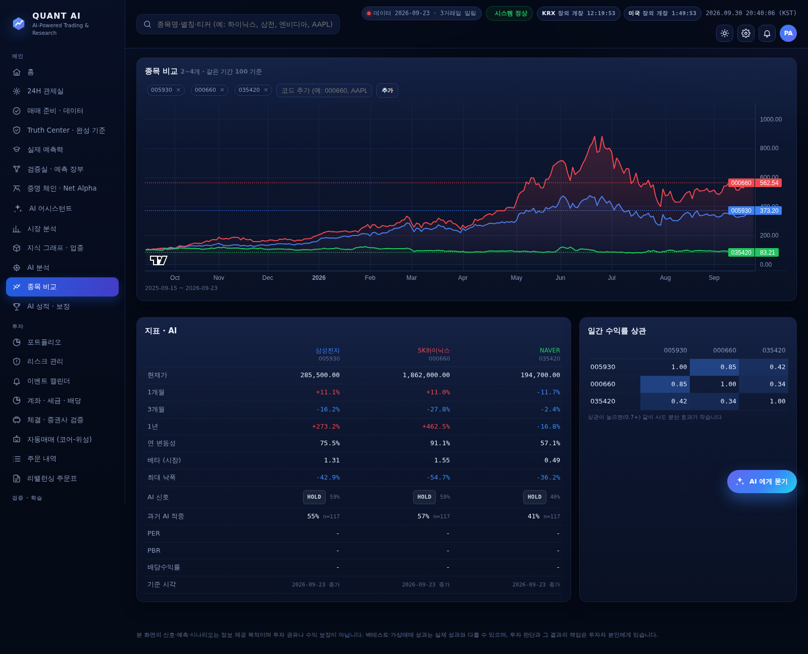

### 이번에 직접 써 보고 고친 것

- **모바일 하단 탭이 세로로 쌓여 화면 절반을 가림** (v11 부터): 전역 `nav` 세로 규칙이 탭바에도 적용됐다 → 가로로 고정.
- **"BUY 가 되려면: 상승 확률 +0.0%p"**: 확률은 이미 기준을 넘고 신뢰도만 모자란 경우 → 필요한 것만 표시 ("신뢰도 +6").
- **'시장 한눈에' 의 KOSPI 가 318**: 실제 지수가 아니라 marcap 으로 만든 "코스피(시총가중 대용)" 이었다 → 이름을 그대로 쓰고, 일봉은 "날짜 종가" 로 표기 (09:00 KST 로 보이던 문제).
- **종목 비교 원화 가격에 소수점** → 원화는 정수로.
- **기존 KIS 배관 테스트가 fail-closed 에 막힘**: 2020년 가짜 데이터라 NOT READY → 매수 0건. 안전장치를 끄지 않고, 배관 테스트만 게이트를 명시적으로 끄고, **게이트가 켜진 LIVE 경로에서 증권사에 매수 주문이 한 건도 가지 않는지** 따로 검증하는 테스트를 추가했다.
- 적중률 카드의 최근 10건이 대부분 빨강인 것은 버그가 아니라 실제 기록이다 (9월 초 하락 구간에서 상승 예측이 연속으로 틀림). 전체 117건 55% · 95% 구간 46~64% · "항상 상승" 기준 61% → **기준과 통계적으로 차이 없음.**

## 8-6. V15 — 요청 35개 대조 · 빠진 것 구현 · 직접 써 보고 고친 것

| # | 요청 | 상태 | 어디 |
|---|---|---|---|
| 1 | 종목 검색 → 올인원 종목 페이지 | ✅ 강화 | 섹션 이동 칩(차트·왜·보유·왜 샀나·사전 리스크·계획·뉴스·실적·알림) · 외부 자료를 기다리지 않고 기록부터 표시 |
| 2 | 장중/장외/휴장 실시간 | ✅ | 상단 시장 시계 (v14) |
| 3 | 실적·공시·경제지표 D-Day | ✅ 강화 | 종목 머리에 이벤트 캘린더 기준 D-day 띠 (종목 + 시장 큰 일정) |
| 4 | 모든 데이터 기준 시각 | ✅ | AS-OF 칩 (v13) |
| 5 | AI BUY/HOLD/SELL/NO TRADE + 이유 | ✅ | 왜 BUY/SELL (v14) |
| 6 | 차트 + AI 매수/매도 구간 | ✅ | 진입·손절·목표 선 (v14) |
| 7 | 뉴스/공시 자동 요약 | ✅ 새로 | **뉴스·공시 자동 요약**: 7일 건수·긍정/부정·톤 · 중요 헤드라인 · 공시 원문 요약 · 추출 이벤트 |
| 8 | 보유종목 연동 | ✅ | 내 보유 (v14) |
| 9 | 데이터 신뢰도/신선도 | ✅ 새로 | 종목별 **데이터 신뢰도 점수**: 기준일(거래일 밀림) · 1차/2차 출처 · 품질 · 거래정지 의심 · AI 판단 나이 |
| 10 | Pre-Trade Risk Gate | ✅ 새로 | 종목 페이지 **사전 리스크 게이트**: 실제 매매와 같은 RiskEngine·매매 준비·이벤트·포트폴리오 게이트로 "지금 사면?" 통과/축소/차단 (주문 없음) |
| 11 | 왜 매수했는지 / 왜 안 샀는지 | ✅ 새로 | 코어 순위·점수 · 상위 K 밖 · 거부 · 1주 가격 초과 · 코어 전용 · 주문/차단 기록으로 실제 매매 설명 |
| 12 | AI 성능 저하 자동 감지 | ✅ 강화 | **AI 별** 저하 감지 + 알림 · **일별 검정**으로 오경보 수정 (아래) |
| 13 | 관심종목 | ✅ 강화 | 홈 관심 종목에 ★ 탭 · 별표 종목 맨 앞 (별표가 홈에 반영되지 않던 문제 수정) |
| 14 | 가격/AI/뉴스 알림 | ✅ | 종목별 알림 규칙 · AI 신호 · 공시 · 뉴스 (v11~v12) |
| 15~19 | 오늘 할 일 · 시장 한눈에 · 포트폴리오 위험 · 비교 · 종목별 적중률 | ✅ | v13·v14 |
| 20 | 실적 Surprise | ✅ | 실적 서프라이즈 모델 + 국내 컨센서스 (v13·로드맵) |
| 21 | 기관/외국인 수급 | ✅ | 수급 카드 · 스마트머니 곡선 (v12·v13) |
| 22 | Sector Rotation | ✅ | RRG · WICS (v13) |
| 23 | AI/모델 Health | ✅ 새로 | **AI · 모델 Health** 화면: AI 별 전체/초기/최근 20일 적중 · 저하 · 기권률 · 멈춤 감지 · LLM 성공/실패/지연 · MODEL·DRIFT·CALIBRATION · 챔피언 · 전진 검증 |
| 24 | 자동 Watchdog | ✅ | v14 |
| 25~28 | 모바일/PWA · 다크모드 · 단축키 · 최근 검색 | ✅ | v11~v14 |
| 29 | 대시보드 커스터마이징 | ✅ 새로 | **홈 편집**: 묶음 숨기기·순서 (서버 저장 — PC·휴대폰 공통) |
| 30 | 사용자별 알림 설정 | ✅ 새로 | **외부 알림 설정**: 종류별 텔레그램/디스코드 · 웹 푸시 켜고 끄기 · **조용한 시간** (긴급은 예외) · 서버 저장 |
| 31 | 멀티 포트폴리오 | ✅ | 계좌 · 세금 · 배당 (일반·ISA·연금·해외 + 시스템 장부, 합산) |
| 32~35 | 자동 리포트 · Telegram/Discord/Push · 개인 저널 · AI 복기 | ✅ | v11~v13 |

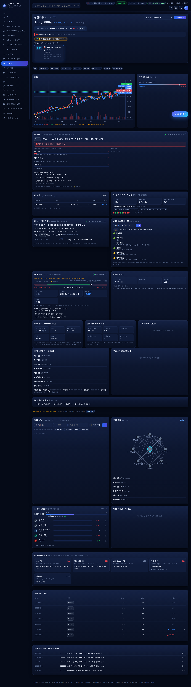

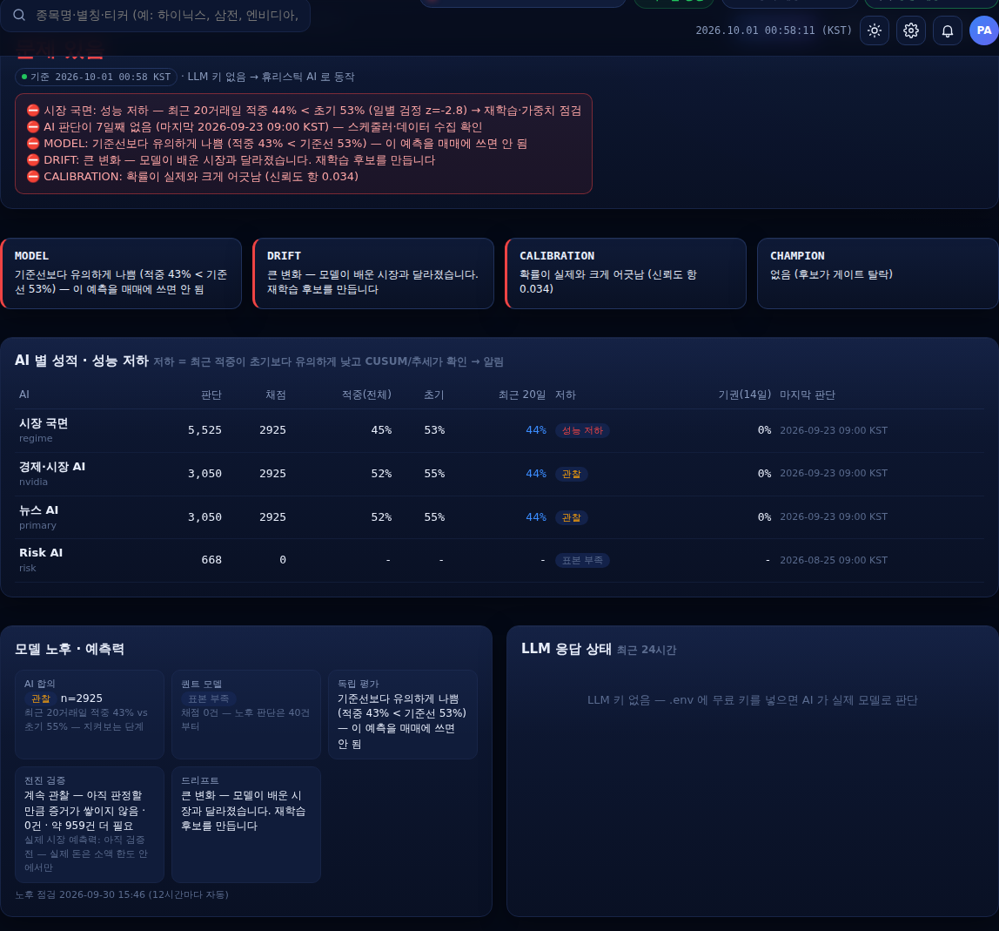

### 직접 써 보고 찾아 고친 문제

- **AI 성능 저하 감지가 거의 항상 '관찰' 경보** — 하루에 종목 100여 개를 판단하면 같은 날 판단들은 시장 방향을 함께 탄다 (나쁜 하루 = 100건 동시 오답). 기존 검정은 이를 독립 표본으로 봐서, 모의실험에서 **안정적인 AI 도 100% 경보**가 났다. 하루 여러 건이면 **일별 적중률**로 묶고 표준편차도 일별 값에서 추정하도록 바꿨다 → 안정인데 '저하' 1% 이하, 58%→45% 하락 검출 98% 이상 (모의실험 300회). 창도 '최근 1000건'(하루 100건이면 10일)에서 '최근 250일'로.
- **실데이터 결과**: 시장 국면 AI 가 초기 53% → 최근 20거래일 44% (일별 z=−2.8) 로 **성능 저하** 판정 · 알림. 뉴스·경제 AI 는 '관찰'.
- **이벤트 D-day 가 하루 어긋남** — 캘린더에 저장된 D-day 는 만든 날 기준이라, 자정이 지나면 최대 26시간 동안 "실적 D-1 매수 ×0.5" 와 매매 준비 EVENT 관문(오늘 FOMC 등)이 하루 늦게 걸렸다 → 주문·점검하는 날 기준으로 다시 계산 (회귀 테스트 추가).
- **DART 공시에서 이벤트를 못 뽑음** — 실제 보고서명은 "자기주식취득결정" 처럼 띄어쓰기가 없는데, 추출기는 "자기주식 취득" 만 찾았다 → 공백 무시 비교.
- **별표 관심종목이 홈 관심 종목 목록에 반영되지 않음** (v14) → 맨 앞 + ★ 탭.
- **AI Health 숫자가 판정과 모순** — '적중'이 최근 400건(약 4일), '최근 60'이 60건(하루도 안 됨)이었다 → 전체 · 초기 · 최근 20거래일(판정과 같은 숫자)로.
- **Risk AI 를 '판단 멈춤'으로 오탐** — Risk AI 는 경고를 낸 날만 기록한다 → 제외하고, 'AI 전체가 멈춤'과 '한 AI 만 멈춤'을 구분.
- **사전 게이트에서 같은 차단 사유가 두 번** 표시 → 정리.
- **외부 자료(프로필)가 늦으면 알림 규칙·관계·공시 카드까지 늦게 뜸** → 기록으로 먼저 표시.

## 8-7. V16 — Stock OS · 검증 가능한 AI · 데이터 OS · 장애가 나도 돈은 안전

> 요청 36개 + '신경써야 할 10개' + 20단계 비전을 코드로 대조했다. 새 모듈은 모두 **저장된 기록만** 읽는다 (화면이 느려지지 않게) —
> LLM 은 사용자가 누를 때(뉴스 AI 요약)만 쓴다.

### 🔴 최우선 1~10

| # | 요청 | 상태 | 어디 |
|---|---|---|---|
| 1 | 올인원 종목 페이지 | ✅ 재구성 | **Stock OS 헤더**(가격·장 상태·AI 상승확률·실적 D-n·뉴스 긍/중/부·최근 공시 3·수급·밸류에이션·위험·내 보유) → 차트 → 뉴스 → 공시 → 실적 → 재무 → 수급 → AI → Risk·주문 → 내 보유·논리. 섹션 숨기기·순서(⚙, 서버 저장) |
| 2 | 뉴스·공시 AI 요약 | ✅ | 뉴스 5~10개 · 톤 · **예상 영향 = 과거 같은 톤 뉴스 다음 날 평균 초과수익(n·오른 비율)** · 출처·시각 · 중요 공시 강조 · 규칙 요약 + **AI 요약 버튼**(3~5줄·톤·영향 −2~+2·지켜볼 점, 외부 텍스트의 지시문 무시) |
| 3 | D-Day | ✅ | 실적·배당·FOMC·CPI·NFP·옵션만기·네 마녀·지수 편입·금통위·공시 · `D-3`/`D-1`/`D-Day` (한국 날짜 기준) |
| 4 | 현재 상황 한 줄 | ✅ | 🟢 강세 / 🟡 관망 / 🔴 위험 + 장 상태 · AI · 이벤트 · 데이터 칩. 이 종목 자체 이벤트만 🔴, 시장 일정은 '관망' 사유 |
| 5 | 쉬운 AI 설명 | ✅ | "AI 3개 중 3개가 오른다고… 신뢰도 49 가 기준 55 미만… 뜻: 지켜보는 구간" |
| 6 | 차트 AI 정보 | ✅ | 매수 관심구간·목표·무효화 선 + **지지/저항**(120일 고·저점 군집, 횟수) + **뉴스(긍/부)·중요 공시·실적 발표 표시** |
| 7 | 실시간 신선도 | ✅ | 가격·뉴스·공시·AI·수급 "N초/분 전"(1초마다) · 기준 초과 경고 · 일봉은 휴장 반영 'N거래일 밀림' |
| 8 | 왜 거래하지 않았나 | ✅ | `#notrade`: 차단·축소·건너뛴 사이클·실행 안 된 AI BUY 를 Risk/이벤트/데이터/포트폴리오/유동성/HALTED… 로 분류 |
| 9 | 검색 ↔ 보유 연결 | ✅ | 헤더 '내 보유' 칸: 수량·평단·수익률·비중 (장부 + 내 계좌) |
| 10 | 시장 상태 고정 | ✅ | 상단 고정: 🇰🇷 KRX 장전 동시호가/장중/장후/휴장 · 🇺🇸 NASDAQ 프리마켓/장중/애프터마켓 · 다음 개장·폐장 |

### 🟠 11~20 · 🟡 21~30

| # | 요청 | 상태 | 어디 |
|---|---|---|---|
| 11 | Action Center | ✅ | `#action`: 확인할 종목 3 · 주의 이벤트 2 · AI 신호 변경 · 위험 증가 · 확인 필요 공시 + **오늘의 AI 브리핑 ①~⑤**(홈에도) |
| 12 | 관심종목 | ✅ | `#watch`: 그룹(새 그룹 만들기) · 국내/미국/ETF · 신호 변화 · 최근 검색은 검색창 |
| 13 | 알림 | ✅ 강화 | 목표가·AI BUY·**BUY→HOLD 해제**·급등락·**거래량 3배**·중요 공시·실적 D-1 · 투자 논리 목표/무효화/점검일 |
| 14 | 비교 | ✅ 강화 | + 성장률·선행 PER·ROE·영업이익률·수급·VaR·AI 적중/Brier/Alpha |
| 15 | 종목별 AI 성적표 | ✅ | `#scorecard/005930`: 최근 50/100/300 · 적중(95% 구간) · Brier · Brier Skill · Calibration · 실제 수익 · AI Alpha |
| 16 | 쉬운 포트폴리오 위험 | ✅ | 종목·업종 집중 · 현금 · 최대 위험 종목 · 예상 손실 · 스트레스 (말로 설명) |
| 17 | 실적 페이지 | ✅ | EPS 예상/실제 · 서프라이즈 · 매출 서프라이즈 · 발표 후 반응(시장 대비 1일·20일) · 가이던스(무료 소스 없음 — 그렇다고 표시) |
| 18 | 뉴스 → 종목 영향 | ✅ | 뉴스 '영향 분석': 관련 종목·업종 · 과거 유사 뉴스 평균 움직임 · 이번 뉴스 뒤 실제 · **AI 점수 74→79 · Risk LOW→MEDIUM** |
| 19 | AI Health Center | ✅ | Quant·뉴스·거시·공시 AI 타일 · 성능 저하 · 데이터 부족 · API 오류 · 자동 감시 |
| 20 | 자동 Watchdog | ✅ | **Sentinel** 5분: 데이터 수집·AI 작업·스케줄러·DB·증권사 → 나빠짐/회복 알림 |
| 21 | Thesis | ✅ | 왜 샀나 · 무엇이 틀리면 판다 · 목표 · 무효화 · 점검일 → 30분 감시·알림 · 수정 이력 |
| 22 | AI 복기 | ✅ | 예측 장부 결과(성공/실패) · 실패 연구 · 저널 실수 분석 |
| 23 | 비용 실측 | ✅ | `#validation`: 장부별 체결률·슬리피지(p90)·수수료·왕복 vs 가정 (가상/섀도는 '모델'로 표시) |
| 24 | 호가 분석 | ✅ | KIS 10단계 호가 → 스프레드·잔량 불균형·"이 수량이면 몇 호가 먹나" (KIS 없으면 이유 표시) |
| 25 | 모바일 3~4탭 | ✅ | 검색 → 종목 → **[모의 주문]**(헤더 버튼) → 미리 보기 → 실행 · 하단 탭 홈/오늘/관심/자산/AI |
| 26 | 다크모드 + 설정 저장 | ✅ | 테마를 서버에 저장 — 기기 간 동기화 |
| 27~28 | 최근 검색 · 단축키 | ✅ | `/` · `g h/o/m/w/s/p/k/e/c/a/n/d/t/r` · `?` |
| 29 | 위젯 이동·숨기기 | ✅ | 홈(v15) + **종목 페이지 섹션** (v16) |
| 30 | 자동 일일 리포트 | ✅ 강화 | 아침 브리핑·일일 리포트에 **내 포트폴리오 · 위험 요소 · 오늘 확인할 것** 추가 |

### 🚨 31~36 — 기능이 아니라 '검증'

| # | 요청 | 상태 |
|---|---|---|
| 31 | KIS 모의계좌 실검증 | ⚙️ 준비됨 — **키가 있어야 한다**. `#validation` 에 스위트·주문 경로·1주 실체결 진행 표시 |
| 32 | WebSocket 검증 | ⚙️ 키 필요 — 체결·호가 수신 수 · 가격 중 실시간 비중(REST 폴링 의존도) 표시 |
| 33 | 슬리피지 50~100건 | ⏳ 실체결 0건 — 50건에서 비용 보정, 100건에서 시뮬레이터 parity |
| 34 | AI Forward 성적 공개 | ✅ `#scorecard`: **최근 1000건 전부** — 정확도 42.5% · Brier Skill −0.098 · Net Alpha −1.24%p/건 · MDD −10.2% · 실패 사례 (좋은 숫자만 고르지 않음) |
| 35 | 장기 검증 | ⏳ 시간 필요 — 봉인된 예측 거래일 수 (목표 250) |
| 36 | 데이터 라이선스 | ✅ `#governance` + [DATA_LICENSES.md](DATA_LICENSES.md): 개인 vs 상용, Yahoo·네이버·KRX 는 상용 불가/계약 필요 |

### 20단계 비전 → 이번에 코드로 만든 것

1. **데이터 출처·지연**: 뉴스·공시 `collected_at`(0006 마이그레이션) · **DATA HEALTH**(분야별 %·전체) · 장중 가격 15분 지연/주가 신뢰도 50% 미만 → **TRADING BLOCKED** (Truth Center → 매매 준비 관문)
2. **Stock OS 헤더** · 섹션 순서 (위 1번)
3. **뉴스 인텔리전스**: 원문 → 관련 종목·업종 → 과거 유사 → 예상 영향 → AI 판단 변화
4. **검증 가능한 AI**: "이 판단(상승 59%)과 비슷한 과거 1,329회 중 실제 상승 49.5% (95% 47~52%) · Calibration FAIR · 최근 100회 42%"
5. **예측 장부**: 예측 UP/DOWN · 확률 · 예상 · Risk(무효화 거리) · 모델 버전 · **데이터 스냅샷 ID** · 결과(성공/실패/대기) · 해시 봉인 · 종목/결과 필터
6. **공개 성적표** (34번)
7. **AI Lab**: 여러 AI → 합의 → Risk Gate → 최종 · Research → Challenger → Shadow → Champion (탈락 모델도 표시)
8. **실패 자동 연구**: 틀린 예측마다 시장·실적·반대 뉴스·국면 변화·거래량·금리/환율·데이터 문제 태그 → 약점 패턴(z 검정)
9. **Portfolio OS**: 내 자산 · 주식/현금 · 업종 집중 · 최대 비중 · **"가장 큰 위험은?" 한 문장**
10. **오늘의 AI 브리핑** ①~⑤ + 오늘 확인할 것 3
11. **메뉴 재구성**: 핵심(홈·오늘·종목·관심·시장·뉴스/공시·일정) · AI · 포트폴리오/리스크 · 기록/연구 · 신뢰/시스템
12. **개인화**: 성향(성장·배당·가치·균형) · 관심 시장/업종 · 목표 · 1일 손실 한도 → 조건 맞는 종목 목록(추천 아님)
13. **투자일지**: 매수 시 AI 판단·5일 상승률 자동 기록 → **"가장 자주 하는 실수"**(추격 매수·AI 반대 매수·물타기…)
14. **시뮬레이션**: 지금 포트폴리오 vs 코어 vs 관심종목 동일 비중 vs 현금 50% · 1년 수익·변동성·VaR·MDD · 2008/2020/2022/2024-08/2025-04 위기 재생
15. **"AI BUY 72% 하지만 데이터 품질 LOW → 거래하지 않음"** — 판단은 기록 그대로, 실행만 막음
16. **규제 단계**: 정보 → 분석 → 개인화 분석 → 투자 조언 → 주문 연결, 기능마다 단계 표시 ([COMPLIANCE.md](COMPLIANCE.md))
17. **보안**: 점검표(키 보관·접근 제어·CSRF·헤더·감사 로그·장부 위변조 방지·백업 / MFA·RBAC·DB 암호화·침투 테스트는 '없음'으로 정직하게) + **감사 로그** ([SECURITY.md](SECURITY.md))
18. **데이터 라이선스 경로** ([DATA_LICENSES.md](DATA_LICENSES.md))
19. **SaaS 구조** — 문서 ([SAAS_ARCHITECTURE.md](SAAS_ARCHITECTURE.md)). 지금은 단일 프로세스 개인용
20. **장애가 나도 돈은 안전** — Fail-Closed 매트릭스: AI 다운=기권 · **뉴스 수집 다운=신규 매수 절반** · 증권사/DB/시세 다운=차단

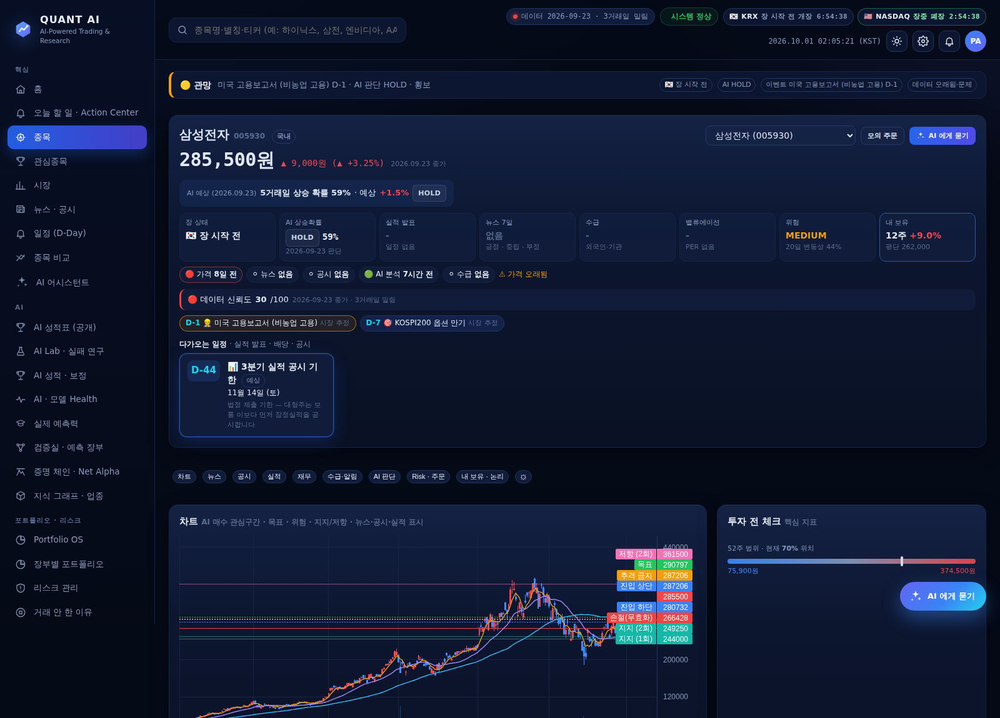

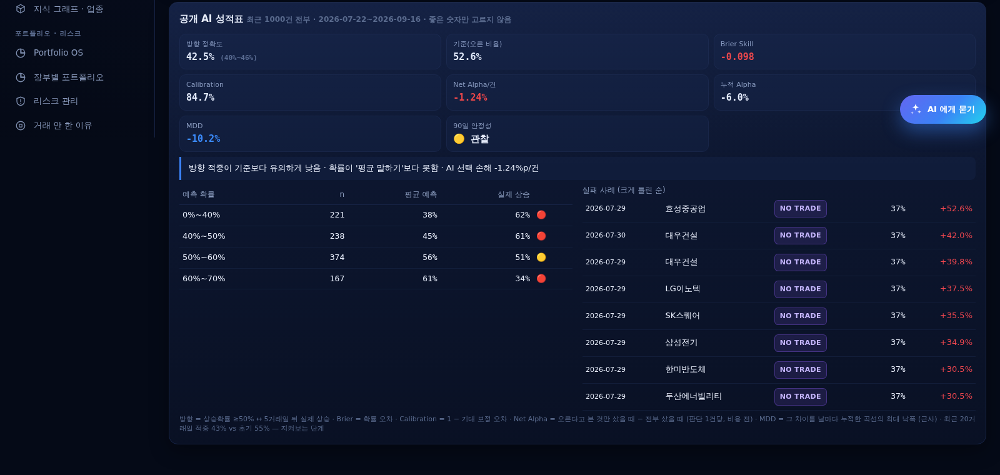

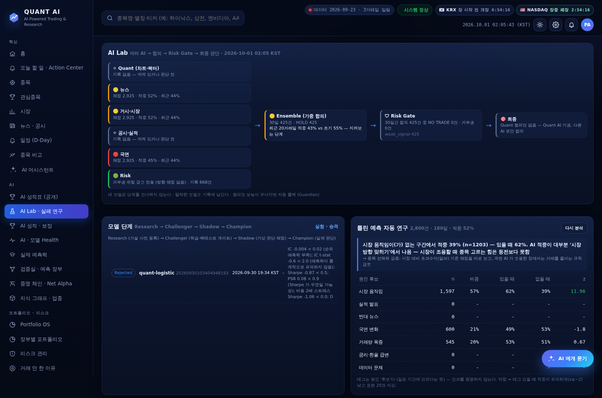

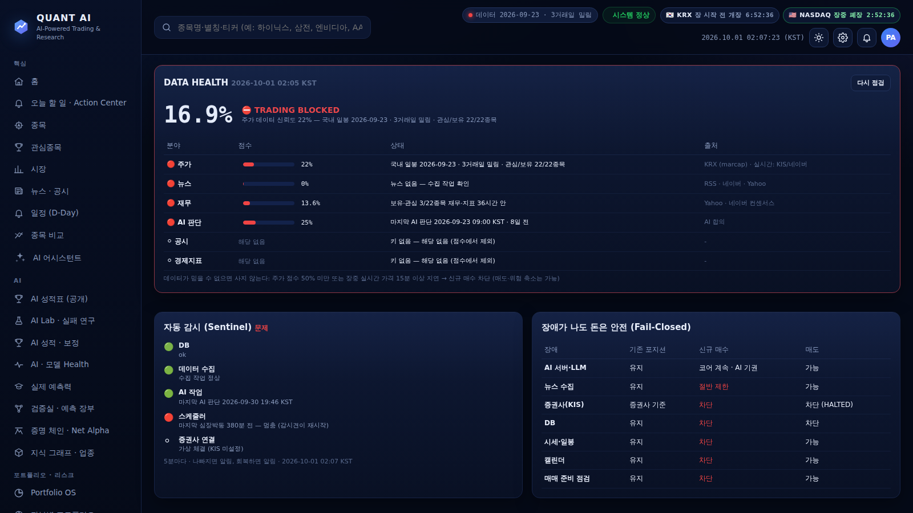

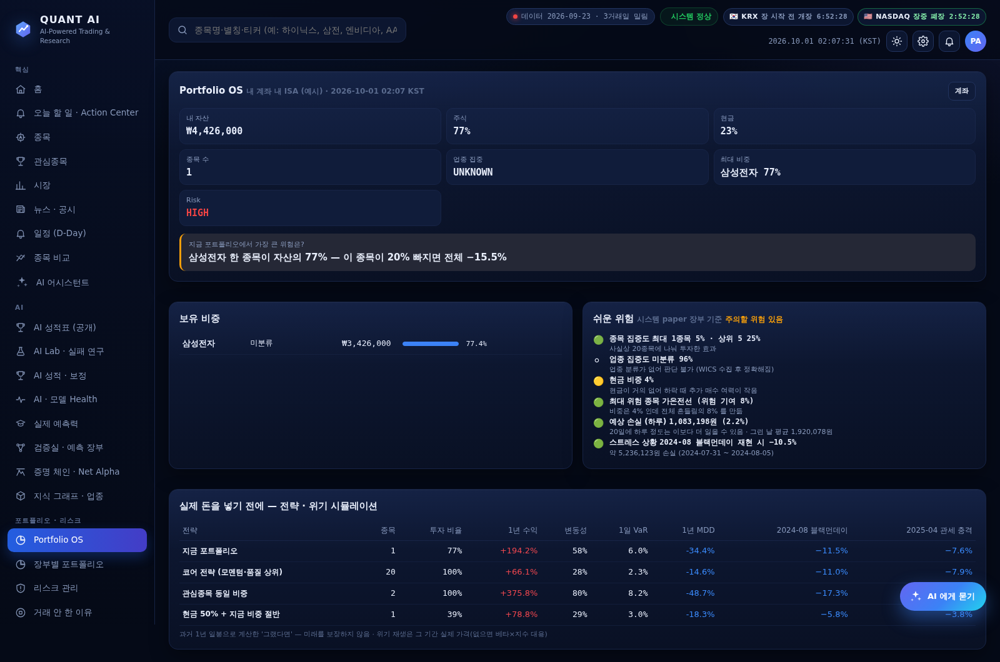

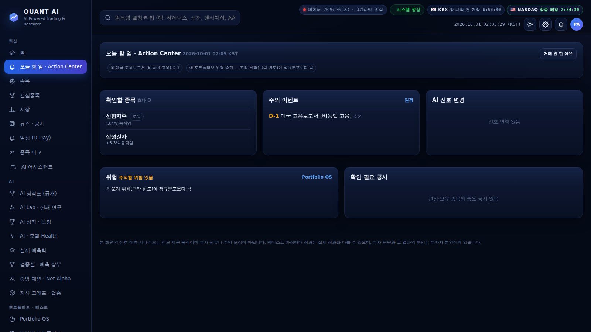

### 실데이터(KRX)로 직접 써 본 결과

- AI 성적(공개 1000건): 정확도 **42.5%** (기준 52.6%) · Brier Skill **−0.098** · Calibration 84.7% · Net Alpha **−1.24%p/건** · MDD −10.2% → **AI 판단에 돈을 걸 근거 없음** (그대로 표시)
- 실패 연구: 시장 움직임이 없는 구간에서 적중 **39%** vs 있을 때 62% — AI 적중 대부분이 '시장 방향 맞히기'
- DATA HEALTH 16.9% · **TRADING BLOCKED** (이 환경은 네트워크가 막혀 일봉이 3거래일 밀림) → 모의 주문 티켓도 매수 차단, 매도는 허용
- Portfolio OS: "삼성전자 한 종목이 자산의 77% — 이 종목이 20% 빠지면 전체 −15.5%"

### 이번에 직접 써 보고 찾아 고친 문제

- **시뮬레이션의 위기 재생이 지수 대신 뉴스 감성 표를 벤치마크로 씀** — `market_data()` 반환 순서를 잘못 풀어서, 종목 가격이 없는 기간의 '베타×지수' 대용이 조용히 빠졌다 (실데이터에선 감성 표가 비어 오류도 안 남) → 수정 + 테스트.
- **대시보드 첫 로딩 82초** — 화면이 API 를 동시에 여러 개 부르면 각자 전 종목 일봉을 다시 읽었다 (thundering herd) → 한 번만 읽고 나머지는 기다렸다 재사용.
- **AI 성적표 '채점 300건'** — 창 크기(300)를 전체 채점 수로 표시 → 실제 2,925건.
- **잘못된 장부 이름이 400 대신 200 + 오류 본문** (캐시 안에서 검사) → 캐시 전에 검사.
- 빈 장부의 '쉬운 위험'이 다른 모양의 응답을 돌려줌 · 실적 서프라이즈 % 단위 추정 코드 · 실패 연구 표의 `undefined` · 모의 주문 차단 사유 중복 · 작업 단계 키 오표기 → 수정.
- v15 D-day 테스트가 UTC 자정~KST 9시에 실행하면 실패하던 시간대 의존 → 한국 날짜 기준으로 검사.

## 8-8. V17 — 키 문제 · AI 를 '실수 방지 도구'로 · 보는 화면 · 내 투자 한도 · 이벤트 전략 · 미국 주문표

> 원칙: **AI 에게 매매를 맡기지 않는다.** 대부분 코어(지수형), AI 신호는 소액 위성에서 6개월 이상 전진 기록이 기준을 넘을 때만.
> AI 성적이 기준 미달이면 시스템이 스스로 주문에서 뺀다 (자동 SHADOW 강등).

### 키 문제 ("DART·FRED 를 .env 에 넣었는데 '키 없음'")

| 원인 | 고친 것 |
|---|---|
| 서버가 시작할 때 한 번만 읽음 | `.env` 를 5초 안에 자동 다시 읽음 (재시작 불필요) · `키 다시 읽기` 버튼 |
| 시작 때 키가 없으면 수집 작업 자체가 등록 안 됨 | 공시·DART 요약·거시 작업은 항상 등록, 실행할 때 키 확인 |
| `.env` 형식 (BOM·`export`·따옴표·중복 줄·별칭 이름) | 견고한 파서 + 줄 번호까지 짚는 진단 (`#datahealth` · `./run.sh keys --probe`) |
| 키가 틀려도 '아직 없음' 만 표시 | 4xx 응답 본문을 그대로 보여 주고(키는 가림) 재시도하지 않음 · "키 형식이 40자 hex 여야 함" 같은 설명 |

### 요청 1~6 + 🔴 10개

| 항목 | 상태 | 어디 |
|---|---|---|
| 테스트 0 error / 0 skip · 문서 수 = CI | ✅ | 임시 PostgreSQL 자동 기동, `QUANT_NO_SKIP=1` 이면 건너뜀도 실패, 문서의 "테스트 N개" 를 테스트가 검사 |
| 실제 AI 지표 숨기지 않고 추적 | ✅ | `#scorecard` · 매일 적중률·Brier·ECE·알파 기록 → UNTRUSTED/WATCH/CANDIDATE · **3일 연속 UNTRUSTED → 자동 SHADOW 강등** |
| 알파 기준 채점 · 조용한 장 규칙 | ✅ | 시장 방향을 뺀 '종목 선택력' · 조용한 장 규칙은 결과를 보기 전에 사전 등록(해시) |
| 데이터 라이선스 · 소스 교체 | ✅ | 상용 불가 소스는 서비스 단계에 따라 작업 자체를 막음 (`QUANT_SERVICE_LEVEL`) |
| 첫 화면 속도 | ✅ | 일봉 로딩 4.5배 (3.2초 → 0.7초) · 서버 시작 때 미리 데우기 |
| 보안: 로그인 · 2단계 인증 · 읽기 전용 | ✅ | `./run.sh auth-setup` · TOTP · 5회 실패 15분 잠금 · 읽기 전용 토큰은 POST 403 |
| 외부 연결 점검 | ✅ | `#datahealth` · 막힘/DNS/시간초과/TLS/서버/형식 분류 |
| KIS 모의 검증 (주문·체결·취소·정정·재시작·잔고) | 🟡 | 순서·완료 예상일·키 확인까지 — **실제 모의계좌 키와 시간 필요** |
| 실측 슬리피지 (저유동 · 급등락 · VI) | ✅ 집계 / 🟡 데이터 | 체결이 쌓이면 상황별로 따로 · VI 는 일봉 근사(고가·저가 ±10%) |

### 리뷰 7개 문제 → 우선순위 1~7

| # | 요청 | 상태 | 어디 |
|---|---|---|---|
| 1 | 원금·최대 손실부터 | ✅ | `#budget` · `./run.sh budget --principal 10000000 --max-loss 1000000 --save` → 일 손실·종목 비중·주문 금액·VaR·업종 한도 자동 · **킬스위치 11번째 조건 '원금 대비 누적 손실'** (80% 경고, 100% 정지) |
| 2 | 뉴스를 LLM 구조화로 | ✅ | 기사마다 `{이벤트, 방향, 확신도, 요약, 회사, 루머}` JSON (키 있을 때) · 규칙 분석에 **부정어 처리** ("어닝 쇼크는 아니다" → 긍정) · **같은 소식 묶기** · **매체 신뢰도 가중** |
| 3 | 이벤트 전략 전진 기록 | ✅ | `#pead` · 실적 서프라이즈 ±5% → 20거래일 초과수익 · 결과 전에 해시 봉인한 것만 '전진', 나중 채운 것은 '사후'(판정 제외) · 30건부터 판정 · **주문에는 안 씀** |
| 4 | 미국 실행 경로 | 🟡 | `#usorder` 수동 주문표 (매도 먼저 · 수수료 · 환전 스프레드 · CSV · 미국 시세가 없으면 **가격 직접 입력**) — **KIS 해외 주문 API 는 아직 아님** |
| 5 | 유료 API | ⛔ 검토만 | 아래 '한계' 참고 |
| 6 | 날짜 선택 재현 | ✅ | `#replay/2026-09-03` · 그날 알 수 있던 가격·뉴스·AI 판단만, '나중 결과' 칸만 이후 값 |
| 7 | 일정 띠 확장 · 세금 | ✅ | 배당락·FOMC·CPI·PCE·옵션 만기·**동종업체 실적**·**락업(보호예수·의무보유) 공시** · 이번 주 보유 종목 일정 카드 + 월요일 알림 · 미국 양도세 22%·연 250만원 공제·환전 비용 추정 |

### '읽는' 화면 → '보는' 화면

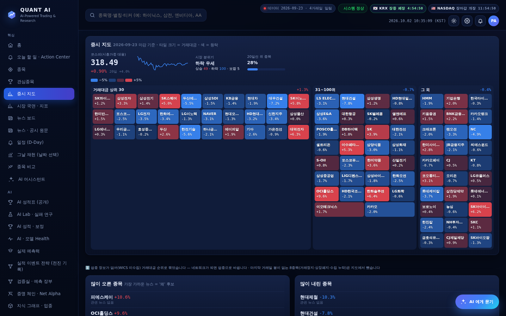

- **뉴스 보드** (`#news`): 같은 소식은 한 장 · 색 = 톤 · 이벤트 아이콘 · 확신도 · 루머 표시 · 관련 종목 칩(미니 차트 + **뉴스 이후 주가** + 지금 AI 판단) · '왜 이 톤?' 근거 단어 · 원문 링크. 예전 목록은 `#newslist`.
- **증시 지도** (`#map`): 업종별 타일 (크기 = 거래대금, 색 = 등락, 한국식 빨강/파랑) · 상승/하락 종목 수 · 20일선 위 비율 · 많이 오른/내린 종목 + 가장 가까운 뉴스.
- **홈 맨 위 한 줄**: 시장(위험 선호/회피) · 3일 안 큰 일정 · 내 위험 · AI 신뢰 — 누르면 해당 화면.
- **차트 표시**: 실적·중요 공시·뉴스 + **급등락(±5% 이상이고 평소 변동성의 2.5배)** + **AI 신호 변화(HOLD→BUY 등)**.

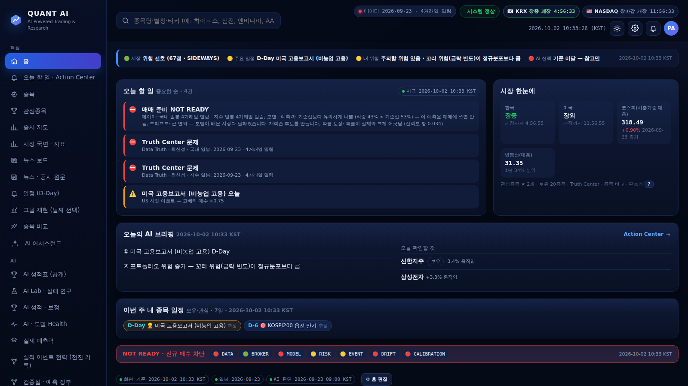

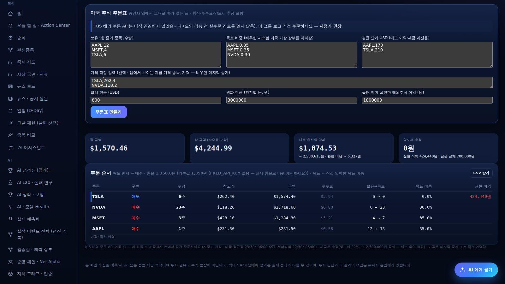

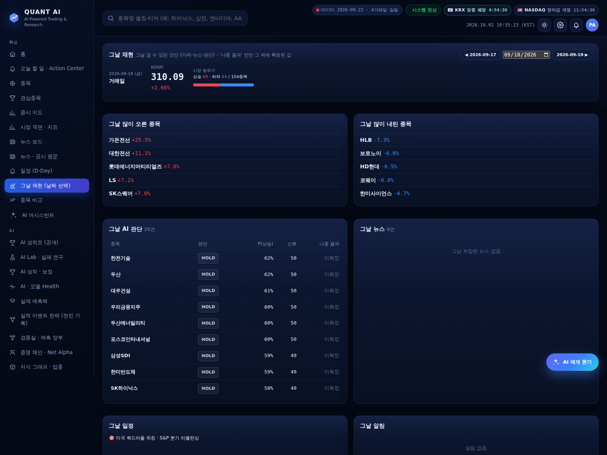

### 리뷰 반영 (2차) — 지적 9개 + 부족한 것

| # | 지적 | 고친 것 |
|---|---|---|
| 1 | 정상적인 날에도 자동 정지 | 일 손실 한도 = max(최대 손실 ÷ 8, **평소 하루 변동 × 2.5**) · 평소 변동은 과거 전략 기준과 **최근 1년 지수 변동 중 큰 값** · `#budget` 에 **과거 재생**("이 한도였으면 연 몇 번 걸렸을까", 최대 손실은 매년 1월 시작 기준 몇 번 닿았나) + 연 1회 이하가 되는 권장 한도 |
| 2 | 입출금이 손실로 계산 | 손실 = (한도를 정한 시점 평가금액 + 그 뒤 입금·출금) − 지금 평가금액 · 출금을 기록하면 손실 아님 |
| 3 | 정지 후 처리 불명확 | 저장할 때 **보유 유지 / 절반 축소 / 전량 정리** 중 선택 · 최대 손실 정지 시 매도 **주문표만** 만들고 알림 (자동 매도 안 함) · 최대 손실 < 과거 최대 낙폭(−43%) 이면 경고 |
| 4 | LLM 응답 한 건 오류로 전체 중단 | 항목별 처리 · `"positive"`·`"high"`·`"75%"` 같은 문자열도 해석 · 해석 불가 건만 규칙 결과 유지 · 묶기·상태 저장은 항상 |
| 5 | LLM 이 과거 감성값 덮어씀 | 수집 때 기록한 `sentiment` 는 바꾸지 않음 (학습·그날 재현용) · 새 규칙 값·LLM 값은 `extract` 에 따로 · 화면 톤만 LLM > 규칙 v2 > 원래 값 순 |
| 6 | PEAD 판정 느슨 | t 값을 **진입 월로 묶어** 계산 (같은 시기 겹침) · 진입 월 6개 이상 필요 · **베타 조정**(진입 전 120일) · **왕복 비용 차감** · 소스 간 10일 이내 같은 실적 **중복 제거**(국내 컨센서스 우선) · 장부 digest **외부 공증**(OpenTimestamps, 하루 한 번) → DB 를 해시까지 고쳐도 외부 기록과 불일치로 드러남 |
| 7 | 미국 세금 단순 | `종목,평단USD,취득환율` 입력 → 과세 이익 = 양도가액(지금 환율) − 취득가액(취득 환율), **환차익** 따로 표시 · 평단 없는 매도는 "이익 0 으로 계산" 경고 · 세율·공제는 가정값으로 명시 |
| 8 | 재현이 한국만·일정 비어 있음 | **미국 장**(그 날짜) 상승/하락·많이 오른/내린 종목 · 지난 일정 **2년 보관** + 휴장·만기·FOMC·지표는 규칙으로 언제든 다시 생성 |
| 9 | 로그인 구멍 | OTP **한 번만 사용**(같은·이전 코드 거부) · 잠금은 **실제 접속 IP**(믿는 프록시 `QUANT_TRUSTED_PROXIES` 의 X-Forwarded-For 만) · TOTP 만 있고 비밀번호 없으면 **시작 거부** · Secure 쿠키는 `QUANT_WEB_SECURE_COOKIE=1` 또는 믿는 프록시의 https 만 · 외부 공개인데 HTTPS 설정 없으면 경고 |
| 부족 1 | 일정 신뢰도 | 실적일 정보를 받은 적이 없으면 "일정 없음" 이 아니라 **"확인 안 됨"** (❔) · 소스끼리 실적일이 7일 넘게 다르면 **데이터 충돌**로 표시 |
| 부족 2 | 미국 일정 띠·재현 | 캘린더가 없거나 오래돼도 FOMC·옵션 만기·휴장 등 시장 일정은 바로 생성 · 재현 화면 미국 포함 |

### Phase 1~5 지도 대조 (34개)

| Phase | 항목 | 상태 · 어디 |
|---|---|---|
| 1 정보 신뢰 | ① 미국/한국 뉴스 | ✅ 기본 RSS 에 미국 3개 추가(구글 영어·CNBC·MarketWatch) · 🟡 실제 수집은 네트워크 필요 |
| | ② LLM 구조화 | ✅ `news_llm.py` (키 필요) |
| | ③ SEC/DART/IR 원천 | ✅ DART · ✅ **SEC EDGAR 신규**(`collectors/sec.py`, 8-K 2.02 = 실적 발표) · ⛔ 기업 IR 페이지는 회사마다 형식이 달라 없음 |
| | ④ 이벤트 DB | ✅ 이벤트 캘린더 + 지난 일정 보관(`event_archive`) |
| | ⑤ D-Day | ✅ 종목 띠·주간 일정·홈 한 줄 · "확인 안 됨" 구분 |
| | ⑥ 데이터 기준시간 | ✅ 모든 칸 as-of · 신선도 |
| | ⑦ 데이터 충돌 감지 | ✅ 가격(KRX↔Yahoo, 증권사↔DB) + **실적일·뉴스 해석 충돌 신규**(`conflicts.py`, `#datahealth`) |
| 2 Stock OS | ⑧~⑭ | ✅ 올인원 페이지 · 차트 Overlay(급등락·AI 신호 변화) · 뉴스/공시 요약 · 실적 서프라이즈 · 수급 · Risk · 내 보유 |
| 3 Market Intelligence | ⑮~⑳ | ✅ 매크로 에이전트 · 국면 · 업종 로테이션(RRG) · 지식 그래프(기사→시장→종목) · 커뮤니티/대체데이터 관심도 · 공시 반응 통계 |
| 4 AI 검증 | ㉑~㉗ | ✅ 해시 봉인 장부 · 보정 · AI별 성적표 · 국면별 성적(evaluator) · 실패 연구 · Champion/Challenger · 자동 강등 |
| 5 실제 돈 | ㉘~㉞ | ✅ Paper · Shadow · Risk Gate · Kill Switch · 슬리피지 학습(상황별) · 🟡 KIS Demo·실제 체결 분석은 **모의계좌 키와 운영 시간 필요** |

### 실데이터로 직접 써 보고 고친 것

- **증시 지도 타일이 전부 빨강** — 새 색 함수 이름(`heatColor`)이 기존 AI 확률 색 함수와 겹쳐 나중에 로드된 쪽이 덮어씀 → 이름 분리 + **화면 스크립트 전역 이름 중복을 잡는 테스트** 추가.
- 그 테스트로 **예전부터 숨어 있던 버그**도 찾음: `#lab`(실험 · 승격) 화면 함수가 연구 결과 함수에 덮여 화면이 오류로 끝나던 문제 → 수정.
- **증시 지도 날짜가 2023-02-20 으로 표시** — 상장폐지·거래정지 종목의 마지막 봉을 기준일로 잡음 → 마지막 거래일 봉이 없는 종목(실데이터 8개)은 지도에서 빼고 개수를 표시.
- **업종이 하나('미분류')로만 묶임** — 오프라인이라 WICS 미수집 → 종목 정보의 업종을 먼저 쓰고, 그것도 없으면 '거래대금 순위' 로 묶고 그렇게 했다고 화면에 표시.
- 지도·재현 화면의 지수 이름 "KOSPI" → 실제로는 **시총가중 대용 지수**라 그대로 표시.
- 미국 주문표가 오프라인 DB 에서 빈 표 → 가격 직접 입력 칸 추가 (입력값이 마지막 종가보다 우선).

### AI 어시스턴트

새 도구 9개: AI 신뢰 등급 · 키 진단("DART 키 왜 안돼?") · 뉴스 보드 · 증시 지도 · 투자 한도 · 이벤트 전략 · 거래 안 한 이유 · 이번 주 일정 · 그날 재현("9월 3일에 무슨 일?", "어제").
답마다 **근거 화면 링크**와 **이어서 물어볼 질문**을 붙인다. 종목을 물으면 AI 성적도 같이 조회해, 기준 미달이면 "참고만" 이라고 먼저 말한다. LLM 키가 없어도 같은 데이터로 규칙 답변.

## 8-9. V18 — 검색 → 이해 → AI 판단 → 위험 확인 → 내 포트폴리오 영향 → 행동

### 키 문제 ("DART·FRED 를 .env 에 넣었는데 '키 없음'") — 진짜 원인

`.env` 읽기 문제가 아니었다. **`./run.sh` 가 이미 떠 있는 옛 버전 서버를 그대로 재사용**했다.
그래서 화면은 옛 폴더의 코드와 옛 폴더의 `.env` 를 보고 있었다. 예를 들어 v16 폴더에서 띄운 서버가 8050 포트를 잡고 있으면, v17 폴더에서 `./run.sh` 를 실행해도 v16 서버가 그대로 남는다.

- `/api/health` 가 (내 PC 에서 부를 때만) 서버의 **버전·폴더·.env 위치·PID** 를 알려 준다.
- `./run.sh` 는 떠 있는 서버가 **이 폴더의 서버인지** 확인한다. 아니면 그 서버를 끄고 새로 띄운다. 끌 때는 PID 로, 그리고 quant_ai 프로세스인지 확인한 뒤에만 끈다.
- 다른 프로그램이 포트를 쓰고 있으면 끄지 않고 다른 포트를 안내한다.
- `./run.sh stop` 이 새로 생겼다.
- 설정 화면 맨 위 배너에 **"서버 v0.18.0 · 폴더 … · .env …"** 가 보인다. 이 줄의 폴더가 지금 쓰는 폴더와 다르면 옛 서버다.

### 70개 요청 대조

✅ 이번에 새로 만듦 · ☑️ 이미 있었음 (이번에 연결·보강) · ⚠️ 한계 있음

| # | 요청 | 상태 | 어디서 |
|---|---|---|---|
| 1 | 회사 로고 | ✅ | `logos.py` · `/api/logo/<종목>` — 검색·관심·포트폴리오·종목 상세·뉴스 칩·홈 |
| 2 | 올인원 종목 페이지 | ☑️ | 종목 OS (가격·차트·AI·뉴스·공시·실적·배당·수급·내 보유) + 이번에 오늘 중요한 것·실적 배너 |
| 3 | 뉴스 원문·출처·발행 시각 | ✅ | 뉴스 카드를 누르면 상세 창 (`newsdetail.news_detail`) |
| 4 | 영어 뉴스 자동 번역 | ✅⚠️ | 상세 창 「AI 설명」 — LLM 키 필요 (없으면 규칙 설명만) |
| 5 | 원문 → 번역 → 쉬운 설명 → 영향 → 관련 종목 | ✅ | 상세 창 ①~⑤ |
| 6 | 공시도 같은 구조 + 중요한 숫자 | ✅ | `disclosure_detail` (DART·SEC) — 기업 IR 페이지는 수집하지 않음 |
| 7 | 중요도 🔴🟠🟡⚪ | ✅ | `newsdetail.level` — 뉴스 보드·상세·홈 |
| 8 | 뉴스 → 영향 종목 연결 | ✅ | 🔴 기사에 직접 · 🟠 같은 업종 거래대금 상위 · 🟡 지식 그래프 이웃 |
| 9 | 뉴스가 AI 판단을 어떻게 바꿨나 | ☑️ | 상세 창 「AI 판단」 열 (뉴스 전후 합의 확률) |
| 10 | 기준 시간 ET/KST | ✅ | 상세 창·종목 일정 (`newsdetail.times`) |
| 11 | 거래소 상태 상단 고정 | ✅ | 상단 시계 🟢장중/🟡시간외/🔴장마감 · 장 시작까지/장 마감까지 |
| 12 | 주말·공휴일·서머타임 | ✅ | "오늘 미국 증시는 휴장입니다 (독립기념일)" 띠 · 서머타임 표시 |
| 13 | 실적 D-Day 최상단 (장 마감 후) | ✅ | 종목 헤더 배너 |
| 14 | CPI·FOMC·고용 D-Day | ☑️ | 일정 띠·이벤트 캘린더 + 이번에 차트에도 표시 |
| 15 | 오늘 중요한 것 | ✅ | 종목 헤더 칩 (실적 D-n · 중요 공시 n건 · 뉴스 위험 · 거래량 · AI 신호 변화) |
| 16 | 여러 AI → 최종 하나 | ☑️ | AI Lab · 합의 → Risk Gate → 최종 |
| 17 | 기간별 확률 1/5/20일 | ✅ | `stockplus.horizon_probs` — 과거 비슷한 확률 판단의 실제 결과 (표본 30 미만이면 숨김) |
| 18 | NO TRADE 적극 사용 | ☑️ | `notrade.py` · 「거래 안 한 이유」 |
| 19 | 왜 BUY 3줄 | ☑️ | 종목 「왜?」 섹션 |
| 20 | 왜 사지 말라는지 | ☑️ | 같은 곳 · Risk 거부권 |
| 21 | 종목별 적중률 | ☑️ | 종목 성적표 |
| 22 | 틀린 원인 자동 기록 | ☑️ | AI Lab · 실패 연구 (원인 '후보' 태그) |
| 23 | 홈 AI 상태 🟢🟡🔴 | ✅ | 홈 5칸 「AI 상태」 (`center.ai_state`) |
| 24 | 데이터 부족 → NO TRADE | ☑️ | 데이터 건강 · Fail-Closed |
| 25 | 예측 당시 입력 저장 | ☑️ | 해시 봉인 예측 장부 + 스냅샷 |
| 26 | 차트 AI 신호 | ☑️ | 차트 오버레이 |
| 27 | 차트 뉴스 시점 | ☑️ | 차트 오버레이 |
| 28 | 차트 실적·FOMC·CPI | ✅ | `stockplus.macro_marks` (미국 종목에는 고용지표도) |
| 29 | 평균매수가 선 | ✅ | 보유 중일 때 |
| 30 | 예상 범위·위험 가격 | ✅ | ±1σ·5일 범위 + 기존 무효화(위험) 가격 |
| 31 | 거래량 급증 | ✅ | 20일 평균의 2.5배 이상 표시 |
| 32 | 52주 고점·저점 | ✅ | 차트 선 + 헤더 |
| 33 | 기본 정보 (시총·PER…) | ☑️ | 종목 상세 핵심 지표 |
| 34 | EPS 예상 vs 실제 | ☑️ | 실적 카드 |
| 35 | 실적 추세 그래프 | ✅ | 실적 카드 막대 (예상 vs 실제, 상회/하회 색) |
| 36 | 뉴스 중복 제거 | ☑️ | 같은 소식 한 장 + 상세 창 「다른 매체 n곳」 |
| 37 | 출처 명확히 | ☑️ | 모든 카드·상세 |
| 38 | 출처 신뢰도 구분 | ☑️ | 매체 신뢰도 · 공시는 1차 자료 |
| 39 | 뉴스 검색 | ✅ | 뉴스 보드 검색창 (`/api/news-search`, 종목 이름으로도) |
| 40 | 기간 필터 | ✅ | 24시간 / 3일 / 7일 / 30일 |
| 41 | 외국어 번역 | ✅⚠️ | 언어 감지 (영·일·중) + LLM 번역 |
| 42 | 금융 용어 쉽게 | ✅ | 상세 창 「용어 풀이」 (키 없이도) |
| 43 | 관련 종목 자동 | ☑️ | 종목 태깅 + #8 연결 |
| 44 | 뉴스 전후 주가 | ✅ | 상세 창 표 (뉴스 전 5일 · 후 1일/5일 · 과거 비슷한 뉴스 뒤 평균) |
| 45 | 보유종목 ↔ AI 연결 | ☑️ | 종목 페이지 「내 보유」 · Action Center |
| 46 | 보유종목 옆 AI 상태 | ✅ | 포트폴리오 표 `🟢 BUY 64%` |
| 47 | 보유종목 중요 뉴스 알림 | ☑️ | 알림 (보유·관심 · 중요도 0.8 이상) |
| 48 | 보유 실적 D-Day 모음 | ☑️ | 이번 주 내 종목 일정 · 일정 화면 |
| 49 | 포트폴리오 Risk Score | ☑️ | Portfolio OS · 리스크 엔진 |
| 50 | 종목·섹터 비중 | ☑️ | Portfolio OS |
| 51 | 같은 베팅 분석 | ☑️ | 상관 묶음 (리스크 엔진) |
| 52 | USD·원화 수익 | ☑️ | 원화 환산 성과 + 이번에 종목 USD/KRW 전환 |
| 53 | 큰 검색창 · `/` | ☑️ | |
| 54 | 최근 검색 | ☑️ | + 이번에 로고 |
| 55 | 관심종목 폴더 | ☑️ | 관심종목 그룹 |
| 56 | 가격·AI·뉴스 알림 | ☑️ | 알림 규칙 |
| 57 | 모바일 | ☑️ | 하단 탭 · 새 화면도 640px 이하 한 줄 배치 |
| 58 | 다크모드 | ☑️ | |
| 59 | USD/KRW 버튼 | ✅ | 종목 헤더 |
| 60 | 1D/1W/1M/3M/1Y | ✅⚠️ | 기간 버튼 — 1D(분봉)는 일봉 데이터만 있어 꺼 둠 (KIS 실시간 필요) |
| 61 | 오늘 할 일 자동 | ☑️ | Action Center + 홈 5칸 |
| 62 | "거래하면 안 되는 이유" 먼저 | ☑️ | 사전 리스크 게이트 · Readiness |
| 63 | 가상 수익 vs 실제 수익 | ☑️ | PAPER · SHADOW · LIVE 장부 비교 · Net Alpha |
| 64 | Paper → Shadow → 실거래 자동 승격 | ☑️ | 승격 사다리 |
| 65 | 성능 저하 → SHADOW/OFF | ☑️ | 3일 연속 UNTRUSTED 자동 강등 |
| 66 | 데이터 이상 → 매매 차단 | ☑️ | Fail-Closed 매트릭스 |
| 67 | 판단 재현 기록 | ☑️ | 예측 장부 · 그날 재현 |
| 68 | 왜 그 판단인지 다시 보기 | ☑️ | 증명 체인 · 예측 장부 상세 |
| 69 | 시장 → 경제 → 뉴스 → 산업 → 종목 → 내 포트폴리오 | ☑️⚠️ | 홈 5칸 → 증시 지도 → 뉴스 상세(영향 종목) → 종목 → 포트폴리오. 한 화면 흐름도는 아님 |
| 70 | 홈 5칸 먼저 | ✅ | 오늘 시장 / 내 자산 / AI 상태 / 중요한 뉴스 / 오늘 할 일 — 기존 홈은 그 아래 |

## 8-10. V19 — "토스처럼 쉬운데 내부는 전문 Quant" (복잡도 줄이기)

### 직접 써 보고 찾은 문제 → 고친 것

| 문제 | 고친 것 |
|---|---|
| 메뉴 52개 · 처음엔 뭘 눌러야 할지 모름 | **쉬운 화면(기본)**: 메뉴 6개(홈·종목·관심종목·뉴스·공시·일정·내 자산) + "고급 메뉴 46개 펼치기". 어려운 메뉴 이름을 쉬운 말로 (Truth Center → 데이터 사실 확인, 증명 체인 → AI가 돈을 벌었나 …). 왼쪽 아래 [쉬운 · 전체] 버튼 |
| 처음 쓰는 사람 안내 없음 | 홈 맨 위 **'처음이라면 이 순서로'**: ① 주가 데이터(명령 복사 버튼) ② 투자 한도 ③ 관심종목 3개 ④ 오늘 할 일 — 다 하면 사라짐, 설정에서 다시 보기 |
| 홈 5칸 아래 긴 예전 홈 | 쉬운 화면에서는 5칸만 · 나머지는 "자세한 홈 화면 보기" 버튼 |
| 서버가 꺼지면 계속 로딩 | **연결 실패 안내 화면** (무엇을 실행할지 + 5초마다 자동 재연결) — 직접 서버를 껐다 켜서 확인 |
| 미국 종목은 AI 판단 불가 | 미국 종목도 **[지금 AI 분석]** → 일봉 + 지수(SPY)를 받아 국내와 같은 AI 합의로 판단 (주문 없음). 못 받으면 쉬운 오류 문장 |
| 처음 실패한 로고가 7일간 이니셜 | 네트워크 오류는 **1시간 뒤** 다시 · '로고 없음'만 7일 · `./run.sh logos --retry` |
| `custom/tsla.png` 소문자 무시 | 대소문자 상관없이 인식 |
| 국내 로고 90개만 · 삼성이 작은 파비콘 | 국내는 **토스증권·알파스퀘어 공개 아이콘**(실제 회사 로고)을 먼저 → 없으면 홈페이지 아이콘 → 이니셜(그라데이션). 관심종목 ★ 누를 때·`./run.sh logos` 로 미리 받기 |
| 2단계 인증 값만 있고 비밀번호 없음 → 서버가 백그라운드에서 조용히 멈춤 | `./run.sh` 가 **멈춘 이유를 화면에 출력** · `doctor`·보안 화면에도 경고 |
| 차트 라이브러리를 외부 CDN 에서 받음 | 서버가 직접 제공 (CDN 이 막혀도 차트) · 외부 스크립트 허용 제거(CSP) |
| (추가 발견) 9일 전 움직임이 '오늘 할 일'에 오늘 일처럼 | "(9/23 종가 기준)" 날짜 표시 |
| (추가 발견) 휴대폰 상단이 화면의 1/3 | 한 줄로 (메뉴 · 장 상태 · 설정 · 알림) · 안내는 지금 단계만 펼침 |
| (추가 발견) 데이터가 없을 때 검색 결과가 빈 채로 끝남 | "왜 안 나오는지" 안내 줄 |

### 60개 요청 대조

✅ 이번에 새로 만듦 · ☑️ 이미 있었음 (이번에 연결·보강) · ⚠️ 한계

| # | 요청 | 상태 | 어디서 |
|---|---|---|---|
| 1 | 홈을 훨씬 단순하게 | ✅ | 쉬운 화면 · 홈 5칸만 · 메뉴 6개 |
| 2 | 홈 최상단 '오늘 할 일' 3개 | ✅ | `center.today3` — 자동 정지 > 투자 논리 > 실적 D-n > AI 신호 변경 > 공시 > CPI·FOMC > 큰 움직임 |
| 3 | 최종 판단 하나를 크게 | ✅ | 종목 첫 화면 "🟢 BUY 66%" + News/Macro/Quant/Risk → FINAL (`explain.verdict`) |
| 4 | NO TRADE 적극 사용 | ✅ | 데이터 부족 · 판단 3일 넘음 · 장중 가격 20분 지연 · 실적 D-1 · 하루 ±5% 넘는 변동성 · AI 사용 금지면 BUY → NO TRADE |
| 5 | 'AI 지금 믿을 만한가' 홈에 | ✅ | 🟢 실전 가능 / 🟡 검증 중 / 🔴 사용 금지 |
| 6 | 성적을 쉬운 말로 | ✅ | "최근 100회 중 42회 방향 적중 (그냥 '오른다'고만 했으면 54회)" (`scorecard.plain`) |
| 7 | 벤치마크 대비 초과수익 | ✅ | "비용 뒤 +0.4% · 같은 기간 지수 +4.7% → 지수보다 −4.3%p" |
| 8 | 틀린 사례 쉽게 | ✅ | "예상 −1.5% → 실제 +13.4% · 원인 후보: 시장 전체 상승" |
| 9 | 어떤 데이터로 판단했나 + 기준 시각 | ✅ | "판단에 쓴 데이터: 가격 09-23 종가 · 뉴스 n건 · 공시 · 경제지표 · 🔒봉인" |
| 10 | 데이터 오래되면 NO TRADE | ✅☑️ | 종목 단위(장중 20분) + 기존 DATA HEALTH 15분 차단 |
| 11 | 로고 모든 곳 | ✅ | 검색·관심·포트폴리오·뉴스·홈·종목·알림·일정 (차트 위는 종목 헤더 로고) |
| 12 | 예쁜 대체 아이콘 | ✅ | 종목별 색 + 그라데이션 이니셜, 이름을 서버가 찾아 그림 |
| 13 | 토스식 첫 화면 | ✅ | 로고·이름 → 가격·등락 → 장 상태 → 52주 위치 → AI 최종 판단 → 오늘 중요한 것 |
| 14 | 차트 바로 위 '가장 중요한 것' | ✅ | |
| 15~19 | 차트 AI 신호·뉴스·이벤트·평단·예상/위험 가격 | ☑️ | V17~V18 |
| 20 | 52주 고점/저점 대비 위치 | ✅ | 막대 + "고점 대비 −21%" |
| 21~30 | 뉴스·공시 상세(원문·번역·쉬운 설명·출처·중요도·묶기·AI 판단 변화) | ☑️ | V18 · 28번 '1시간 뒤 +2.1%'는 ⚠️ 일봉이라 1일·5일 단위 |
| 31 | 실적 종목 상단 고정 | ☑️ | |
| 32 | 예상 EPS·매출 | ✅ | 실적 배너에 "예상 EPS $0.98 · 예상 매출 $32.5B" (자료가 있을 때) |
| 33 | 예상 vs 실제 | ☑️ | + 실적 추세 그래프 |
| 34~37 | CPI/FOMC D-Day · KST/ET · 장 상태 고정 · 휴장 | ☑️ | + 상단 시계 "한국 · 뉴욕" 함께 |
| 38 | 검색 · `/` | ☑️ | |
| 39 | 삼성전자 = 005930 = Samsung Electronics | ✅ | 영문 회사명 70여 개 |
| 40~43 | 최근 검색 · 관심 폴더 · 알림 · USD/KRW | ☑️ | |
| 44 | 미국주식 원화 손익 | ☑️ | 계좌 · 세금 화면의 원화 환산 성과 |
| 45 | 휴대폰은 핵심만 | ✅ | 쉬운 화면 + 휴대폰: 종목 페이지에서 재무·수급·AI 세부·위험은 버튼으로 |
| 46 | 보유종목 로고 + AI 상태 | ✅ | 포트폴리오·내 자산 표 `🟢 BUY` |
| 47 | 보유종목 중요 뉴스 표시 | ✅ | 내 자산 "📰 중요 뉴스 n" (누르면 상세) + 알림 ☑️ |
| 48 | 보유 실적 D-Day 한 화면 | ✅ | 내 자산 "보유 종목 — 지금 챙길 것" |
| 49 | Risk LOW/MEDIUM/HIGH | ✅☑️ | 크게 표시 |
| 50~51 | 섹터·테마 집중 · 같은 베팅 | ✅ | "반도체·AI 집중 43% (엔비디아·AMD·TSMC) — 사실상 같은 베팅" |
| 52 | AI 의견 비교할 필요 없이 FINAL | ✅ | #3 |
| 53 | 예측 기간 표시 | ☑️ | "5거래일" + 1/5/20일 |
| 54~55 | 잘하는/못하는 시장 · 국면별 적중 | ✅ | "횡보장에서 약함 — 적중 42%" |
| 56~59 | 자동 강등 · 데이터 부족 차단 · 스냅샷 · 예측 vs 결과 | ☑️ | |
| 60 | 과거 비슷한 상황에서 틀렸으면 경고 | ✅ | 비슷한 확률의 과거 판단 적중 45% 미만이면 "⚠ 이런 상황에서 자주 틀렸습니다" · 실적이 낀 예측이 약하면 함께 경고 |

## 8-11. V20 — "500만원 → 1억" 을 위한 정직한 기반 (P0 → P3 순서)

목표를 숫자로 따져 보면 이렇다. 500만원이 1억이 되려면 20배여야 한다. 적립 없이 10년 안에 하려면 해마다 35% 가 필요한데, 세계 최고 펀드도 오래 유지하기 어려운 수익률이다.
그래서 이번 작업은 **"확률을 보여 주고, 확률을 올리는 행동(적립·기간·비용)을 자동으로"** 하는 것과 **"AI 가 진짜 실력이 있는지 시장 대비로 증명"** 하는 데 집중했다.

| 순서 | 무엇을 | 어디서 |
|---|---|---|
| P0-1 실측 | 실제 백테스터(비용·체결 포함, 16년) 결과. GBM 순위 모델은 연 6.5% · Sharpe 0.53 · 최대 하락 −35% (같은 비중 지수 8.7% · 0.50 · −44%). 예측력(IC t≈19)은 진짜다. 하지만 최대 하락 기준(−25%) 때문에 **관문 미통과 → 실전 투입 안 함**. 함께 고친 버그: 리스크 엔진의 '확률 0.55 미만 무시' 규칙이 순위 모델 매수를 거의 다 막고 있었다 | [RESEARCH_QUANT_V2.md](RESEARCH_QUANT_V2.md) 6장 |
| P0-1 | **Quant 모델 v2**. 원인: '학습된 모델 없음' 은 버그가 아니었다. 유일한 모델이 관문에서 떨어졌기 때문이다 (IC −0.004). 고친 것: '시장보다 더 오를까' 라벨 + 날짜별 순위 피처 + 장기 팩터. 16년 검증 구간 IC 0.005 → 0.047 (t 5.0) | [RESEARCH_QUANT_V2.md](RESEARCH_QUANT_V2.md) · `engines/features.py` · `QuantAnalyst` |
| P0-3 | **AI 를 시장 대비로 채점**. "시장이 다 오를 때 '오른다' 고 한 적중" 은 걷어낸다. 홈 AI 카드와 쉬운 성적표에 "📏 시장 대비로 채점하면 43% (기준 50%)" 가 나온다. 종목 선택력이 증명되지 않으면 🟢 를 주지 않는다 | `center.ai_state` · `scorecard.plain` |
| P0-4 | **코어 vs 지수 ETF 기준선**. ① 16년 연구 결과: 코어 7.6% vs KOSPI 8.3%, 흔들림은 15.7% vs 21.4%. ② 실제 장부 vs 'ETF 그림자 장부' (같은 돈·같은 날 입금, 보수 반영). 권고 규칙은 고정했다: 의미 있게 뒤처지면 "적립은 ETF 로" | `baseline.py` · 내 목표 화면 |
| P0-5·6 | **내 목표**. 몬테카를로 3,000가지 미래로 확률을 보여 준다. 예: "매달 50만원이면 10년 안 49% · 100만원이면 99%". 함께 보여 주는 것: 방식별·적립액별 비교, 필요한 월 적립(50%·80%), 가는 길에 겪을 최대 하락. **월 적립 자동**: 모의 장부는 자동 입금, 실계좌는 알림만. 홈에 진행률 막대 | `goal.py` · `goal.js` |
| P2-11 | **24시간 운영**. `./run.sh install-service` 로 PC 를 켜면 자동 시작하고 죽으면 다시 켠다 (macOS launchd · Linux systemd). `status` · `update` 명령 추가. 운영 꺼짐·데이터 n거래일 밀림·뉴스 0건·업종 미분류를 **'오늘 할 일' 맨 위**에 고치는 명령과 함께 표시 | `run.sh` · `center.ops_status` |
| P2 | 업종 분류: `qa collect sectors` (WICS → 나머지 Yahoo). `./run.sh data` 가 데이터 적재 직후 자동 실행. 데이터 적재는 3년 → **5년** (12개월 모멘텀·순위 모델 학습용) | `cli.py` · `run.sh` |
| P3 | **종목 페이지 탭**: 전체 · 차트 · 뉴스·공시 · 실적·재무 · AI 판단 · 위험·주문 · 내 보유. 7,300px 한 페이지가 탭마다 1,600~2,200px 로 줄었다. **차트 라벨 겹침 정리**: 가까운 가격선은 중요한 라벨만 남긴다 (손절 > 평단 > 진입 > 목표 > …). 표시 글자도 같은 구간에 몰리면 중요한 것만 남긴다 | `os.js` · `app.js` |
| P3 | 작은 오류 3개를 고쳤다. ① 라이트 테마 긴급정지 버튼 대비. ② 관심종목 표에서 별표 안 한 '최근 본 종목' 도 ★ 로 보이던 것 → ☆ (누르면 담기). ③ 메뉴 아이콘 중복 (관심종목·내 목표가 모두 트로피) → ★ · 📅 · 🎯 | `style.css` · `hub.js` · `icons.js` |
| P3 | 홈 '내 자산' 에 **최근 90일 미니 차트**를 넣었다. **입금은 수익이 아니다**: 월 적립을 하면 "시작 대비 %" 가 부풀려지던 것을 "낸 돈 대비" 로 고쳤다 | `center._equity_spark` · `easy.js` |
| 수정 | GBM 학습 오류를 고쳤다. 학습 초기 구간에서 값이 하나도 없는 피처(12개월 모멘텀)가 있으면 구간 나누기가 실패했다 → 그 열은 0 으로 채운다 | `engines/prediction.py` |

## 8-12. V21 — "AI 티" 를 빼고 매일 쓰기 편하게 · 세금 계좌 · ETF 적립 · 점검 보고서

### 실사용자처럼 다시 써 보고 찾은 문제 → 고친 것

| 문제 | 고친 것 |
|---|---|
| **(버그)** 24시간 운영이 56시간 꺼져 있고 데이터가 5거래일 밀렸는데 상단이 '시스템 정상' | 상단 표시가 DB 연결뿐 아니라 운영·데이터 날짜·뉴스·업종까지 본다 → '점검 필요 3' (마우스를 올리면 문제와 고치는 명령) |
| **(버그)** '내 자산' 이 입력해 둔 예시 계좌(442만원·1종목)만 보여 주고 실제 모의 장부(4,996만원·20종목)는 볼 방법 없음 | [내가 입력한 계좌 · 시스템 모의 장부] 전환 버튼 |
| AI 성적이 '사용 금지' 인데 종목 화면에 'HOLD 59%' 가 크게 | 'AI 성적이 기준에 못 미칩니다 — 참고만' 안내 + 판단을 흐리게 |
| HOLD · NO TRADE · FINAL · News/Macro/Quant/Regime/Risk · MEDIUM · Paper Trading · PAPER 등 영어 | 쉬운 화면은 우리말: 관망 · 쉬어가기 · 최종 · 뉴스/경제/차트·통계/시장 흐름/위험 점검 · 보통 · 모의투자 (`words.js` 한 곳에서 정함) |
| 화면당 이모지 10~50개 (🟢🟡🔴📏💡🎯🔌…) | 상태는 색 점 하나 · 일정은 종류별 색 점 5가지 · 장식 이모지 제거 |
| 같은 내용이 여러 번 (휴장 안내 2번 · '관망 AI HOLD' 띠 + 판단 카드 · 데이터 오래됨 3곳) | 쉬운 화면에서 중복 띠·신선도 칩 숨김 · 휴장 안내는 위쪽 한 번 |
| 종목 화면이 처음부터 7,300px 전부 | 첫 탭이 '요약'(차트·뉴스·내 보유) · AI 별 의견·판단 이력·과거 사례는 '전체' 화면에서 |
| 홈의 주인공이 없음 (같은 크기 카드 6개) · 처음 안내가 휴대폰 첫 화면 전부 | 홈 맨 위 = **내 자산(큰 숫자) + 내 목표** · 처음 안내는 '다음 할 것' 한 줄 + 진행 막대 |
| AI 카드가 긴 문장 4줄 | '방향 적중 42/100 · 그대로 샀다면 지수 −4.3%p · 시장 대비 43% (기준 50%)' 숫자 3줄 |
| 'AI 에게 묻기' 떠 있는 버튼이 카드를 가림 | 작은 동그라미 버튼 + 화면 아래 여백 |
| 고급 메뉴 46개를 훑어야 함 | '더 많은 기능 46개' 안에 **기능 찾기** 입력칸 |
| 성적표에 Brier·Calibration·n 이 먼저 | 쉬운 말 성적표만 보이고 전문 지표는 '펼치기' |
| 일정 화면 맨 위가 변동성 지표 · ECOS 키 안내 | 일정 목록이 맨 위 · 지표/통계는 '전체' 화면에서 |
| 뉴스가 0건이면 '수집이 돌면 채워집니다' 만 | 왜 없는지(24시간 운영) + 지금 받는 명령 + 운영 상태 버튼 |
| 브랜드 아래 영어 'AI-Powered Trading & Research' · 명언 문구 | '내 투자 비서 · 확률로 판단' · 명언 삭제 |
| 세금 계좌 표가 카드 밖으로 넘침 (화면 확인 중 발견) | 칸 너비 고정 · 휴대폰은 조건 칸 숨김 |

### 돈과 직접 관련된 기능

| 기능 | 내용 |
|---|---|
| **세금 계좌 비교** (`goal.tax_compare`) | 같은 돈·같은 방식을 일반 / ISA / 연금저축+IRP 에 넣었을 때 목표 확률. 500만원 + 월 50만원 S&P500 ETF 10년: 일반 52% → ISA 56% → 연금 65% (해마다 세액공제 약 79만원을 다시 투자). 연금은 개별 종목 불가(코어 전략 X)와 55세 전 해지 시 세금 반환을 함께 표시 |
| **ETF 월 적립** | 적립 대상을 [코어 전략 / 지수 ETF] 중 선택 (KODEX 200 · TIGER 미국S&P500). ETF 는 코어 장부와 **분리한 'ETF 적립 장부'** (섞으면 코어 리밸런싱이 ETF 를 팔아 버림) — 원금부터 함께, 1주 단위·수수료 반영, 가격을 못 받은 날은 현금으로 두고 다음 거래일에 자동 매수 · 실계좌는 '○○ n주 시장가' 주문표 알림 |

### 사용자 PC 점검 (C)

- `./run.sh report` 실행 결과를 붙여 넣어 주시면 문제를 바로 찾을 수 있습니다.
  - 들어가는 것: 버전·운영 상태·데이터 날짜·외부 연결·실패한 작업·KIS 검증 진행.
  - 키·비밀번호·계좌번호·금액은 넣지 않습니다. 키는 '있음/없음'만 씁니다.
  - 마지막에 한 번 더 거릅니다. `.env` 의 모든 값, 키처럼 보이는 긴 문자열, 계좌번호 모양, 이메일, 텔레그램 토큰 모양, DB 접속 주소를 지웁니다.
- 이 작업 환경은 인터넷이 막혀 있어 외부 소스를 실제로 시험하지 못했습니다. 그래서 사용자 PC 보고서가 가장 정확한 다음 단계입니다.

## 8-21. V30 — AI 자동매매 · 목표 현실성 · 회사 이해 · 로고 큐 · 관측성

| 요청 | 한 것 |
|---|---|
| AI 가 알아서 자동 매수·매도 | `autopilot.py` — 신호 엔진 2.0 후보로 하루 한 번(장중 09:10~15:10) 결정: 손절선 도달 · 점수 0 이하 · 20거래일 지났는데 후보 아님 · 계산 대상 이탈 → 매도 / 점수 +0.8 이상 높은 순 매수(1주 가격 ≤ 종목당 상한) / 꽉 차면 점수 차 1.0 이상일 때 하나 교체 / 200일선 아래면 자리 절반·기준 +0.5 · 일봉이 2거래일 넘게 밀리면 쉼 · 주문은 기존 파이프라인(리스크 엔진·킬스위치·매매 준비·중복 방지·장부) 그대로 · 결정·이유·체결을 해시 체인으로 봉인 |
| 실제 돈 연결 | 가상 100만원 장부 'autopilot' 은 늘 자동 운용 · 실제 계좌는 관문 5개(신호 엔진 전진 기록 60건+·이긴 비율 55%+·평균 초과 > 0 / 가상 장부 40거래일+·코스피 초과 / KIS e2e 검증 / 증명 프로젝트 실계좌 진행 중 / 사용자 '연결 요청') 모두 통과 시에만 · 연결되면 같은 계좌의 코어 전략 주문은 멈춤 |
| 100만원 → 1억 (6~12개월) | 목표 현실성 계산: 같은 규칙을 가중치 학습에 쓰지 않은 기간(국내 162종목, 2026-03-04~09-23, 139거래일)에 비용 반영해 돌린 결과 **+2.9%** (같은 기간 대상 종목 평균 +11.3%) → 그 일별 수익을 20일 묶음으로 4,000번 다시 뽑음: **1억 도달 0% (6·12개월 모두)** · 12개월 두 배 10.5% · 이익으로 끝남 40% · -15% 정지선에 닿음 85% · 중간값 약 85만원 · 1억에 필요한 수익 매달 +47%(12개월)/+115%(6개월) — 화면·CLI 에 그대로 |
| 회사를 쉽게 알기 (A-5) | `company.py` + 종목 화면 '회사' 탭: 초보자 3줄(근거 있는 것만) · 한 줄 소개 · 업종·시가총액(KRX)·상장주식수·1년 수익률 · DART 재무 5년(단일회사 주요계정, 연결 우선, 7일 캐시, 고유번호는 받아 둔 공시 → corpCode.xml) · PER/PBR(없으면 시가총액÷순이익·순자산으로 계산) · 같은 업종 시가총액 상위 4곳 · 120일 이슈 타임라인(공시·뉴스·급등락·일정) |
| 차트 (A-3) | 종목 요약 차트 '코스피와 비교' 점선(시작점을 맞춤) + 기간 수익률 옆에 코스피 수익률 · 차트 탭은 이미 캔들·이동평균 5/20/60·AI/공시/뉴스/실적 표시 |
| 로고 (A-2) | `logos.coverage` + 화면 '로고 관리': 진짜 로고 비율 · 없는 종목(관심·보유 먼저) 목록과 받지 못한 이유 · 바로 '올리기' |
| 겁주는 위 막대 (A-4·A-7) | 쉬운 화면: 시계·버전 줄 숨김 · '점검 필요 n' → '확인할 것 n' (누르면 데이터 상태) · 전체 화면은 그대로 |
| 속도 (A-6) · 관측성 (B-7) | 무거운 화면(홈·AI 신뢰·목표·사실 확인·감시실·AI 추천·AI 자동매매·로고 큐)을 켜 둔 동안 4분마다 미리 계산 · `/metrics`(Prometheus: API 호출 수·평균/최대 응답 시간·24시간 작업 성공/실패·마지막 성공 뒤 시간·일봉 밀림·긴급 정지·자동매매 장부) — 같은 PC 는 로그인 없이 |

확인: `test_v30`(10개) · 실데이터 서버로 AI 자동매매·회사·로고 관리·코스피 비교 화면 확인 (PC/휴대폰 · 오류·가로 넘침 없음).
솔직하게: 실데이터 '보지 않은 기간'에서 이 규칙은 대상 종목 평균보다 낮았다 — 지금 실력으로 실제 돈을 늘리면 안 된다. 가상 장부가 기록을 쌓고 관문이 통과될 때까지 실제 계좌는 자동으로 막혀 있다.

## 8-20. V29 — 1단계 마무리: 데이터 정합성 · KIS 전 과정 · 100만원 증명 프로젝트 · 차트

| 1단계 항목 | 한 것 |
|---|---|
| 1. 데이터 정합성 (수정주가 · 52주 · 시가총액 · 일봉 자동 갱신) | `datacheck.py` — ① 일봉 기준일·몇 거래일 밀림·자동 갱신 작업(krx_data) 마지막 성공/실패·marcap 위치 ② 원천 자체 점검: 가격제한폭 ±30% 초과(오류) · 대형주(거래대금 상위 30) 최근 1년 최대 하루 변동 ±15%(확인) · 같은 날 대형주 4개 이상 함께 움직인 날(시장 전체 움직임 가능성) · 고가/저가 모순 · 거래량 0 연속(거래정지 의심) · 원천 시가총액 ≠ 주식수×종가 · 상장폐지 종목 제외 ③ 가격 조정 이벤트(기준가 ≠ 전일 종가: 액면분할·병합·권리락)와 배율 ④ 인터넷이 되면 관심·보유 + 거래대금 상위 15종목 1년 종가를 네이버 차트(수정주가) → Yahoo 와 날짜별 대조 (0.5% 넘게 다른 날 · 일정한 배율 차이 = 수정 기준 다름) · 처음 두 종목이 안 받아지면 '대조 못 함'으로 멈춤 ⑤ 새 일봉 적재 직후 + 하루 한 번 자동 · `./run.sh datacheck` · 화면 '데이터 점검' · 종목 화면 시가총액(KRX 원천, 기준일 표시) |
| 3. KIS 모의 전 과정 | `kis_check.e2e` (`kis-check --suite --e2e`, 모의투자·장중만): 멱등 키 기록 → KISBroker 주문 → 주문번호 즉시 기록 → 체결 → 주문·체결 DB → 증권사 잔고와 장부 대조(반영 지연 6번 재확인) → 같은 키 재주문 차단 → 되팔기 → 잔고 원래대로 → 체결 안 될 가격 주문을 남긴 채 재시작 복구가 찾아 취소 · 실전 계좌·장외·요청 없음이면 하지 않음 · 검증 진행표에 4번째 단계로 |
| 4. 100만원 실계좌 규칙 · 매일 공개 | `proof.py` — 시작할 때 규칙(원금 100만원 · 누적 -15만원 전체 정지 → 전량 정리 주문표 · 종목당 20% · 최대 5종목 · 1주 20만원 이하 종목만 · 하루 -3% 신규 매수 중단/-4.5% 자동 정지 · 거래대금 10억 · 신용·미수·공매도·레버리지 금지)과 성공 기준(실주문 300건 · 코스피 대비 연 +5%p · 최대 낙폭 -15% 이내 · 예측력 순차 검정 통과)을 해시로 봉인, '내 투자 한도'에 반영 · 리스크 엔진에 보유 종목 수 한도 · 장 마감(15:40) 뒤 하루 한 번 평가금액·입출금 제외 수익률·누적·코스피 대비·낙폭·체결 수를 앞 기록 해시에 이어 봉인 · 한 글자만 고쳐도 검증에서 끊김 표시 · 판정은 종료일에 한 번 · 시작 시점 장부 금액이 원금과 다르면 경고 · 지금 1주를 살 수 있는 종목 수 경고 · 공개 페이지 `/proof`(+`/proof.json`) — 공개를 켰을 때만 로그인 없이, 금액·계좌번호 기본 비공개 |
| 5. 차트 기본 손질 | 가격 축·마지막 값 콤마 · 기간 시작가 점선(1일은 어제 종가) · 누른 채 끌면 두 지점 구간 수익률 · 기간 등락 + '시작 대비' 표시 · 라이브러리 로고 대신 '차트 TradingView' 글 표기와 시세 출처 · 예전 화면 차트도 콤마 |

실데이터(국내 162종목, 2026-09-23)로 점검: 오류 0 · 확인 24건 · 가격 조정 이벤트 34건(LS ELECTRIC 1:5 액면분할 등) · 2026-07-31 에 삼성전자·SK하이닉스 등 대형주 8개가 함께 +15% 이상 → '시장 전체 움직임 가능성'으로 묶어 표시 · 원천 시가총액과 주식수×종가 불일치 0. 이 값이 실제 시세와 맞는지는 인터넷이 막혀 대조하지 못했다 — 사용자 PC 에서 `./run.sh datacheck` 가 네이버/Yahoo 와 대조한다.
확인: `test_v29`(11개) · PC/휴대폰 화면 확인. KIS 전 과정은 잔고가 실제로 바뀌는 가짜 모의계좌로 시험했다 — 실제 KIS 모의투자에서는 장중에 `./run.sh kis-check --suite --e2e` 로 확인해야 한다.

## 8-19. V28 — 신호 엔진 2.0 · 매수/매도 후보 화면

| 요청 | 한 것 |
|---|---|
| AI가 최고로 추천하는 걸 확실히 보고 싶다 | `signals2.py` — 종목마다 가격·거래량 신호 7개를 -3~+3 점수로 · 가중치는 과거 결과(20거래일 뒤 시장 대비 수익과의 순위 상관 IC, 5일 간격, t ≥ 1.5)로 결정 · 효과 없음 0 · 반대로 작동하면 부호 뒤집기 · 근거 있는 신호가 없으면 '검증 전 기본값'으로 표시 |
| 뉴스·커뮤니티·공시·수급·실적까지 합쳐서 | 공시 종류(과거 같은 종류 공시 반응이 10건 이상이면 그 평균, 아니면 일반 영향) · 최근 3일 뉴스 분위기 · 외국인/기관 5일 수급 · 90일 내 실적 서프라이즈 · 커뮤니티 과열/공포(역발상)를 '검증 전'으로 30%만 반영 — 자료가 없으면 점수를 만들지 않음 |
| 정말 믿어도 되나 | 마지막 120거래일은 학습에서 빼 두고(보지 않은 기간) 점수대 5칸별 '시장을 이긴 비율 · 평균 초과수익' → 신뢰 등급(근거 있음 / 약한 근거 / 근거 부족) · 평균은 좋지만 이긴 비율이 낮으면 그대로 말함 |
| 매도 신호 화면 | '비중 축소' = 보유·관심 중 점수 -0.5 이하 · '피할 종목' = 그 밖의 낮은 점수 · 후보마다 손절선(하루 평균 움직임 × 2) |
| 나중에 증명 | 매일 첫 계산을 해시로 봉인(`signals2_log`, 같은 날 다시 계산해도 바꾸지 않음) → 20거래일 뒤 '실제로 지나 본 결과' 채점 · 1시간마다 스케줄러가 계산 |
| 화면 | 메뉴 'AI 추천'(국내/미국 · 매수 후보/비중 축소/피할 종목 탭 · 점수 만드는 법 · 점수대별 실제 결과 · 전진 기록) · 홈 '오늘의 매수 후보' 3개 · 종목 화면 종합 탭 '신호 점수' · 카드에서 바로 모의 주문 시트 |
| 후보 자격 | 20일 평균 거래대금 국내 10억원 · 미국 500만달러 이상 · 마지막 거래일 시세 있음 |

실데이터(국내 162종목, 2026-09-23 기준): 학습 구간에서 12개월 오름세(IC 0.117, t 6.7) · 추세(0.063, t 3.6) · 52주 고점(0.050, t 3.0)만 효과가 확인됐고 나머지 4개는 0.
보지 않은 기간(2026-03~08)에서 최고 점수대는 평균 시장 대비 +3.1% 였지만 시장을 이긴 종목은 43% — 등급 '약한 근거'. 화면에도 그대로 나온다.
확인: `test_v28`(9개) · PC/휴대폰 화면 확인. 이 환경은 인터넷이 막혀 뉴스·수급·커뮤니티 실시간 신호(검증 전)는 0건으로만 확인했고, 미국은 일봉이 없어 계산하지 못했다.
**자동매매에는 쓰지 않는다** — 전진 기록이 쌓여 기준을 넘으면 연결한다.

## 8-18. V27 — 나머지 화면 하나하나 토스식 · 진짜 지수 · 1일 차트 · 로컬 LLM · 미국 모의 매수

| 요청 | 한 것 |
|---|---|
| 나머지 화면도 토스처럼 하나하나 새로 | `toss2.js` — 메뉴 50개 화면을 화면마다 다시 그림 (공통 스킨이 아니라 화면별 구성): 한 줄 결론 칸(상태 색 테두리) · 숫자 칸 · 막대 비교(AI vs 기준선 등) · 진행 막대 · 상태 행(점·제목·설명·상태말) · 시트/폼 · 두 화면 모드 모두 · 화면 아래 '전문가용 전체 화면'(`#화면//full`) |
| 5. 진짜 코스피·나스닥 | `data/collectors/indices.py`: 코스피·코스닥·나스닥·S&P500·다우 일봉을 Yahoo → 네이버(국내) → stooq(해외) 순으로 받아 저장 (30분마다 · `QUANT_INDICES=false` 로 끔) · 실패한 지수는 이전 값 + 오류 기록 · 홈/시장은 진짜 지수를 먼저, 없으면 예전 대용 |
| 6. 분봉 | `/api/t/intraday` (Yahoo 5분봉 · 1분 저장 · 코스피/코스닥 구분) · 종목 차트 '1일' 버튼 · 어제 종가 대비 · 손가락 올리면 시각·가격 · 못 받으면 이유 + '1주 차트로' |
| 7. LLM 키 없이 번역·요약·채팅 | 공급자 `local` (Ollama · LM Studio · llama.cpp — OpenAI 호환): `.env` 에 `QUANT_LOCAL_LLM_URL=http://127.0.0.1:11434/v1` 만 넣으면 채팅·뉴스 설명·번역·AI 역할이 로컬로 (클라우드 키가 있으면 그쪽이 먼저) · 이 컴퓨터 주소(또는 https)만 허용 · 모델 목록 자동 탐색 |
| 8. 미국 종목 모의 매수 | `ticket` 이 미국 종목을 달러 장부 `us-manual`(시작 $100,000)에 기록 · 수수료 0.25% · 원화 환산(참고 환율) · 수동 모의 장부 화면에 국내/미국 칩 |
| 9. 47개 화면 공통 디자인만 | 위 첫 줄 |
| 10. 제목 두 번 | 토스 화면은 머리 하나 · 예전(전문가) 화면은 첫 카드 제목이 머리와 같으면 지움(`dedupeTitle`) · `#pos/full` 이 토스 화면으로 다시 돌던 문제 수정 |
| 11. 지표 쉬운 설명 | 용어 30개 풀이(`GLOSSARY`) · 토스 화면은 밑줄+? 단추, 예전 화면도 표 머리·라벨이 용어면 자동으로 ? 표시 → 누르면 아래에서 설명 시트 |
| 12. 국내 로고 | '로고 직접 넣기'(종목 화면의 '로고 바꾸기' · 데이터 상태 화면) → `artifacts/logos/custom/` 에 저장, 모든 출처보다 먼저 · PNG/JPG/WEBP/GIF/SVG(스크립트 든 SVG 거부) · 140KB 이하 · 잘못 올려도 기존 로고 유지 · logo.dev 키(`QUANT_LOGO_DEV_TOKEN`) 안내 |
| 13. 커뮤니티 확대 | 수집 대상 = 관심·보유 + 오늘 많이 움직인 종목(거래대금 50억 이상 · 등락 큰 순 10개) · 최대 25 · `./run.sh community --collect` 가 대상 목록을 보여 줌 |
| 14. AI 버튼이 카드 가림 | PC: 떠 있는 버튼 숨기고 위 막대에 'AI 에게 묻기' · 휴대폰: 아래 버튼 유지 + 화면 아래 여백 |
| (찾음) 이벤트 반응 분석 오류 | 공시일(날짜)과 일봉(UTC 시각) 비교 오류로 '모델 실험' 화면 일부가 깨지던 것 수정 |

확인: `test_v27`(12개) · 전체 화면 스윕(쉬운/전체 × PC/휴대폰) · 화면 묶음별 스크린샷 확인.
이 환경은 인터넷이 막혀 Yahoo·네이버·stooq 지수/분봉과 로컬 LLM 실제 연결은 확인하지 못했다 — 파서·대체 경로·로컬 서버 흉내(가짜 OpenAI 호환 서버)로 시험했다.

## 8-17. V26 — 나머지 47개 화면 통일 · 영어 꼬리표 우리말 · 로고 · 커뮤니티 · 종목별 뉴스

| 요청 | 한 것 |
|---|---|
| 나머지 47개 화면도 토스 디자인 | 공통 스킨(`toss.css` v26): 화면 머리(← 메뉴 이름) · 둥근 카드 20px · 큰 카드 제목 · 단색 탭(회색 바탕 흰 알약) · 단색 버튼 · 넉넉한 표 · 칩/알약 옅은 면 · 숫자 칸 · 입력칸 · 휴대폰에서 넓은 표는 카드 안 가로 밀기 |
| 디자인이 AI·개발툴 같음 | 숫자·라벨의 코딩용 고정폭 글꼴 → 본문 글꼴(같은 폭 숫자) · 영어 꼬리표 60여 개 우리말 자동 변환(`words.js` deJargon) · 쉬운 화면에서 소스 파일 경로 숨김 · 위 막대의 시세 배지/휴장 띠 정리 · 개발자 명령(`quant-ai …`) 안내 → `./run.sh …` |
| 이미지가 안 뜨는 주식 | 미국 인기 158종목 로고 내장(WebP, MIT) + 미국 4천여 종목 jsDelivr 출처 1순위 · 진짜 로고가 없으면 이름 첫 글자(한글 1자·영문 2자) · 데이터 상태 화면에 '내장/받음/못 받음' 개수 |
| 커뮤니티 수집이 별로 | 네이버 모바일 토론실(JSON, 모양이 바뀌어도 '제목 있는 글'을 찾아냄) → PC 게시판(정규식 2가지) · 브라우저와 같은 요청 머리 · 커뮤니티 말투 사전 · 출처별 실패 이유 기록 · 종목 '뉴스' 탭에 커뮤니티 분위기 · `./run.sh community --test` |
| (찾음) 덜 알려진 종목은 뉴스가 거의 없음 | 일반 경제 RSS 7개만 쓰던 것 → 관심·보유 종목마다 구글뉴스 검색 RSS (30분마다 · 종목 태그 · 매체명 분리) |
| (찾음) 처음 화면이 몇 초 멈춤 | 서버 시작 때 홈·AI 신뢰·목표·사실 확인·감시실 미리 계산 · 대시보드 자료는 10초~3분 지난 값을 바로 주고 뒤에서 새로 계산 |
| (찾음) 휴대폰 '내 투자 한도' 라디오 설명이 안 보임 · 표가 한 글자씩 줄바꿈 | 라디오/체크박스 폭 고정 해제 · 4칸 이상 표는 가로 밀기 |

확인: `test_v26` · 62개 화면 × (휴대폰 쉬운 / PC 전체) 오류 0 · 가로 넘침 0 · 이모지 0 · 직접 눌러 보기 31단계 · 브라우저 E2E 통과.
이 환경은 인터넷이 막혀 네이버 토론실·StockTwits·구글뉴스·jsDelivr 를 실제로 받아 보지 못했다 — `./run.sh community --test 005930,NVDA` 와 데이터 상태 화면의 '커뮤니티 수집 · 종목 로고' 칸으로 사용자 PC 에서 바로 확인할 수 있게 했다.

## 8-16. V25 — 토스 같은 앱 화면 (시안 8장 → 쉬운 화면 전면 교체)

| 시안 화면 | 한 것 | 데이터 |
|---|---|---|
| 홈 | 인사·날짜·장 상태 칩 · 지수 카드(60일 흐름, 대용값은 '대용' 표시, 자료 없으면 이유) · AI가 본 오늘의 종목(가로 카드, AI 신뢰 단계 한 줄 먼저) · 오늘의 주요 이벤트(D-day) · 내 보유 현황(총 자산·손익·상위 3종목) · 오늘 확인할 것/주의할 것 · 중요한 뉴스 · 오늘의 결론 | `/api/t/home` + `/api/home5`(느린 칸은 나중에) |
| 종목 상세 | ← · 검색 · ★ · 로고·이름·티커·거래소·업종 · 큰 가격·등락 · 종가/실시간 · 장 상태 · AI 판단 카드 · 실적 D-day 카드 · 내 보유 · 52주 위치 · 탭 6개(종합/차트/뉴스/공시/실적/분석) · 기간 1주~3년 · 시가/고가/저가/거래량/52주/시가총액/20일 평균 · 관심종목 · 모의 매수(수량 → 사전 점검 → 실행) · 판단 없으면 '지금 AI 분석' | `/api/t/stock` · `/api/verdict` · `/api/chart` · `/api/stock/news·earnings` · `/api/ticket` |
| 뉴스 상세 | 전체 화면 기사(뒤로 가기 됨) · 태그(중요도·종류·톤) · 원문 보기 · 번역 상태 칩 · 원문/한국어 번역/AI 요약 탭 · 이 뉴스가 중요한 이유(번호) · 결론 · 중요한 숫자 · 관련 종목 카드(오늘 등락) · 용어 풀이 · 같은 소식 다른 매체 | `/api/news/ID` · `/api/disclosure/ID` · `/api/t/quotes` |
| 포트폴리오 | 장부 칩(모의/그림자/실계좌/미국 모의) · 총 자산·손익(시작·입금 대비) · 주식/현금/종목 수 · 흐름 · 보유종목/자산 구성(도넛)/거래내역 탭 | `/api/t/portfolio` |
| 뉴스·공시 통합 | 전체/뉴스/공시/일정 탭 · 전체/한국/미국 · AI/반도체/내 종목 칩 · 로고 · 출처 · 몇 시간 전(공시는 오늘/어제/날짜) · 톤 · D-day | `/api/t/feed` |
| AI 투자 분석 리포트 | 큰 판단 + 확률 + **직전 판단 대비 %p** · 신뢰 단계 · 주요 근거 · 주의할 점 · 쉽게 말하면 · AI 의견별 · 판단 흐름(최근 30번) · 가격 기준 · 근거 데이터 | `/api/verdict` · `/api/t/report` |
| 알림 설정 | 가격 알림(종목별 ±3/5/7/10% 스위치) · 뉴스·공시 · 일정·AI(실적·경제지표·AI 판단 변경·자동 정지) · 연결 안 된 채널 안내 | `/api/t/alerts` (GET/POST · 감사 기록) |
| 더보기 | AI 신뢰 센터 · AI 리포트 · 리서치 · 글로벌 시장 · 경제지표 캘린더 · 증시 지도 · 내 목표 · 투자 한도 · 알림 · AI 에게 묻기 · 데이터 상태 · 설정 · 화면 모드/테마 · 모든 기능(접기) | — |
| (추가) 시장 | 한국/미국 장 상태 · 지수 · 많이 오른/내린/거래대금(거래대금 상위 200 안에서) · 시장 일정 | `/api/t/market` |

확인: `test_v25` · 직접 눌러 보기 32단계(홈→기사→뒤로→종목→기간→★→탭 5개→모의 매수 점검→전문가 화면→피드 필터→공시→번역 탭→관련 종목 등락→알림 켜고 끄기→포트폴리오 탭·장부→정렬→전체 화면 전환) 모두 통과 · 62개 화면 × 휴대폰(쉬운)/PC(전체) 오류 0 · 가로 넘침 0 · 이모지 0 · 브라우저 E2E 통과.

이번에 고친 문제: 휴대폰에서 화면이 980px 로 넓어지던 것(그리드 안 최소 폭) · 날짜만 있는 일정이 하루 밀려 보이던 것 · 사이드바 '모의투자' 글자가 안 보이던 것 · 메뉴 단추(☰)가 빈 칸이던 것 · 뒤로 단추가 앱 밖으로 나가던 것 · 공시가 '15시간 전'으로 보이던 것 · 52주 고가 숫자 두 개가 달라 보이던 것(종가 기준임을 표시).

## 8-15. V24 — 토스처럼 딱딱 보이게 · 모든 종목 로고 · AI 신뢰 센터

| 요청 | 한 것 |
|---|---|
| 토스 수준 UI | 굵은 제목 · 넉넉한 행 · 오른쪽 정렬 가격/등락 · 회색 보조 글자 · 카드 테두리 제거 · 기기 라이트/다크 자동 · 홈 휴장 띠 중복 제거 |
| 이모지 90% 제거 | 화면 이모지 0 (국기 포함 — 'KR·US' 글자 표시) |
| 모든 종목 로고 | 내장 53 + 국내: 토스·알파스퀘어·**네이버 SVG(정화 통과만)** · 해외: FMP·**companiesmarketcap**·**EODHD** · logo.dev(키) · 홈페이지 아이콘 → 그래도 없으면 업종 색 기본 아이콘 · `logos --all` 전 종목 미리 받기(시작 시 백그라운드) · 이전 실패 기록 재시도(META_V=3) · 로고 응답은 `sandbox` CSP 로 격리 · 화면 어디든 `#analysis/종목` 링크에 로고 자동 |
| 검색 → 올인원 | Enter 하면 첫 결과의 종목 화면으로 (결과가 아직 안 왔어도) |
| 실적·FOMC·CPI D-Day · 장 상태 | 홈 '다가오는 일정' 띠(관심종목 없어도 시장 일정) · 장중/프리마켓/애프터마켓/시간외/장마감/휴장(이유) |
| AI Trust Center | `#aitrust` 한 화면: 판정(3단계)·단계 · 전진 기록 성적 · 독립 평가·장부 봉인·자동 강등 · 약점(실패 분석) · 상황별 성적 · 다음 단계 |

확인: `test_v24` · 54개 화면 점검(PC·모바일) 오류 0 · 이모지 0 · 브라우저 E2E 통과. 이 환경은 인터넷이 막혀 외부 로고 다운로드 자체는 확인 못 함 (정화·순서·격리는 테스트).

## 8-14. V23 — 전문 Quant 엔진 + 토스처럼 쉬운 화면

| 요청 | 한 것 | 확인 |
|---|---|---|
| 삼성전자·엔비디아 로고가 반드시 보이게 · 기업 마스터 · 공통 컴포넌트 | `companies.py` 기업 마스터(국내 62 · 미국 46: 이름·영문명·거래소·통화·업종·세부업종·홈페이지·ISIN 체크숫자 검사) · `assets/logos` 내장 로고 53개(Simple Icons·Iconify logos CC0, Super Tiny Icons MIT — `NOTICE.md`) · 순서: 직접 넣은 파일 → **내장** → 받아 둔 것 → 정식 API/공개 이미지 → **기본 기업 아이콘**(업종 색 건물 · ETF) · `coId()` 하나로 검색·관심·포트폴리오·종목 머리 | `test_v23` · 브라우저 E2E `scripts/e2e_browser.py` |
| 홈 단순화 · 오늘 할 일 중심 | 시장(휴장 이유·개장/마감까지·서머타임) · 데이터 상태 한 줄 · 시스템 점검은 할 일과 분리 · 확인할 것 3 · 주의할 것 3 · AI 상태(단계 BACKTEST/SHADOW/PAPER/LIVE + 3단계 판정) · 시장 핵심(금리·달러·변동성·업종 5일) · 관심종목 판단 · **오늘의 결론**(할 일 없으면 "아무것도 하지 않아도 됩니다") | `test_home_sections_and_stale_data_conclusion` |
| 종목 페이지 머리 | 로고·이름·티커·거래소·영문명 · 가격 크게 · 장 상태 · 한국/현지 시각(1초) · 실적 D-day · 내 보유(수량·평단·수익률) · 이유 3개만 · 막는 이유 | 스크린샷 |
| 뉴스 So What · 공시 숫자 | 무슨 뜻 → 관련 기업 → 내 보유 영향 → AI 판단 변화(BUY 72% → HOLD 58%) → 결론 · 매출·영업이익·순이익·EPS + 증감률 카드 | `test_so_what_rules` · `test_fin_numbers_*` |
| AI 성적 | 상황별 성적(뉴스 유형 · 실적 전후 · 종목, 판단 당시 저장된 증거로 분류 · 표본 10건 미만 흐리게) — 국면별은 기존 | `test_ai_context_scorecard_groups` |
| 포트폴리오 | '사실상 하나의 큰 베팅' (같은 테마 + 실제 가격으로 같이 움직인 묶음) | 화면 |
| 색·디자인 | `calm.css` 토큰 한 곳 · 그라데이션·그림자·움직임 제거 · 판단 배지 국내 관례 색 · 차트 표식도 같은 색 | 54개 화면 점검: JS 오류 0 · 넘침 0 · 이모지 0 (PC·모바일) |
| 테스트·CI | 의존성 빠지면 첫 줄에 이유(`pip install -e ".[dev]"`) · CI 에 '최소 설치' 작업 추가 · 문서에 테스트 개수 손으로 안 적음(검사) · API E2E(삼성전자·엔비디아 검색·로고·뉴스 없는 종목·오래된 데이터·휴장·서머타임) | `test_v23` · `test_docs_counts` |
| 주문 | 통신 끊김 → `unknown` + 신규 매수 중단 + 알림 (재시작 복구와 같은 규칙) · 해제 뒤 증권사 잔고로 맞춰 중복 주문 없음 · `LiveBroker` 는 '증권사 미설정 거절' 역할로 명확히(`BrokerNotConfigured`), 실제 주문은 `KISBroker` | `test_lost_order_response_*` (가짜 KIS 서버) |

**아직 사람이 해야 하는 것**: 실제 KIS 모의계좌로 주문 → 체결 → 잔고 E2E (키가 있어야 함 — `docs/KIS_DEMO_RUNBOOK.md` · `./run.sh kis-check`), 실데이터 AI 전진 기록 누적.

## 8-13. V22 — 로고가 안 뜨는 원인 · 이모지 0개 · 서비스 준비도

| 문제 (직접 써 보고 확인) | 고친 것 |
|---|---|
| 삼성전자·엔비디아 등 로고가 이니셜로만 나옴 | `tls.py` 인증서(시스템+certifi) · 브라우저 User-Agent · 401/403/429 는 1시간 뒤 재시도 · 예전 실패 기록 무시 · 화면은 기다리지 않고 뒤에서 받기 · (선택) logo.dev 정식 API · 점검 보고서에 로고 현황 |
| 해외 종목 제목이 'NVDA' | 한글 이름 우선 (엔비디아) |
| 떠 있는 채팅 버튼이 '지금 AI 분석' 단추를 가림 | 종목 화면에선 숨김 (위에 같은 버튼) |
| 그림 이모지 114개 (56개 메뉴 합계) | 화면 정리기: 상태 이모지 → 색 점, 장식 그림 → 삭제 → **0개** (PC·모바일 모두) |
| 관심종목으로 빨리 넘어가면 JS 오류 | 늦게 온 '사전 리스크 게이트' 응답이 문서 전체를 찾던 문제 → 자기 카드 안에서만 찾기 · 떠난 화면의 오류 무시 |

상용 서비스까지 가정한 전체 점검(규제 · 데이터 라이선스 · 다중 사용자 · 보안 · 운영 · 사업 · 로드맵): [`SERVICE_READINESS.md`](SERVICE_READINESS.md).
로고는 이 개발 환경에서 인터넷이 막혀 실제 다운로드까지는 확인하지 못했다 — 사용자 PC 에서 `./run.sh logos --retry` 후 `./run.sh report` 로 확인.

## 9. 솔직한 한계

- **v20 목표 계획의 숫자는 가정이다.** 과거 16년의 평균 수익과 흔들림으로 3,000가지 미래를 만든 것이다. 앞으로 시장이 과거와 다르면 확률도 달라진다. 세금·수수료는 연 수익 가정에 대략 포함했다.
- **Quant v2 의 연구 결과는 비용 전이다.** 비용·체결을 반영한 백테스트 관문을 통과해야만 Shadow → champion 으로 쓰인다. 통과하지 못하면 '학습된 모델 없음' 이 계속 나온다. 이것은 의도된 동작이다.
- **전략 기대치는 그대로다.** 코어는 16년 실데이터에서 KOSPI 와 비슷한 수익에 변동성이 더 작다. 이번 작업은 "AI 가 돈을 더 버는지" 를 **증명할 수 있게** 만든 것이지, 수익을 올린 것이 아니다.
- **AI 의 가치는 아직 증명되지 않았다.** 휴리스틱 AI 는 ②③④ 에서 미달이다. 무료 LLM 키로 수 개월 쌓인 기록이 같은 기준을 통과해야 AI 를 켠다.
- **⑤ 실주문 동일성**: KIS 모의·실전 주문 기록이 20건·20거래일 이상 쌓여야 판정된다.
- **1년 안의 수익은 시스템이 보장할 수 없다.** 사다리는 기술 검증을 1년보다 훨씬 빨리 끝낼 수 있게 해 주지만, 투자 우위가 계속되는지는 실측으로만 알 수 있다.
- **실시간 시세·커뮤니티 수집은 공개 페이지 기반**이라 사이트 구조가 바뀌면 멈출 수 있다. 실패하면 조용히 쉬었다가 다시 시도하고, 매매에는 쓰지 않는다.
- **종목 상세의 외부 자료**(일정·지표·목표가)는 무료 공개 소스라 가끔 막히거나 늦을 수 있다. 화면에 출처와 기준 시각을 항상 표시한다.
- **새 외부 연결은 이 환경에서 실제 서버로 시험하지 못했다.**
  - 대상: 네이버 수급·토론방·실시간, StockTwits, DART 원문, KIS 웹소켓, 웹 푸시.
  - 응답 모양을 맞춘 가짜 데이터와 로컬 테스트 서버로만 확인했다. KIS 웹소켓은 로컬 웹소켓 서버, 웹 푸시는 암호화 왕복·서명 검증으로 시험했다.
  - 형식이 다르면 각 기능은 조용히 쉬고 다시 시도하며, 매매에는 영향을 주지 않는다.
- **업종 분류**: 국내는 WICS 를 먼저 쓴다. WICS 를 받지 못하면 Yahoo 업종을 옮긴 것으로 돌아간다.
- **v13 새 외부 연결도 실제 서버로 시험하지 못했다.**
  - 대상: WICS · OpenTimestamps · GitHub Gist · Yahoo 옵션·실적 이력 · 위키 조회수 · 네이버 데이터랩 · FRED 발표 일정 · KIS 검증 스위트·호가 스트림.
  - 이 환경의 네트워크가 막혀 있어 응답 모양을 맞춘 가짜 데이터로만 확인했다.
  - 실패하면 기록하고 다음에 다시 시도하며, 매매 판단에는 영향이 없다.
- **실제 시장 예측력은 아직 증명되지 않았다.** 사후 검증은 "혼재" 이고, 전진 검증은 이제 시작이다. 실제 돈은 소액 한도 안에서만.
- **무료로 안정적으로 구할 수 없어 넣지 않은 것**: 해외 PIT 유니버스, 국내 종목별 옵션, 국내 실적 컨센서스.
- **v14 의 2차 가격 소스(Yahoo)도 이 환경에서 실제 서버로 시험하지 못했다.** 정렬·채우기·덮어쓰기는 가짜 데이터로 검증했다.
- **Truth Center 는 "사실인가" 를 확인할 뿐, 초과수익의 증거가 아니다.** 🔴 없음 = 매매해도 된다는 뜻이 아니라, 매매를 막을 사실 문제가 없다는 뜻이다.
- **v15 의 사전 리스크 게이트는 '지금 가격'이 아니라 마지막 일봉 종가 기준이다.** 장중 실시간 가격은 실제 매매 사이클에서만 반영된다.
- **뉴스·공시 요약은 규칙 기반**이다 (LLM 요약은 공시 원문 요약에만 쓴다). 이 환경은 네트워크가 막혀 실데이터 DB 에 뉴스·공시가 없어 "없음" 으로 보인다 — 테스트 데이터로 검증했다.
- **v16 의 데이터 출처·지연 추적은 '우리가 받은 시각'까지다.** 제공자가 원래 늦게 준 데이터(무료 소스의 15~20분 지연 등)는 제공자 시각을 알 수 있을 때만 표시된다.
- **뉴스 '예상 영향'은 과거 평균**이다 (같은 톤 뉴스 다음 날 시장 대비 움직임). 인과가 아니며 표본이 8건 미만이면 표시하지 않는다.
- **실패 연구의 태그는 원인 '후보'**다 — 같은 기간에 있었다는 뜻이지 원인이라는 증거가 아니다.
- **KIS 모의계좌·WebSocket·실측 슬리피지·장기 전진 기록은 키와 시간이 필요**해서 이번에도 검증되지 않았다 (`#validation` 진행률 0%). 코드가 아니라 실제 계좌와 시간이 병목이다.
- **규제·라이선스·보안 화면은 법률 자문이 아니다.** 다른 사람에게 제공하려면 변호사 검토가 먼저다.
- **V17 미국 주식은 여전히 자동 매매가 안 된다.** 주문표를 보고 사람이 직접 넣는다. KIS 해외 주문 API 는 모의 서버로 검증하기 전에는 열지 않는다.
- **V17 세금 계산은 추정**이다. 해외주식 양도소득세 22%(지방세 포함)·연 250만원 기본공제를 가정했고, 손실 상계·환율 기준일(취득·양도일 기준환율) 등 세부는 단순화했다. 신고 전에 세법·증권사 자료로 확인한다.
- **V17 뉴스 구조화는 LLM 키가 있어야 '이벤트·확신도·요약' 이 채워진다.** 키가 없으면 키워드+부정어 규칙이다 — 반어·비교·조건문("~라면")은 여전히 틀릴 수 있다.
- **V17 이벤트 전략(PEAD)은 무료 실적 데이터(네이버 컨센서스·Yahoo)** 라 발표가 늦게 잡히거나 빠질 수 있다. 전진 30건이 쌓이려면 실적 시즌 1~2번이 필요하다.
- **V17 VI 판단은 일봉 근사**다 (실제 VI 발동 기록은 KIS 실시간으로만 정확).
- **유료 API 는 넣지 않았다.** 실적 일정·컨센서스를 안정적으로 받으려면 유료(예: FnGuide/에프앤가이드, 해외는 유료 실적 캘린더)가 필요하다 — 개인 사용 비용 대비 효과를 먼저 전진 기록으로 확인하는 것을 권한다.
- **전략 성과 자체는 이번에도 바뀌지 않았다.** 이번 작업은 '덜 잃게' 와 '확인하기 쉽게' 이지 수익을 올린 것이 아니다.
- **과거 재생(투자 한도)은 지수로 근사**한다 — 코어 전략 자체의 자산곡선이 저장돼 있지 않으면 시총가중 대용 지수의 하루 변동으로 센다. 이 환경의 실데이터(2023~2026)는 하루 −5% 이상이 잦아 한도를 넓혀도 자동 정지가 연 몇 회 남는다 (그런 날은 실제로 멈추는 게 맞을 수도 있다).
- **SEC EDGAR 는 연락처가 담긴 User-Agent 가 필요**하다 (`QUANT_SEC_USER_AGENT`). 이 환경에서는 네트워크가 막혀 가짜 응답으로만 확인했다.
- **기존 DB 의 뉴스 감성값 중 일부는 이미 덮어써졌다** (이번 수정 전 v17-4~5 를 돌린 경우) — 이후 수집분부터 원래 값이 보존된다.
- **V18 번역·쉬운 설명은 LLM 키가 있어야 한다.** 키가 없으면 용어 풀이·중요 숫자·과거 비슷한 뉴스 뒤 평균 움직임만 나오고 번역 칸은 비어 있다. 번역은 AI 가 만든 것이라 숫자·고유명사는 원문으로 확인한다.
- **V18 로고는 인터넷에서 받아 온다.** 이 환경은 네트워크가 막혀 있어 이니셜 아이콘으로만 확인했다. 받기 실패한 종목은 7일 동안 다시 시도하지 않는다. 로고는 각 회사의 상표이므로 식별 표시로만 쓴다.
- **V18 기간별 확률(1/5/20일)은 '과거에 비슷한 확률을 냈을 때 실제로 오른 비율'**이다. 예측 장부에 결과가 30건 이상 쌓여야 보인다. 모델 자체가 기간별로 따로 예측하는 것은 아니다.
- **V18 중요도 🔴🟠🟡⚪ 와 영향 종목은 규칙 점수**다 (기사 중요도·톤·이벤트 종류·출처 신뢰도·보유 여부). 🟠🟡 종목은 같은 업종·자주 함께 언급된 종목일 뿐, 실제로 영향을 받는다는 증거는 아니다.
- **V18 차트 1D(분봉)는 꺼져 있다.** 저장 데이터가 일봉이기 때문이다.
- **V19 국내 로고 출처(토스증권·알파스퀘어 아이콘)는 공식 API 가 아니다.** 주소 규칙이 바뀌면 다음 출처로 넘어가고, 이 환경은 네트워크가 막혀 실제로 받아지는지는 확인하지 못했다 (`./run.sh logos` 가 출처별 개수를 보여 준다). 개인 사용 · 식별 표시로만.
- **V19 '실적 D-1 이내 매수 보류'는 기본값이 바뀐 것이다** (예전 ×0.5 → ×0). 예전 방식은 `QUANT_EVENT_GATE=reduce`.
- **V19 쉬운 성적표의 '지수 대비'는 같은 기간 지수(국내: 시총가중 대용 지수, 미국: SPY)와의 비교**이고 비용은 수수료·미끄러짐·세금 가정값이다 (실측 슬리피지가 쌓이면 그걸 쓰는 게 맞다).
- **V25 화면의 코스피는 실제 지수가 아니라 상위 종목 시가총액 가중 대용값**이다 ('대용' 표시). 나스닥·S&P500 은 FRED 경제지표나 미국 시세를 받아야 나온다 — 이 환경은 인터넷이 막혀 '자료 없음' 으로 보인다.
- **V25 차트는 일봉**이다 (1일 안 움직임·분봉 없음 — 시안의 1D 대신 1주부터). 시가총액은 종목 상세(Yahoo) 자료를 받았을 때만 나온다.
- **V25 모의 매수는 국내 종목만**(수동 모의 장부). 미국 종목은 주문표로 안내한다. 사전 점검에서 데이터가 오래됐으면 '차단' 이 정상이다.
- **V25 번역·AI 요약은 LLM 키가 있어야** 채워진다. 키가 없으면 '번역 전' 칩과 규칙 기반 설명만 보인다.
- **V19 '장중 가격 20분 지연' 판단은 실시간 시세(KIS·네이버 폴링)가 들어올 때만 의미가 있다.** 실시간 시세가 없으면 "장중인데 실시간 가격 없음"으로 BUY 를 막는다.


## 8-22. V31 — 목표 계획 '200만원 + 매달 100만원 → 1억' 설정

| 요청 | 한 것 |
|---|---|
| 매달 100만원으로 계획 설정 | `goal.RECOMMENDED["m100"]`: 원금 200만원 · 매달 100만원(25일) · 목표 1억 · 7년 · 국내 지수 ETF(KODEX 200) 적립 · AI 자동매매 상한 15% · 목표 화면 '추천 계획' 카드에서 **모의로 먼저 시작 / 실제 계좌로 시작** 한 번에 · CLI `quant goal-plan apply [--mode live] [--monthly 1500000]` · `quant goal-plan show` |
| 실현 가능성 (3,000가지 미래) | 7년 안 1억 **68%** · 보통 6.2년 · 80% 로 올리려면 매달 111만원 · 중간에 고점 대비 −30% 넘게 빠질 확률 95% (지수 ETF 가정 연 8.3% · 변동성 21.4%) · 넣는 돈만 7년 8,600만원 — 1억의 대부분은 수익이 아니라 적립 |
| 계획대로 가고 있나 | 저장할 때 해마다 '이쯤이면 정상' 범위(하위 10% · 중간 · 상위 10% · 넣은 돈)를 함께 저장 → 진행률에 지금 달의 범위(해마다 값 사이 직선) · 판정(상위 10% 위 / 중간 위 / 정상 범위 / 하위 10% 아래 = 적립 누락 확인) · 다음 점검 날짜 · 목표 화면 '해마다 점검표' |
| 실제 계좌에서 AI 가 적립 ETF 를 팔 위험 (발견·수정) | 전에는 AI 자동매매가 실제 계좌와 연결되면 계좌 전체를 자기 장부로 보고, 목표에 없는 보유(사람이 산 ETF)를 '계산 대상 이탈 → 매도' 할 수 있었다 → `autopilot.live_scope`: AI 가 직접 산 종목만 사고팔고 나머지는 `protect`(파이프라인이 그 종목은 주문 자체를 만들지 않음) · AI 예산 = 계좌 평가금액 × 목표 계획의 AI 비중(15%) · 실제 돈이면 소액 상한도 · AI 자동매매 화면에 규칙 표시 |
| 실제 계좌 시작 | 프로그램은 돈을 옮기지 않는다 — '실제 계좌로 시작' 은 오늘 할 일(계좌에 200만원 · KODEX 200 n주 시장가)과 매달 적립일 알림·주문표 |

확인: `test_v31`(8개 — 추천 계획 저장·ETF 장부 시작·점검표·범위 판정·AI 범위/보호·보호 종목 주문 없음·API/CLI) · 실데이터 서버 목표 화면 (PC/휴대폰).
솔직하게: 68% 는 과거 평균·변동성으로 만든 가정이지 약속이 아니다. AI 자동매매는 여전히 검증 전이라 계획의 수익 가정에 넣지 않았다 — AI 가 관문을 넘어 지수보다 잘하면 그만큼 앞당겨지는 '덤' 이다.

## 8-23. V32 — 소액 현실 검증 · AI 자동매매 6번째 관문 · 화면 자동 테스트

| 요청 | 한 것 |
|---|---|
| 다음 단계 개선 — AI 가 정말 돈을 늘릴 수 있나 | `research_lab.simulate_cash` (원 단위 · 1주 단위 · 그날 실제 가격 · 매달 적립 · 순위 밖 매도 · 같은 비중 되돌리기 · 실비용 · 상장폐지 할인) + `simulate_cash_index` (같은 돈 지수 ETF 적립) + `small_capital_study` (개발 구간으로만 선택 → 검증 구간 한 번 · DSR) · KRX 자료에 실제 1주 가격(`close_raw`) 추가 |
| 결과 (16년 KRX · 상장폐지 포함) | 2021~2026-09, 넣은 돈 0.70억: 지수 ETF 적립 **1.69억(연 +17.3%)** · 종목 고르기 규칙 1.04~1.14억(연 +11~15%) · 지금 AI 와 비슷한 단기 추세 0.92억(연 +0.8%, 최대 하락 -67%) · 개발 구간(2012~2020)에서도 ETF 적립(연 +5.1%)을 이긴 규칙 없음 → **지수 ETF 적립이 정답** |
| 검산 · 발견한 버그 | 처음 결과가 너무 나빠 시뮬레이터를 검산: ① 자리가 차 있으면 매달 넣은 돈이 현금으로만 쌓이던 것 → 보유 종목도 목표 금액까지 채움 ② 자료 마지막 날 모든 보유를 상장폐지로 30% 깎던 것 → 자료 끝까지 있는 종목은 제외 · 이후 큰 돈 20종목으로 기존 시뮬레이터와 같은 범위 확인 |
| AI 자동매매 실제 계좌 관문 | 6번째 관문 '소액 검증: 같은 돈 지수 ETF 적립보다 나았나' — 결과는 해시 봉인 (`smallcap.py`) · 내 PC 에서 `./run.sh smallcap` 으로 다시 계산 가능(없으면 개발자 PC 결과를 '참고'로) · 봉인이 깨지면 관문도 막힘 · 화면 'AI 자동매매'에 표 · '내 목표'에 한 줄 근거 |
| 메뉴 (A-7) | 쉬운 메뉴에 '내 목표' (AI 분석은 홈·종목·더보기로) |
| 화면 자동 테스트 (B-3) | `tests_ui/test_screens.py` — 사용자 메뉴·핵심 18개 화면 + 종목 화면을 실제 Chromium 으로 열어 JS 오류 · /api 5xx · 빈 화면 · 휴대폰(390px) 가로 넘침을 실패로 · CI `ui-smoke` 작업 · 첫 실행에서 '내 목표' 화면 휴대폰 가로 220px 넘침을 잡아 고침 (그리드 칸 minmax(0)) |

확인: `test_v32`(9개) · `tests_ui`(25개) · 전체 테스트 · 실데이터 서버로 AI 자동매매·내 목표 화면(PC/휴대폰).
솔직하게: 이 검증은 과거 한 번의 경로다. 2021~2026 은 대형주가 끌어올린 시장이라 지수에 유리했을 수 있다 — 그래도 개발 구간(2012~2020, 박스권)에서도 ETF 적립이 이겼다.

## 8-24. V33 — 오늘 바로 쓰기 (직접 써 보며 찾은 빈 곳 메우기)

처음 쓰는 사람처럼 빈 DB 와 실데이터 서버로 61개 화면 + 하위 화면을 PC·휴대폰으로 모두 열어 보고, '200만원 + 매달 100만원' 계획을 실제로 따라가 봤다.

| 써 보며 찾은 문제 | 고친 것 |
|---|---|
| 홈에 내 목표가 없음 (목표 화면에 들어가야만 보임) | 홈 맨 위(지수보다 위)에 '내 목표' 카드 — 지금 자산 · 목표의 몇 % · 몇 개월째 · 계획 대비 위/아래 · 다음 적립일 D-day · 목표가 없으면 '목표 정하기' 버튼 (`/api/goal-home`) |
| 적립일을 알려 주지 않음 | '오늘 할 일'에 적립일 이틀 전부터 알림 · 당일엔 '증권 계좌에 100만원 넣고 KODEX 200 사기' + 주문표(몇 주) · 이번 달 했으면 다음 달로 · 휴장일이면 다음 거래일 · 계획보다 많이 뒤처지면 '목표 점검' 항목 |
| 실계좌로 직접 사면 진행률이 안 움직임 | 목표 화면 '이번 달 샀어요' 기록 (몇 주 · 1주 가격 · 넣은 돈) → '목표 적립 계좌'에 평균단가로 쌓이고 진행률이 그 계좌를 따라감 · 적립 알림도 그 달은 끝 |
| 시작 안내가 목표로 이어지지 않음 | 시작 안내 ② = '목표 계획 정하기' (투자 한도는 AI 자동매매를 쓸 때만 하는 선택 단계로) |
| 빈 DB 에서 '코어 계획'·'증시 지도'에 undefined | 빈 상태 안내 문구 |
| '이번 달 샀어요' 입력칸이 카드와 같은 색이라 안 보임 | 입력칸 테두리·배경 |
| 홈 보유 종목이 가상 돈인지 헷갈림 | 모의면 '모의투자 장부 · 가상 돈', 실계좌면 '내 보유 종목 현황' · 홈 AI 후보에 '작은 계좌는 지수 ETF 적립이 나았어요' 한 줄 |
| 수동 계좌 종목 가격이 비어 평가액 0 | 저장된 마지막 종가(069500 / 069500.KS)로 채움 |

확인: `test_v33` · 전체 테스트 · `tests_ui` · ruff · 빈 DB/실데이터 서버로 홈·목표 화면(PC/휴대폰 390px).
솔직하게: 이 환경은 인터넷이 막혀 ETF 오늘 가격을 직접 받아 보지 못했다 (저장된 종가로 계산). 프로그램은 돈을 옮기지 않는다 — 실계좌 적립은 알림 + 주문표 + 기록이다. AI 매매가 돈을 늘린다는 증거는 아직 없다.

## 8-25. V34 — 여러 사용자 서비스 (회원 · 사람별 데이터 · 운영 콘솔)

| 요청 | 한 것 |
|---|---|
| 여러 사용자 구조 설계 | `docs/MULTI_USER.md` — 공용(시세·뉴스·AI 계산)과 사람별(목표·계좌·관심종목·알림·일지·모의투자) 분리 · 요청 문맥(`tenancy.py`)으로 저장소·장부·캐시가 자동으로 그 사람 칸을 씀 · 혼자 쓰는 모드는 그대로 |
| 계정 | `members.py` — 가입(필수 동의 4개 · 초대/누구나/막음) · 로그인(계정별 5번 잠금 · IP 제한 · 같은 시간 응답) · DB 세션(해시만 저장 · 서버 여러 대) · 2단계 인증 · 비밀번호 찾기/재설정 · 이메일 확인 · 다른 기기 로그아웃 · 약관 재동의 · CLI `users` |
| 데이터 분리 · 보안 | 개인 상태 키 `u:{id}:…` + Fernet 암호화(`QUANT_DATA_KEY`) · 알림 규칙/일지/알림에 owner · 모의 장부 `manual@{id}` · 화면 캐시 사람별(공용 계산만 공유) · 회원 API 허용 목록 · 속도 제한 · 감사 기록에 회원 번호 |
| 서비스 정책 | `service.py` — 투자 정보 범위 none(기본: AI 매수·매도 판단을 API·응답·화면 세 겹으로 숨김) / info · 요금제(무료·프로) 하루·개수 한도 · AI 채팅에서 운영 도구 차단 |
| 화면 | 가입·로그인·비밀번호 찾기 전체 화면 · 회원 메뉴(운영 기능 없음) · 내 계정(프로필·비밀번호·2단계·요금제·사용량·기기·내 데이터 내려받기·탈퇴) · 운영 콘솔(회원 통계·정책·초대 링크·회원 관리·보낼 편지함) · 약관/개인정보 처리방침 초안 |
| 회원별 알림 | 적립일 이틀 전·당일 휴대폰 푸시를 그 사람에게만 · 가격 알림 규칙도 주인에게만 (운영자 텔레그램으로 새지 않음) |
| 직접 써 보며 고친 것 | 실데이터 복사본 + 실제 브라우저로 가입→회원 화면 전부→운영 콘솔: 회원 종목 화면이 AI 판단 API 차단으로 통째로 오류 → 숨김 처리 · 관심종목에 운영자의 '최근 본 종목'이 보임 → 회원 것만 · 홈의 'AI가 본 오늘의 종목'·전문가용 홈 버튼·'신규 매수 막힘' 문구 → 회원용으로 · 로그인 실패 횟수가 오류와 함께 되돌려져 잠금이 안 걸리던 보안 버그 |

확인: `test_v34`(격리·권한·암호화·잠금·초대·재설정·2단계·내보내기·탈퇴·한도·CSRF·마이그레이션) · `tests_ui/test_members.py`(PC·휴대폰 가입→회원 화면 17개·운영 콘솔) · 전체 테스트 · ruff.
솔직하게: 결제(PG) 연동·실제 메일 발송(이 환경은 인터넷이 막힘)·부하 시험·외부 보안 점검은 하지 않았다. 공개 전 법률 검토·상용 데이터 계약이 필요하다.

## 8-26. V35 — 목표를 끝까지 (계산기 · 꾸준함 · 같이 모으기)

| 요청 | 한 것 |
|---|---|
| '1,000만원 만들기' 체험 | 가입 전에도 쓰는 계산기: 기간 안 확률 · 넣은 돈 vs 시장이 보탠 돈 · 범위 · 해마다 그래프 · 확률을 올리는 방법 · 무리한 목표면 필요한 연 수익률과 그 위험 · 가입하면 계획 자동 저장 (`goal.explore` · `habit.js`) |
| 꾸준함 | 연속 적립 기록 · 12개월 달력 · 월간 목표 리포트(넣은 돈 / 시장 / 계획 대비) 푸시 · 배지 11개 · 급락 때 '계획대로' 안내 + 과거 통계 (`habit.py`) |
| 친구 초대 · 함께 모으기 | 회원 초대 링크 + 보상(운영자 설정) · 모임(금액 없이 % · 연속 적립만) (`together.py`) |
| 써 보며 고친 것 | 계획 다시 저장 시 적립 기록 삭제 · 새 회원 진행률 100% (가상 장부를 자산으로 셈) · 화면 파일 이름 충돌로 계산기가 안 뜨던 것 · 이번 달 시작한 계획에 '지난달 리포트 없음' 표시 |

확인: `test_v35` · `tests_ui/test_members.py`(가입 전 계산 → 가입 → 계획 저장 → 꾸준함 → 모임) · 전체 테스트 · 실데이터 복사본 + 실제 브라우저(PC·휴대폰).
솔직하게: 계산기는 과거 평균·변동성 가정의 확률이지 약속이 아니다. 급락 안내의 과거 통계도 앞으로를 보장하지 않는다.
