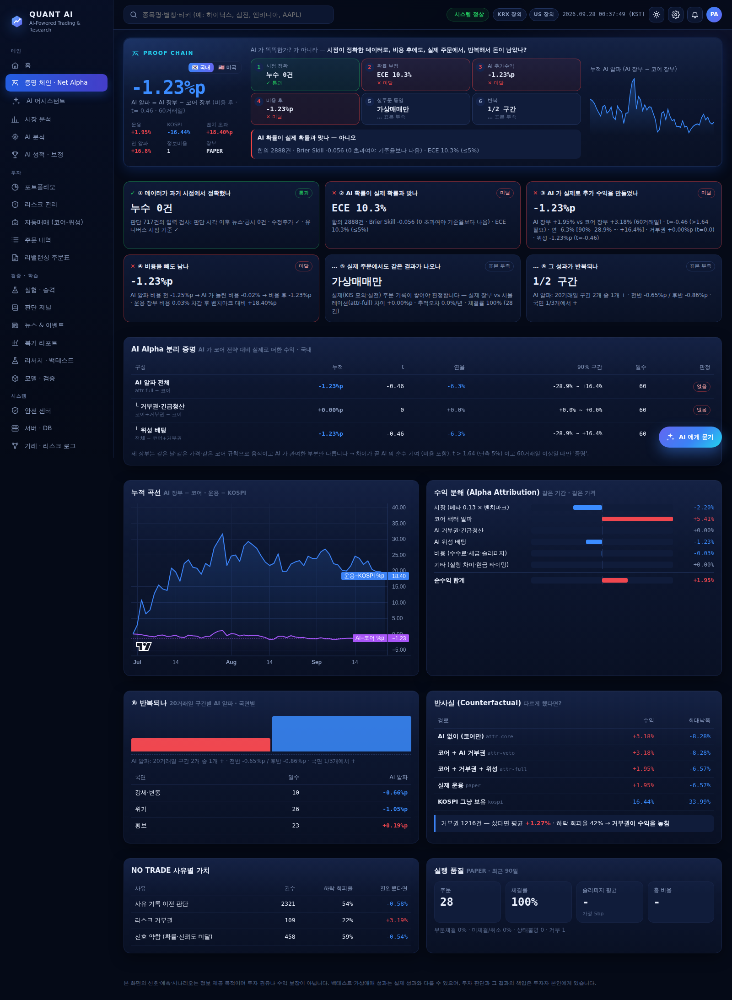
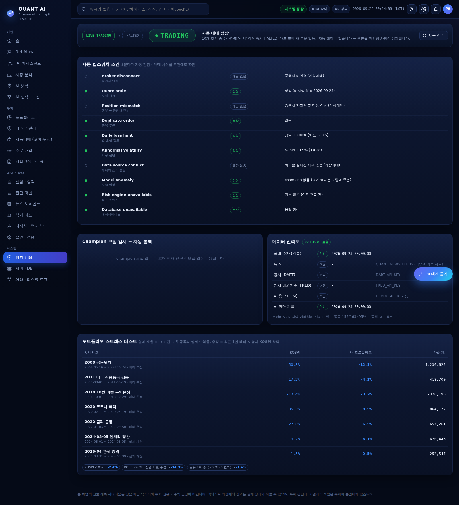
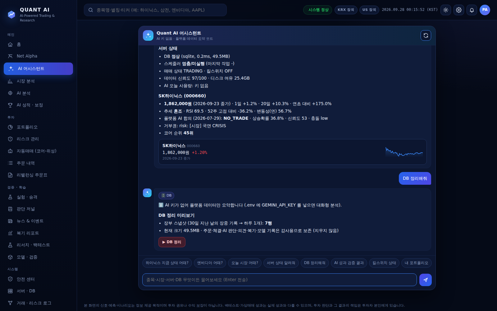

# 플랫폼 현황 — 증명 체인 · AI 알파 · 자동 킬스위치 · 해외장 · 채팅 AI

상태 표시: ✅ 구현·테스트 완료 · 🟡 일부 구현 (한계를 적어 둠) · ⛔ 아직 없음 (이유를 적어 둠)
검증: 테스트 198개 통과 (PostgreSQL 통합 테스트 포함).
실제 KRX 데이터, 가짜 KIS 서버, `./run.sh` 전체 자동 실행(예전 DB 업그레이드 포함)으로 확인했다.



## 1. 가장 중요한 질문 — 증명 체인 6단계

이 플랫폼은 "AI 가 똑똑한가" 를 묻지 않는다. 아래 여섯 가지를 **순서대로** 묻는다.
각 단계는 통과 / 미달 / 표본 부족 중 하나로 판정한다. 기준은 `review/net_alpha.py` 에 상수로 고정되어 있고, 결과를 본 뒤에 바꾸지 않는다.

| 단계 | 질문 | 판정 기준 | 실데이터 결과 (휴리스틱 AI, 60거래일) |
|---|---|---|---|
| ① | 데이터가 과거 시점에서 정확했나 | 판단 기록에 저장된 뉴스·공시·마지막 봉이 모두 판단 시각 이전일 것. 수정주가일 것. 유니버스가 시점 기준이거나 전진 기록만 쓸 것 | ✅ 판단 717건 중 누수 0건 |
| ② | AI 확률이 실제 확률과 맞나 | 채점 200건 이상에서 Brier Skill > 0, ECE ≤ 5%p | ❌ Brier Skill −0.056, ECE 10.3% |
| ③ | AI 가 실제로 추가 수익을 만들었나 | AI 장부 − 코어 장부. 60거래일 이상이고 t > 1.64 (단측 5%) | ❌ −1.23%p (t=−0.46) |
| ④ | 비용을 빼도 남나 | AI 알파가 비용 후에도 + 이고, 운용 장부가 비용 후에도 벤치마크를 넘을 것 | ❌ AI 알파 −1.23%p |
| ⑤ | 실제 주문에서도 같은 결과가 나오나 | 실제 장부와 같은 규칙의 시뮬레이션 장부 차이 ±1%p 이내, 실측 슬리피지 ≤ 가정, 체결률 ≥ 90% (KIS 실주문 20건·20거래일 이상) | ⚪ 가상매매만 있어 판정 불가 |
| ⑥ | 그 성과가 반복되나 | 20거래일 구간의 2/3 이상에서 + 이고, 전반과 후반 모두 + | ⚪ 구간 2개 중 1개 (표본 부족) |

이 결과는 LLM 키 없이 휴리스틱 AI 로 돌린 것이다. 판정이 정확히 그렇게 나왔다. 확률은 찍기보다 못했고, AI 는 코어에 수익을 더하지 못했다.
그래서 기본값은 **코어 전용**이다. `.env` 에 넣은 AI 키는 이제 **AI 섀도** 로 매일 판단하고 채점된다. 그 기록이 쌓이면 같은 여섯 단계로 다시 판정한다.

- **AI Alpha 분리 증명 ✅**
  - 같은 날, 같은 가격, 같은 코어 규칙으로 장부 세 개를 굴린다: 코어 / 코어+거부권 / 코어+거부권+위성. 세 장부는 AI 가 관여한 부분만 다르다.
  - 따라서 장부 사이의 차이가 곧 AI 의 순수 기여다. 비용이 포함되어 있고, t 값과 90% 구간을 함께 보여준다.
  - 이 기여는 다시 **거부권·긴급청산**과 **위성 베팅**으로 나눠 보여준다.
- **Point-in-Time 보정·가중치 ✅**
  - 보정기는 적합할 때마다 버전을 기록한다(`calibration_history`).
  - 과거 재생에서는 그 시점 이전에 적합된 보정기와 그 시점에 결과가 나와 있던 성적만 쓴다.
  - 합의 확률 자체도 과거 합의로 한 번 더 보정한다(OOS Ensemble Calibration). 정보가 없는 합의는 0.5 로 눌려 NO TRADE 가 된다.

## 2. 해외장 (미국) 🟡

- **장부**: 미국 대형주 40종목으로 국내와 **같은 코어 팩터 규칙**을 쓴다.
  - 실제 설정 장부 `us-paper` 와 AI 기여 측정 장부 3개(`us-attr-*`)를 둔다.
  - 모두 가상매매이고 단위는 USD다. 벤치마크는 SPY, 수수료는 0.25%(해외주식)이고 매도세는 없다.
- **증명**: 국내와 같은 6단계 체인과 AI 알파 분리 증명을 쓴다. 대시보드에서 🇰🇷/🇺🇸 로 전환한다.
- **데이터**: 무료 일봉을 받는다(Yahoo → 실패하면 Stooq, 수정주가, 키 필요 없음).
  - 과거 백테스트는 **하지 않는다**. 현재 구성 종목으로 과거를 돌리면 생존편향이 생기기 때문이다. 목록을 고정한 날부터의 전진 기록만 성과로 쓴다.
  - ① 단계에는 "전진 기록만 사용" 으로 표시된다.
- **한계**
  - 해외 실주문(KIS 해외주식)은 실계좌로 검증하기 전까지 넣지 않았다. 그래서 ⑤ 단계는 계속 "가상매매만" 이다.
  - 환율 효과는 장부에 반영하지 않는다(USD 기준).

## 3. 자동 킬스위치 — 버튼이 아니라 조건 ✅



5분마다 자동으로 점검하고, 매매 사이클 직전에도 한 번 더 점검한다(`trading/guardian.py`). 조건 하나라도 **심각** 이면 `LIVE TRADING → HALTED` 로 바뀐다.

| 조건 | 심각 기준 |
|---|---|
| Broker disconnect | 증권사 API 연속 3회 실패 |
| Quote stale | 주가가 한도(5영업일)보다 오래됨 · 0/음수 시세 |
| Position mismatch | DB 장부 ≠ 증권사 잔고 2회 연속 |
| Duplicate order | 같은 목표의 미완료 주문 2개 이상 |
| Daily loss limit | 당일 손실이 한도의 1.5배 |
| Abnormal volatility | KOSPI 일간 ±5% (서킷브레이커급) |
| Data source conflict | 증권사 시세 vs DB 종가가 ±30%(가격제한폭) 밖 |
| Model anomaly | champion 확률 붕괴 · 전진 적중률 45% 미만 → **자동 롤백** |
| Risk engine unavailable | 리스크 계산 연속 2회 실패 |
| Database unavailable | DB 응답 없음 |

- **HALTED 상태**: 매도를 포함해 새 주문을 하나도 내지 않는다. 자동 해제는 없다. 원인을 확인한 사람이 안전 센터에서 해제한다. 해제해도 조건이 여전히 심각이면 다음 점검에서 다시 멈춘다.
- **수동 긴급정지**: 기존과 같다. 신규 매수만 막고 매도·위험 축소는 허용한다.

## 4. 연구하고, 검증을 통과한 것만 승격 ✅

```
연구(walk-forward · 비용 2배 · DSR) → Candidate(백테스트 게이트) → Shadow(채점만) → Champion(실매매 모델)
      → 전진 감시(적중률 · Brier · 확률 붕괴) → 이상 시 Rollback(직전 champion 복귀) + 알림 + 기록
```
- AI 는 스스로 바뀌지 않는다. 매일 후보가 생겨도 게이트를 통과해야 shadow 가 되고, 실시간 성적까지 통과해야 champion 이 된다.
- **실험 레지스트리**: 모든 모델 후보와 연구 리포트의 시험 수를 모은다. 시험을 많이 할수록 DSR 기준이 올라간다.
- **AI 켜기 판정**
  - 섀도 60거래일과 채점 200건을 채우고, Brier Skill > 0 이고, 가상 장부 초과수익 +1%p 이상일 때만 "AI 켜기" 를 추천한다.
  - 추천은 알림으로만 간다. 설정은 사람이 바꾼다.

## 5. 요청 14개

| # | 항목 | 상태 | 어디에 |
|---|---|---|---|
| ① | PIT Calibration | ✅ | 보정기 버전 기록 · 판단 시점 이전 적합만 사용 (`ensemble/calibration.py calibrators_as_of`) |
| ② | OOS Ensemble Calibration | ✅ | 합의 확률 보정 (`CONSENSUS_KEY`) · 원래 확률은 `prob_raw` 로 보존 |
| ③ | Point-in-Time Model Weights | ✅ | 성적표 `scoreboard(until=)` — 그 시점에 결과가 나와 있던 의견만 |
| ④ | Alpha Attribution | ✅ | 시장(베타) · 코어 팩터 · AI 거부권 · AI 위성 · 비용 · 기타 |
| ⑤ | Counterfactual Engine | ✅ | "AI 없이 / 거부권만 / 전부 / KOSPI 보유" 경로 · 거부권이 피한 손실 · NO TRADE 사유별 가치 |
| ⑥ | Event Reaction DB | ✅ | 공시 유형별 다음 1·5일 KOSPI 대비 초과수익 → AI 입력("과거 유상증자 다음날 평균 −3.1%") |
| ⑦ | Execution Quality Analytics | ✅ | 체결률 · 부분체결 · 취소 · 슬리피지 평균/p90 vs 가정 · Implementation Shortfall · 최악 주문 |
| ⑧ | Real Broker Reconciliation | ✅ | 매 사이클 증권사 잔고 = 진실의 원천, 불일치 연속 시 HALTED |
| ⑨ | Portfolio Stress Engine | ✅ | 2008·2011·2018·2020·2022·2024·2025 실제 급락 재현(데이터가 있으면 실제, 없으면 베타 추정) + 요인 충격 |
| ⑩ | Champion/Challenger Forward Validation | ✅ | champion 승격 이후 전진 성적 감시 |
| ⑪ | Automatic Rollback | ✅ | 이상 시 직전 champion 복귀 + 알림 + 기록 |
| ⑫ | Data Confidence / Freshness | ✅ | 소스별 신선도 · 커버리지 · 품질 경고 → 0~100 신뢰도 |
| ⑬ | Research Experiment Registry | ✅ | 모델 후보 + 연구 리포트 시험 수 · DSR |
| ⑭ | Net Alpha Dashboard | ✅ | **홈 최상단** · 🇰🇷/🇺🇸 전환 · 6단계 · AI 알파 곡선 |

## 6. 완성 기준

| 영역 | 기준 | 상태 |
|---|---|---|
| 데이터 | PIT + survivorship + corporate action + release timestamp | ✅ 국내 (상장폐지 포함 월별 유니버스 · 수정주가 · 판단 입력 시각 감사). 🟡 미국은 전진 기록만 |
| AI | OOS 예측 + calibrated probability + 모델별 forward 성적 | ✅ 판정은 키를 넣은 뒤 쌓이는 기록으로 |
| 전략 | benchmark 대비 순수익 기준 incremental alpha 검증 | ✅ AI 장부 − 코어 장부, 비용 후, t · 구간 |
| 리스크 | portfolio / factor / correlation / liquidity / stress | ✅ |
| 실행 | 실제 주문·부분체결·취소·복구·재시작·reconciliation | ✅ 국내 KIS (가짜 서버로 전 과정 테스트). 실계좌 검증은 사용자 키가 있어야 함 |
| 학습 | Champion/Challenger + Shadow + Promotion + Rollback | ✅ |

## 7. 사이트 채팅 AI ✅



- **위치**: 모든 화면 오른쪽 아래의 **AI 에게 묻기**, 또는 메뉴의 **AI 어시스턴트**. 터미널에서는 `./run.sh chat`.
- **모델**: 설정된 키 중 문맥이 가장 길고 품질이 높은 것을 쓴다. 기본은 Gemini 2.5 Pro이고, 한도에 걸리면 Flash 로 자동 전환한다. `QUANT_CHAT_PROVIDER` 로 바꿀 수 있다.
- **플랫폼 데이터 조회 (읽기 전용 도구 10종)**
  - 종목(국내·해외), 시장, 포트폴리오, 증명 체인
  - 안전 상태, AI 성적, 서버 상태, DB 상태
  - 예: "하이닉스 지금 어때?" → 시세·추세·AI 합의·코어 순위·보유·뉴스·공시. "엔비디아 어때?" → 무료 일봉을 받아 분석(해외는 AI 합의 대상이 아님을 밝힘).
- **안전**: DB 정리 같은 작업은 채팅이 **버튼으로 제안만** 하고, 사람이 눌러야 실행된다. DB 정리는 주문·체결·판단·복기·모델 기록을 절대 지우지 않는다.
- **키가 없거나 한도를 다 썼을 때**: 같은 데이터를 규칙으로 요약해 답한다.
- **검색 개선**: 한글 별명(하이닉스·하닉·삼전·현차·엔솔…), 미국 티커·한글 이름(엔비디아·애플·테슬라…), 종목코드로 찾는다. 해외 종목을 누르면 무료 일봉을 받아 차트를 보여준다.

## 8. 이번 점검에서 찾아 고친 문제

1. **코어 전용이면 AI 를 한 번도 부르지 않았다**
   - 문제: `.env` 에 넣은 AI 키가 쓰이지 않았고, 성적표·보정·저널·근거 추적이 계속 비어 있었다.
   - 수정: 이제 AI 섀도가 새 일봉마다 한 번 판단한다. 실제 주문을 낸 뒤에 판단하므로 LLM 지연이 주문을 늦추지 않는다.
2. **"데이터 없음"**
   - 문제: 뉴스 피드 기본값이 없었고, AI 판단 기록도 없었다.
   - 수정: 기본 국내 경제·증권 RSS 를 넣었다. 대시보드에 **시작 체크리스트와 "지금 채우기"** 버튼을 달았다. `./run.sh` 는 대시보드를 먼저 띄우고 뒤에서 데이터를 채운다.
3. **스케줄러 버그 (예전부터 있던 것)**
   - 문제: `QUANT_MARCAP_DIR` 이 비어 있으면 코어 전략과 함께 **AI 합의 직접매매가 15분마다 같은 장부에서** 돌았다(코어 전용 설정도 무시). 주가 자동 갱신도 꺼져 있었다.
   - 수정: 전략 분기를 고치고, 기본 데이터 위치를 쓰게 했다. 회귀 테스트를 추가했다.
4. **모델 파일이 없어지면 AI 판단 전체가 멈췄다**
   - 수정: 그 모델만 빼고 계속 판단하고, 알림을 보낸다.
5. **미국 고가 종목** 은 1주도 못 사는 경우가 있었다.
   - 수정: 국내와 같은 "다음 순위 대체" 규칙을 적용했다.
6. **대시보드 속도**
   - 문제: 전 종목 일봉을 매번 다시 읽었다.
   - 수정: 60초 캐시를 넣었다(적재 시 무효화). 두 번째 호출부터 0.03~0.4초.

### 실사용 피드백으로 고친 것 (v4)

- **`doctor --ai` 가 멈춘 것처럼 보였다**
  - 원인: 긴 타임아웃(120초)과 재시도 3회에, 분당 한도 대기까지 겹쳤다.
  - 수정: 공급사당 최대 40초로 줄이고 진행 표시를 넣었다. 같은 공급사는 한 번만 확인한다.
  - 오류 원인을 공급사 응답 본문으로 구분해서 안내한다(키 / 한도 / 모델 / 네트워크).
- **AI 키를 넣었는데 "AI 판단 0건"**
  - 원인: AI 4곳을 한 줄로 차례차례 불렀고, 전 종목이 끝나야 한 번에 저장했다.
  - 수정: 공급사를 동시에 부르고, 종목마다 즉시 저장하고, 진행률(예: 12/42)을 표시한다.
  - 응답 없는 공급사는 3번 연속 실패하면 10분간 건너뛴다(서킷 브레이커).
  - 백그라운드 채우기와 스케줄러가 같은 판단을 두 번 하지 않게 잠갔다. SQLite 는 WAL 모드와 30초 대기로 동시 사용 충돌을 막았다.
- **SK하이닉스처럼 코어 후보가 아닌 종목은 AI 판단이 영영 없었다**
  - 종목 화면을 열면 AI 가 **그 자리에서 판단**한다(키가 있으면 자동, 없으면 버튼).
  - 본 종목과 채팅에서 물어본 종목은 **관심 종목**이 되어 매일 판단한다(최근 20개).
- **엔비디아 시세: Yahoo 429 · Stooq 결과 없음**
  - 수정: yfinance(브라우저 흉내) 일괄 받기 → Yahoo query1·query2 → Nasdaq → Stooq 순서로 시도한다.
  - 실패한 종목은 30분 동안 다시 요청하지 않아 차단이 길어지지 않는다.
- **설치 때 `Ignoring invalid distribution ~ip` 경고**
  - 원인: 중단된 pip 업그레이드가 깨진 폴더를 남겼다.
  - 수정: `./run.sh` 가 명령마다 자동으로 정리한다.
- **상단 "작업 실패 N건"**: 누르면 서버·DB 화면으로 가고, 마우스를 올리면 실패한 작업 이름과 오류가 보인다.

## 9. 솔직한 한계

- **전략 기대치는 그대로다.** 코어는 16년 실데이터에서 KOSPI 와 비슷한 수익에 변동성이 더 작다. 이번 작업은 "AI 가 돈을 더 버는지" 를 **증명할 수 있게** 만든 것이지, 수익을 올린 것이 아니다.
- **AI 의 가치는 아직 증명되지 않았다.** 휴리스틱 AI 는 ②③④ 에서 미달이다. 무료 LLM 키로 수 개월 쌓인 기록이 같은 기준을 통과해야 AI 를 켠다.
- **⑤ 실주문 동일성**: KIS 모의·실전 주문 기록이 20건·20거래일 이상 쌓여야 판정된다.
- **무료로 안정적으로 구할 수 없어 넣지 않은 것**: 외국인·기관 수급, 공식 섹터 분류, 해외 PIT 유니버스, 실시간 호가 스트림.
