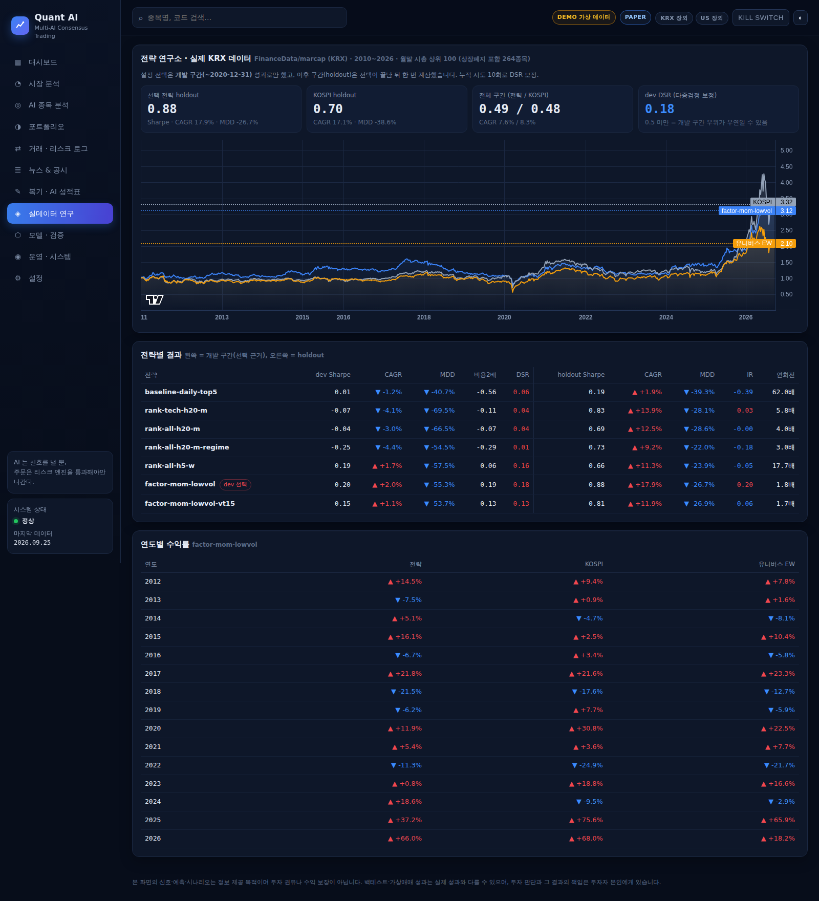
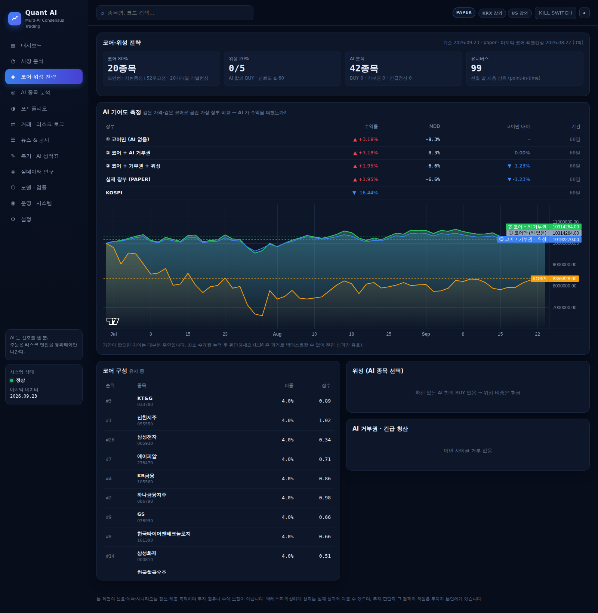

# 실제 KRX 데이터 연구 결과

> 데이터: FinanceData/marcap (KRX 전 종목 일별, 상장폐지 포함), 2010-01 ~ 2026-09.
> 유니버스: 매월 말 시가총액 상위 100 (보통주, 20일 평균 거래대금 10억 원 이상) — **그 시점 기준 선정**, 다음 달 매매.
> 비용: 수수료 1.5bp + 슬리피지 5bp (편도), 매도 거래세 18bp, 상장폐지 보유분 30% 할인 청산.
> 모든 수치는 백테스트이며 실제 성과를 보장하지 않는다.

## 1. 연구 절차 (과최적화 방지)

1. **개발 구간(2010~2020)** 성과로만 전략을 고른다. 규칙: 비용 2배에서도 Sharpe > 0 인 것 중 Sharpe 최고.
2. 선택이 끝난 뒤 **검증 구간(2021-01 ~ 2026-09)** 을 한 번 계산한다.
3. 시도한 모든 설정(이전 3회 + 연구소 7회 = 10회)으로 DSR 을 보정한다.
4. 선택 후에는 설정을 바꾸지 않고 **주변 설정(강건성)** 만 확인한다.

재현: `quant-ai lab --marcap-dir marcap/data --start 2010 --top 100 --dev-end 2020-12-31 --prior-trials 3`

## 2. 출발점: 왜 처음 전략은 돈을 못 벌었나

| | 값 |
|---|---|
| 예측력 (날짜별 IC) | 0.047, t=6.2 — **통계적으로 유의한 신호가 있음** |
| 연 회전율 | **62배** (매일 리밸런싱) |
| 개발 구간 Sharpe / CAGR | 0.01 / -1.2% |
| 비용 2배 Sharpe | -0.56 |

→ 예측력은 있었지만, 5일짜리 약한 신호를 매일 매매해서 **거래비용(연 10% 이상)이 수익을 전부 먹었다.**

## 3. 전략 비교

| 전략 | dev Sharpe | dev CAGR | dev MDD | 비용2배 | 연회전 | holdout Sharpe | holdout CAGR | holdout MDD |
|---|---|---|---|---|---|---|---|---|
| 기존 방식 (매일, 5종목, 50%) | 0.01 | -1.2% | -40.7% | -0.56 | 62배 | 0.19 | 1.9% | -39.3% |
| ML 순위, 기술지표, 월간 | -0.07 | -4.1% | -69.5% | -0.11 | 5.8배 | 0.83 | 13.9% | -28.1% |
| ML 순위, 기술+팩터, 월간 | -0.04 | -3.0% | -66.5% | -0.07 | 4.0배 | 0.69 | 12.5% | -28.6% |
| 위 + 국면 노출 조절 | -0.25 | -4.4% | -54.5% | -0.29 | 3.0배 | 0.73 | 9.2% | -22.0% |
| ML 순위, 기술+팩터, 주간 | 0.19 | 1.7% | -57.5% | 0.06 | 17.7배 | 0.66 | 11.3% | -23.9% |
| **고전 팩터: 모멘텀+저변동성+52주고점 (선택)** | **0.20** | **2.0%** | -55.3% | **0.19** | **1.8배** | **0.88** | **17.9%** | -26.7% |
| 위 + 변동성 타깃 15% | 0.15 | 1.1% | -53.7% | 0.13 | — | 0.81 | 11.9% | -26.9% |
| *참고: KOSPI (시총가중)* | *0.28* | *3.4%* | *-44.1%* | | | *0.70* | *17.1%* | *-38.6%* |
| *참고: 유니버스 동일가중* | *0.15* | *1.2%* | *-53.0%* | | | *0.59* | *11.6%* | *-33.7%* |

**발견**
- 2010~2020 은 한국 시장이 박스권이던 시기라 모든 전략이 약했다. 이 구간에서 KOSPI 를 이긴 전략은 없다.
- **머신러닝(로지스틱) 순위 모델이 단순 팩터 조합을 이기지 못했다.** 20일 기간에서는 예측력(IC)이 유의하지 않았다(t≈1).
- 거래를 줄이는 것(연회전 62배 → 1.8배)이 가장 큰 개선이었다.
- 국면 노출 조절·변동성 타깃팅은 낙폭을 거의 줄이지 못하고 수익만 줄였다 (반응이 늦음).

## 4. 선택 전략: 모멘텀 + 저변동성 + 52주 고점 (월간, 상위 20, 버퍼 40)

점수 = 순위(12-1개월 모멘텀) − 순위(60일 변동성) + 순위(52주 고점 근접도). 상위 20종목 동일가중, 20거래일마다 리밸런싱, 보유 종목은 순위 40위 안이면 유지.

### 검증 구간 (2021-01 ~ 2026-09, 선택에 사용하지 않음)

| | 전략 | KOSPI | 유니버스 동일가중 |
|---|---|---|---|
| Sharpe | **0.88** | 0.70 | 0.59 |
| CAGR | **17.9%** | 17.1% | 11.6% |
| MDD | **-26.7%** | -38.6% | -33.7% |
| 비용 2배 Sharpe | 0.87 | | |
| 정보비율 (vs 동일가중) | +0.20 | | |

### 전체 구간 (2012 ~ 2026)

| | 전략 | KOSPI |
|---|---|---|
| CAGR | 7.6% | 8.3% |
| Sharpe | 0.49 | 0.48 |
| MDD | **-55.3%** | -44.1% |
| PSR | 0.97 | |
| DSR (10회 보정) | 0.64 | |
| 개발 구간 DSR | **0.18** | |

### 연도별

| 연도 | 전략 | KOSPI | 동일가중 |
|---|---|---|---|
| 2012 | 14.5% | 9.4% | 7.8% |
| 2013 | -7.5% | 0.9% | 1.6% |
| 2014 | 5.1% | -4.7% | -8.1% |
| 2015 | 16.1% | 2.5% | 10.4% |
| 2016 | -6.7% | 3.4% | -5.8% |
| 2017 | 21.8% | 21.6% | 23.3% |
| 2018 | -21.5% | -17.6% | -12.7% |
| 2019 | -6.2% | 7.7% | -5.9% |
| 2020 | 11.9% | 30.8% | 22.5% |
| 2021 | 5.4% | 3.6% | 7.7% |
| 2022 | **-11.3%** | -24.9% | -21.7% |
| 2023 | 0.8% | 18.8% | 16.6% |
| 2024 | **18.6%** | -9.5% | -2.9% |
| 2025 | 37.2% | 75.6% | 65.9% |
| 2026 (9월까지) | 66.0% | 68.0% | 18.2% |

**하락장 방어(2014, 2022, 2024)는 좋고, 급반등장(2020, 2023, 2025)은 크게 뒤처진다** — 저변동성·모멘텀 전략의 전형적인 모습.

### 강건성 (선택 후 설정 변경 없이 주변만 확인)

보유 10/20/30종목 × 리밸런싱 10/20/40일 × 리밸런싱일 이동 — **15개 변형 모두 holdout Sharpe 0.78 ~ 0.98.** 특정 설정에서만 되는 '칼날' 결과가 아니다.
팩터를 하나씩 빼면 모멘텀·52주고점을 뺄 때 성과가 가장 크게 떨어진다 (두 팩터가 핵심).

## 5. 결론 (솔직하게)

1. **수익은 난다.** 비용·세금·상장폐지를 반영하고도 연 7.6%(전체), 최근 5.7년 연 17.9%, 비용 2배에서도 유지.
2. **하지만 KOSPI 를 확실히 이긴다고 말할 수는 없다.** 전체 구간 Sharpe 는 KOSPI 와 같고(0.49 vs 0.48), 최대 낙폭은 더 크다. 개발 구간 DSR 0.18 → 개발 구간의 우위는 우연일 가능성이 크다. 최근 5.7년의 우위(Sharpe 0.88 vs 0.70)는 고무적이지만 한 번의 구간이다.
3. **AI(머신러닝)가 단순 팩터를 이기지 못했다.** 따라서 LLM 멀티 AI 도 "종목 선택"보다는 **리스크 관리(이벤트 veto, 뉴스 쇼크 회피)** 역할로 먼저 검증하는 것이 합리적이다.
4. 이 결과로 "고객 돈을 굴리는 AI" 를 주장하기는 이르다. 다음 단계는 실시간 전진(forward) 성과 누적.

## 6. 다음 단계 제안

- **코어-위성 구조:** 선택 전략을 코어 포트폴리오로, 멀티 AI 는 Risk AI veto(이벤트·뉴스 쇼크 회피)와 급반등 구간 노출 조절에 한정해 Shadow 로 효과 측정.
- 가치(PBR·PER)·퀄리티(ROE) 팩터: point-in-time 재무 데이터가 필요 (DART 재무제표 공시일 기준 결합).
- 낙폭 관리: 추세 필터(지수 200일선 아래면 노출 축소)를 **새 시도로 등록**해 같은 절차로 검증.
- KIS 모의투자로 월간 리밸런싱을 실제로 돌려 슬리피지 실측.

## 7. 코어-위성 실데이터 재생 (2026-06-30 ~ 2026-09-23, 60거래일)

`quant-ai collect krx --years 3` → `quant-ai replay --days 60` (매일 그날 종가까지의 정보로 판단, 종가 체결, 초기 1,000만 원).
이 환경에는 LLM API 키가 없어 Primary/NVIDIA AI 는 오프라인 휴리스틱, Risk AI 는 규칙만으로 동작했다.

| 장부 | 수익률 | MDD |
|---|---|---|
| ① 코어만 (AI 없음) | +3.18% | -8.3% |
| ② 코어 + AI 거부권 | +3.18% | -8.3% |
| ③ 코어 + 거부권 + 위성 (= 실제 PAPER 장부) | +1.95% | -6.6% |
| KOSPI (시총가중 대용) | **-16.44%** | |

- 코어 리밸런싱 3회 (06-30, 07-29, 08-27), 매 사이클 AI 가 후보 42종목 분석.
- **하락장(KOSPI -16%)에서 코어가 +3% 로 방어** — 저변동성·모멘텀 코어의 전형적 모습 (연구의 2022·2024 결과와 일치).
- AI 거부권: 코어 종목(저변동성 성향)에 종목 고유 위험이 없어 발동 0회 → ①과 ② 동일.
- 위성: 휴리스틱 AI 가 신뢰도 60 이상 BUY 합의를 내지 못해 20% 가 현금 → 수익률 -1.2%p, 낙폭 +1.7%p 개선.
- **60일은 너무 짧아 AI 기여도에 대해 결론을 낼 수 없다.** LLM 키를 넣고 수개월 전진 누적이 필요하다.

재생 중 발견·수정한 문제
1. Risk AI 의 변동성 급증·가격 급변 규칙이 수학적으로 발동 불가능했다 (같은 구간 변동성으로 나눠 상한이 생김) → 이전 구간 대비로 수정.
2. '위기 국면' 판정이 코어 20종목을 전량 청산했다 → 위험을 종목/시장으로 분리, 시장 위험은 위성만 막도록.
3. 코어 매수가 AI 확률 최소치(0.55)로 거부됐다 → 코어는 AI 확률 검사 대상에서 제외.
